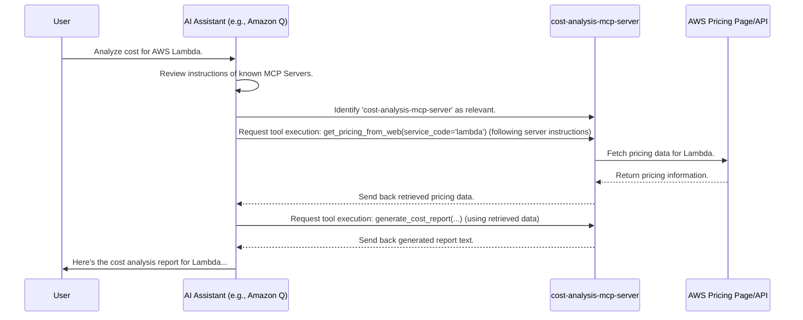

# Chapter 1: MCP Server (FastMCP)

Welcome to the `gx-aws-mcp` tutorial! Imagine you have a super-smart AI assistant that helps you with all things AWS. But how does this assistant know *what* it can do and *how* to do specific tasks, like calculating potential costs or generating diagrams? That's where the **MCP Server** comes in.

## What's the Big Idea?

Think of the `gx-aws-mcp` system as a large company, and the AI assistant is the CEO. The CEO is smart but can't do *everything* alone. They rely on specialized departments to handle specific tasks.

An **MCP Server** is like one of these specialized departments.

*   One department might handle **Cost Analysis**.
*   Another might be experts in **Generating Diagrams**.
*   Yet another could specialize in looking up **AWS Documentation**.

Each MCP Server bundles together the knowledge, tools, and instructions needed for its specific area of expertise. It tells the AI assistant (the CEO) "Here's who I am, here's what I'm good at, and here are the specific tools I have to get the job done."

The core component we use to build these servers is the `FastMCP` class. It's the blueprint for creating these specialized departments.

## Our First Department: The Cost Analyzer

Let's imagine we want our AI assistant to answer questions like: "How much would it cost to run a simple website using AWS Lambda and API Gateway?"

To handle this, we need a dedicated "Cost Analysis Department" – an MCP Server focused on AWS pricing.

Here's how we might *start* defining this server using the `FastMCP` class in Python:

```python
# --- File: src/cost-analysis-mcp-server/awslabs/cost_analysis_mcp_server/server.py ---
# (Simplified for clarity)

from mcp.server.fastmcp import FastMCP

# Create the MCP Server instance (our "department")
mcp = FastMCP(
    # Give the department a unique name/ID
    name='awslabs.cost-analysis-mcp-server',

    # Provide instructions for the AI assistant on how to use this department
    instructions="""Use this server for analyzing AWS service costs.
    Start by getting pricing data, then generate a report.""",

    # List any other software packages this department needs (dependencies)
    dependencies=['pydantic', 'boto3', 'beautifulsoup4', 'websearch'],
)

# ... (Tools and resources will be defined later) ...

# Function to start the server (make the department operational)
def main():
    print(f"Starting the {mcp.name} server!")
    mcp.run() # This makes the server listen for requests

if __name__ == '__main__':
    main()
```

**Explanation:**

1.  **`from mcp.server.fastmcp import FastMCP`**: We import the necessary blueprint (`FastMCP`) to create our server.
2.  **`mcp = FastMCP(...)`**: We create an instance of our server. Think of this as officially establishing the Cost Analysis department.
3.  **`name='awslabs.cost-analysis-mcp-server'`**: This is the unique identifier for our server, like the department's official name (e.g., "Finance-CostAnalysis-01").
4.  **`instructions="..."`**: This is crucial! It's a message directly to the AI assistant (the CEO) explaining *when* and *how* to interact with this server. We've kept it very simple here. The real server has much more detailed instructions (as seen in the full code snippets).
5.  **`dependencies=[...]`**: This lists other Python libraries the server needs to function, like tools a department might need.
6.  **`mcp.run()`**: This command starts the server, making it active and ready to receive tasks from the AI assistant.

## Key Parts of an MCP Server

Our simple example showed the `name` and `instructions`. But a fully functional MCP Server defined with `FastMCP` typically includes:

1.  **Name**: The unique identifier (e.g., `awslabs.cost-analysis-mcp-server`).
2.  **Instructions**: A natural language guide for the AI assistant. This tells the assistant the server's purpose, capabilities, required workflows, and limitations. For example, the cost server's instructions specify the *exact order* to try fetching pricing data (web first, then API).
3.  **Tools**: These are the specific actions the server can perform. Defined using a special marker called `@mcp.tool`. Think of these as the specific services offered by the department (e.g., `get_pricing_from_web`, `generate_cost_report`). We'll dive deep into tools in the [next chapter](02_mcp_tool___mcp_tool_.md).
4.  **Resources**: These represent data or knowledge the server can access. Defined using `@mcp.resource`. This could be like accessing a specific database or a knowledge base file (e.g., `resource://knowledgebases`). We'll cover resources in [Chapter 3](03_mcp_resource___mcp_resource_.md).

## How it Works Under the Hood (Simplified)

Let's trace what happens when you ask the AI assistant, "Analyze costs for AWS Lambda":



1.  **User Query**: You ask the AI assistant about Lambda costs.
2.  **Assistant Consults**: The assistant checks the `instructions` of all the MCP Servers it knows. It sees that `awslabs.cost-analysis-mcp-server` is the right "department" for cost analysis.
3.  **Assistant Delegates**: Following the server's `instructions`, the assistant decides to call the `get_pricing_from_web` tool provided by the Cost Server.
4.  **Server Executes**: The Cost Server runs the code associated with the `get_pricing_from_web` tool, fetching data from AWS.
5.  **Server Responds**: The Cost Server sends the fetched pricing data back to the assistant.
6.  **Assistant Continues**: The assistant might then (again, following instructions) call the `generate_cost_report` tool on the same server, providing the data it just received.
7.  **Final Answer**: The server generates the report, sends it back, and the assistant presents the final cost analysis to you.

The `FastMCP` class handles the setup, listening for requests, and routing them to the correct tool functions within the server.

## Conclusion

The **MCP Server**, created using the `FastMCP` class, is the fundamental organizational unit in `gx-aws-mcp`. It acts like a specialized department, defining its identity (`name`), purpose and usage guide (`instructions`), specific capabilities ([Tools](02_mcp_tool___mcp_tool_.md)), and accessible knowledge ([Resources](03_mcp_resource___mcp_resource_.md)). This modular approach allows the AI assistant to leverage specialized expertise for various tasks.

Now that we understand the concept of the server "department," let's look closer at the specific actions these departments can perform. In the next chapter, we'll explore [MCP Tool (@mcp.tool)](02_mcp_tool___mcp_tool_.md).

---

Generated by [AI Codebase Knowledge Builder](https://github.com/The-Pocket/Tutorial-Codebase-Knowledge)