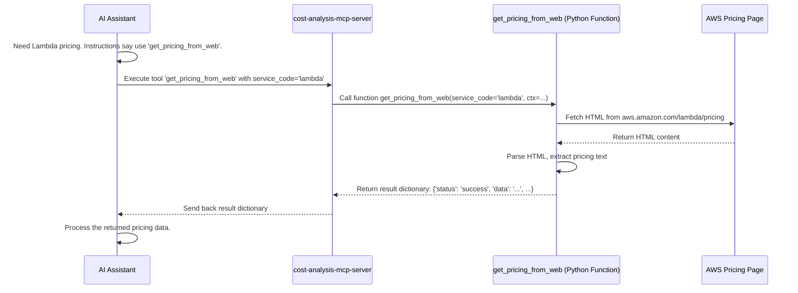

# Chapter 2: MCP Tool (@mcp.tool)

In [Chapter 1: MCP Server (FastMCP)](01_mcp_server__fastmcp_.md), we learned that an MCP Server is like a specialized department in our AI assistant's company. It bundles expertise for a specific area, like Cost Analysis.

But how does this department actually *do* anything? If the AI assistant (the CEO) asks the Cost Analysis department, "Can you find the latest pricing for AWS Lambda?", what specific action does the department take?

That's where **MCP Tools** come in.

## What is an MCP Tool?

Think back to our department analogy. An MCP Server is the department (e.g., Cost Analysis). An **MCP Tool** is a *specific service* offered by that department.

*   The Cost Analysis department might offer services like:
    *   `get_pricing_from_web`: A service to look up pricing on the AWS website.
    *   `generate_cost_report`: A service to create a formatted report based on pricing data.
*   A Diagram Generation department might offer:
    *   `generate_diagram`: A service to create a diagram from code.

Essentially, an MCP Tool is a single, well-defined function or action that the MCP Server can perform. When the AI assistant needs a specific task done, it asks the appropriate MCP Server to use one of its available tools.

Just like a real-world service, a tool:
1.  Takes specific **inputs** (called *parameters* or *arguments*). For example, `get_pricing_from_web` needs the name of the AWS service (`service_code`) as input.
2.  Performs an action.
3.  Returns an **output** (the result). For example, `get_pricing_from_web` returns the pricing information it found.

## Making a Function into a Tool: The `@mcp.tool` Decorator

In Python, we write functions to perform actions. How do we tell our MCP Server (the `FastMCP` instance) that a particular Python function should be available as a tool for the AI assistant?

We use something called a **decorator**. In Python, a decorator is a special piece of syntax (starting with `@`) that modifies or enhances a function.

The `gx-aws-mcp` system provides the `@mcp.tool` decorator. When you place `@mcp.tool(...)` directly above a Python function definition, you're telling the MCP Server: "Hey, register this function as a tool that the AI can use!"

Let's look at a simplified example from our Cost Analysis server (`cost-analysis-mcp-server`):

```python
# --- File: src/cost-analysis-mcp-server/awslabs/cost_analysis_mcp_server/server.py ---
# (Simplified view)

# Assume 'mcp' is our FastMCP instance from Chapter 1
# mcp = FastMCP(name='awslabs.cost-analysis-mcp-server', ...)

# This decorator registers the function below as a tool
@mcp.tool(
    name='get_pricing_from_web',  # The name the AI will use to call the tool
    description='Get pricing information from AWS pricing webpage. Service codes typically use lowercase with hyphens format (e.g., "lambda").' # VERY important description for the AI!
)
# This is the Python function that implements the tool
async def get_pricing_from_web(service_code: str, ctx: Context) -> Optional[Dict]:
    """Get pricing information from AWS pricing webpage."""
    await ctx.info(f"Fetching pricing for {service_code} from the web...")

    # --- Simplified Logic ---
    # In reality, this part contains code to:
    # 1. Construct the URL (e.g., https://aws.amazon.com/lambda/pricing)
    # 2. Fetch the HTML content of the page
    # 3. Parse the HTML to extract relevant pricing text
    # 4. Handle errors if the page isn't found or format changes
    pricing_text = f"Simulated pricing details for {service_code}..."
    # --- End Simplified Logic ---

    if pricing_text:
        # If successful, return the data in a structured dictionary
        result = {
            'status': 'success',
            'service_name': service_code,
            'data': pricing_text,
            'message': f'Retrieved pricing for {service_code} from AWS Pricing url',
        }
        return result
    else:
        # If failed, return None or an error structure
        await ctx.error(f"Failed to get pricing for {service_code} from web.")
        return None

# ... other tools like get_pricing_from_api, generate_cost_report ...
```

**Explanation:**

1.  **`@mcp.tool(...)`**: This is the decorator. It takes arguments:
    *   `name='get_pricing_from_web'`: This is the official name the AI assistant will use when it wants to invoke this specific tool.
    *   `description='...'`: This is **crucial**. It's a natural language explanation for the AI assistant, telling it *what the tool does*, *how to use it* (e.g., expected format for `service_code`), and any important notes. The AI relies heavily on this description to understand the tool's purpose and parameters.
2.  **`async def get_pricing_from_web(...)`**: This is the standard Python function definition. The `async` keyword means it's an asynchronous function (common in modern web frameworks).
3.  **`service_code: str`**: This defines an input parameter named `service_code` which must be a string (like `"lambda"` or `"s3"`). The AI will provide this value when calling the tool.
4.  **`ctx: Context`**: This is a special parameter provided by the `FastMCP` framework. It gives the tool access to server functionalities like logging (`ctx.info`, `ctx.error`) or potentially accessing shared state (though not used heavily in this example). You'll see this in most tool definitions.
5.  **`-> Optional[Dict]`**: This is a Python type hint indicating that the function is expected to return either a dictionary (`Dict`) containing the results or `None` if something went wrong.
6.  **Function Body**: Contains the actual Python code to perform the action (fetching and parsing the webpage). We've simplified it here with comments.
7.  **Return Value**: The function returns a dictionary with the results or `None`. This is what gets sent back to the AI assistant.

## How the AI Uses the Tool

Now, let's connect this back to the AI assistant. When the assistant receives a request like "What's the price of AWS Lambda?", it follows these steps:

1.  **Consult Instructions:** The assistant first looks at the `instructions` provided when the `FastMCP` server was created (see [Chapter 1](01_mcp_server__fastmcp_.md)). These instructions guide the overall workflow (e.g., "Try web pricing first, then API").
2.  **Identify Tool:** Based on the instructions and the user's request, the assistant identifies that it needs pricing information. It looks through the available tools provided by the `cost-analysis-mcp-server`.
3.  **Read Tool Description:** It finds the tool named `get_pricing_from_web` and reads its `description`. The description confirms this tool gets pricing from the web and explains the expected format for the service code.
4.  **Prepare Call:** The assistant prepares the necessary input parameter, in this case, `service_code='lambda'`.
5.  **Invoke Tool:** The assistant sends a request to the `cost-analysis-mcp-server`, asking it to execute the `get_pricing_from_web` tool with the parameter `service_code='lambda'`.
6.  **Server Executes:** The `FastMCP` server receives the request, finds the Python function `get_pricing_from_web` associated with the tool name, and calls it, passing the `service_code` parameter.
7.  **Function Runs:** Our Python function executes, fetching the data.
8.  **Return Result:** The function returns the dictionary containing the pricing data (or `None`).
9.  **Server Responds:** The `FastMCP` server sends this result back to the AI assistant.
10. **AI Processes:** The assistant receives the pricing data and can then either present it to the user or use it as input for another tool (like `generate_cost_report`, following the server's instructions).

Here's a simplified view of the AI invoking the tool:



## What Does the Decorator *Actually* Do?

The `@mcp.tool(...)` decorator isn't magic, but it does some important housekeeping. When the Python code defining the server is loaded:

1.  The decorator takes the function (`get_pricing_from_web` in our example) and the arguments passed to the decorator (`name`, `description`).
2.  It registers this information with the `FastMCP` instance (`mcp`). Essentially, it adds an entry to an internal list within the `mcp` object, saying: "The tool named 'get_pricing_from_web' is implemented by the Python function `get_pricing_from_web`, and here's its description and parameter information."

Later, when the `FastMCP` server is running (`mcp.run()`) and receives a request from the AI assistant to execute a tool, it looks up the tool name in its internal list and calls the corresponding registered Python function.

## Conclusion

MCP Tools are the individual actions or services that an MCP Server provides. They take inputs, perform actions, and return outputs.

The `@mcp.tool` decorator is the key mechanism for making a standard Python function available as a tool to the AI assistant. It registers the function with the `FastMCP` server and provides the essential `name` and `description` that the AI uses to discover and invoke the tool correctly.

By defining clear, well-described tools, we empower the AI assistant to perform complex tasks by delegating specific actions to the appropriate MCP Server "departments".

So far, we've seen how servers act as departments and tools act as specific services. But what if a server needs access to persistent data or knowledge, like a configuration file or a database? That's where MCP Resources come in. Let's explore them in the [next chapter](03_mcp_resource___mcp_resource_.md).

---

Generated by [AI Codebase Knowledge Builder](https://github.com/The-Pocket/Tutorial-Codebase-Knowledge)