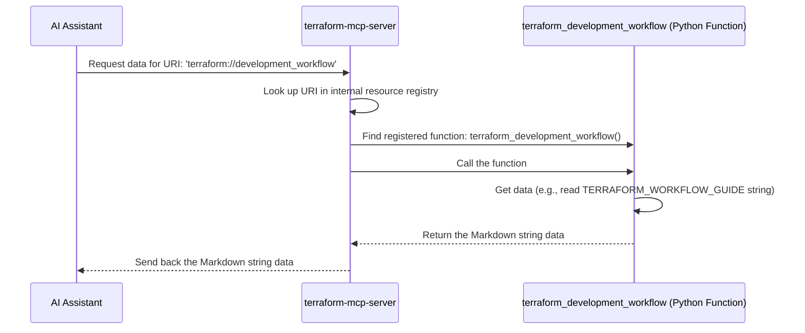

# Chapter 3: MCP Resource (@mcp.resource)

In the previous chapters, we learned about the [MCP Server (FastMCP)](01_mcp_server__fastmcp_.md) (our specialized department) and [MCP Tool (@mcp.tool)](02_mcp_tool___mcp_tool_.md) (the specific actions or services the department can perform). Tools are great when the AI assistant needs the server to *do* something, like calculate costs or generate a diagram.

But what if the AI assistant simply needs to retrieve a specific piece of information or data that the server holds? For instance, imagine the AI needs to know the standard "Terraform Development Workflow" recommended by the Terraform server. It doesn't need the server to *perform* an action, just to provide existing knowledge.

This is where **MCP Resources** come in.

## What is an MCP Resource?

Think back to our department analogy.
*   The [MCP Server (FastMCP)](01_mcp_server__fastmcp_.md) is the department (e.g., the Terraform Department).
*   An [MCP Tool (@mcp.tool)](02_mcp_tool___mcp_tool_.md) is a service the department offers (e.g., `ExecuteTerraformCommand`).
*   An **MCP Resource** is like a specific document, file, or knowledge base *within* that department that someone can request access to.

It represents a specific piece of information or data that the server can provide. Examples include:
*   A list of available items (like all Terraform resources supported by the AWS provider).
*   A standard operating procedure document (like the recommended Terraform workflow).
*   A configuration file.
*   Data fetched from a knowledge base.

Each resource is identified by a unique address called a **URI** (Uniform Resource Identifier). This URI tells the AI exactly which piece of information it wants from the server. For example, the Terraform server might provide a resource identified by the URI `terraform://development_workflow`.

## Making Data Available: The `@mcp.resource` Decorator

Just like we used the `@mcp.tool` decorator to turn a Python function into an action the server can perform, we use the `@mcp.resource` decorator to make a Python function provide the data for a specific resource URI.

When you place `@mcp.resource(...)` above a Python function, you're telling the MCP Server: "Hey, if someone requests the data at this specific URI, run this function and send back whatever it returns."

Let's look at a simplified example from our Terraform server (`terraform-mcp-server`):

```python
# --- File: src/terraform-mcp-server/awslabs/terraform_mcp_server/server.py ---
# (Simplified view)

from mcp.server.fastmcp import FastMCP
from awslabs.terraform_mcp_server.static import TERRAFORM_WORKFLOW_GUIDE

# Assume 'mcp' is our FastMCP instance from Chapter 1
# mcp = FastMCP(name='terraform_mcp_server', ...)

# This decorator registers the function below as a resource provider
@mcp.resource(
    name='terraform_development_workflow', # A friendly name for the resource
    uri='terraform://development_workflow', # The unique address (URI) for this resource
    description='Terraform Development Workflow Guide...', # Description for the AI
    mime_type='text/markdown', # Tells the AI what kind of data it is (e.g., text, JSON)
)
# This is the Python function that provides the resource data
async def terraform_development_workflow() -> str:
    """Provides guidance for developing Terraform code."""
    # This function simply returns a pre-defined string constant
    # containing the workflow guide in Markdown format.
    # In other cases, it might fetch data from a file or database.
    return f'{TERRAFORM_WORKFLOW_GUIDE}' # The actual guide text

# ... other resources and tools ...
```

**Explanation:**

1.  **`@mcp.resource(...)`**: This is the decorator. It takes arguments:
    *   `name='terraform_development_workflow'`: A human-readable name for the resource.
    *   `uri='terraform://development_workflow'`: This is the **critical** unique identifier. It's the address the AI will use to request this specific piece of information. The `terraform://` part is like a custom web protocol for this server.
    *   `description='...'`: Explains to the AI what information this resource provides.
    *   `mime_type='text/markdown'`: Tells the AI the format of the data (in this case, Markdown text). Other common types are `application/json`.
2.  **`async def terraform_development_workflow() -> str`**: This is the standard Python function definition. It takes no arguments in this simple case. The `async` keyword means it's asynchronous. It's type-hinted (`-> str`) to return a string.
3.  **Function Body**: Contains the code to get the data. Here, it's super simple: it just returns the content of a pre-defined string variable `TERRAFORM_WORKFLOW_GUIDE`. In more complex scenarios, this function might read a file, query a database, or call another service.
4.  **Return Value**: The function returns the data (the Markdown string). This is what gets sent back to the AI assistant when it requests the resource via its URI.

## How the AI Accesses a Resource

When the AI assistant needs the information stored in a resource, it doesn't call a tool. Instead, it directly requests the resource using its URI.

Imagine the AI determines it needs the standard Terraform workflow guide.
1.  **Identify Resource:** The AI consults the information provided by the `terraform-mcp-server` (including the descriptions of its resources). It identifies that the resource with the URI `terraform://development_workflow` contains the needed guide.
2.  **Request URI:** The AI sends a request to the `terraform-mcp-server`, specifically asking for the content associated with the URI `terraform://development_workflow`.
3.  **Server Responds:** The server finds the function registered for that URI (`terraform_development_workflow`), runs it, and sends the returned data (the Markdown guide) back to the AI.
4.  **AI Uses Data:** The AI receives the Markdown text and can then use it, perhaps to explain the workflow to the user or incorporate it into generated code comments.

## How it Works Under the Hood (Simplified)

What happens when the AI requests `terraform://development_workflow`?



1.  **AI Request:** The AI sends a request specifically targeting the resource URI.
2.  **Server Lookup:** The `FastMCP` server receives the request. It has an internal list (created when the `@mcp.resource` decorator ran) mapping URIs to the Python functions that provide the data. It looks up `terraform://development_workflow` in this list.
3.  **Function Call:** The server finds the corresponding function (`terraform_development_workflow` in our example).
4.  **Data Retrieval:** The server calls the function. The function executes its logic (in this case, just returning a string) and returns the data.
5.  **Server Response:** The server takes the data returned by the function and sends it back to the AI assistant.

## Registering Resources (Alternative Syntax)

You might also see resources registered directly on the `mcp` object instance, especially when setting up the server, like in the `cdk-mcp-server`:

```python
# --- File: src/cdk-mcp-server/awslabs/cdk_mcp_server/core/server.py ---
# (Simplified view)

from awslabs.cdk_mcp_server.core import resources # Import the module with resource functions
# Assume 'mcp' is our FastMCP instance

# Register resources using the mcp object directly
# The URI pattern includes placeholders like {rule_pack}
mcp.resource('cdk-nag://rules/{rule_pack}')(resources.get_all_cdk_nag_rules)
mcp.resource('lambda-powertools://')(resources.get_lambda_powertools_index)
# ... more resource registrations ...
```

This achieves the same result as the `@mcp.resource` decorator placed above the function definition. It maps a URI (potentially with placeholders like `{rule_pack}`) to a specific Python function (`resources.get_all_cdk_nag_rules`, `resources.get_lambda_powertools_index`). When a request comes in matching the URI pattern, the corresponding function is called with the placeholder values passed as arguments.

## Conclusion

MCP Resources provide a way for an [MCP Server (FastMCP)](01_mcp_server__fastmcp_.md) to expose specific pieces of data or information to the AI assistant. They are identified by unique URIs and implemented by Python functions registered using the `@mcp.resource` decorator (or the `mcp.resource(...)` method).

Unlike [MCP Tool (@mcp.tool)](02_mcp_tool___mcp_tool_.md) which perform actions, Resources are primarily about providing access to data. This allows the AI assistant to retrieve knowledge, lists, configurations, or other static or dynamically generated information directly from the specialized servers.

Now that we understand Servers, Tools, and Resources, we can see how these building blocks combine to perform more complex tasks. In the next chapter, we'll examine a complete workflow using these concepts: the [Cost Analysis Workflow](04_cost_analysis_workflow.md).

---

Generated by [AI Codebase Knowledge Builder](https://github.com/The-Pocket/Tutorial-Codebase-Knowledge)