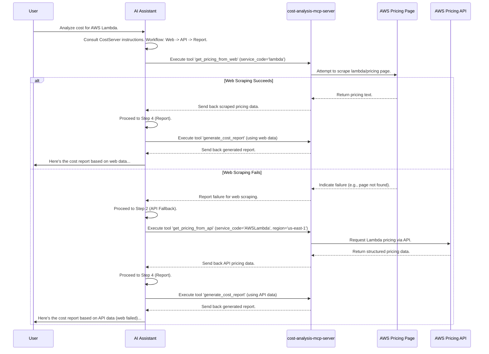

# Chapter 4: Cost Analysis Workflow

In the previous chapters, we explored the building blocks of `gx-aws-mcp`: the [MCP Server (FastMCP)](01_mcp_server__fastmcp_.md) (our specialized department), the [MCP Tool (@mcp.tool)](02_mcp_tool___mcp_tool_.md) (the specific actions the department can perform), and the [MCP Resource (@mcp.resource)](03_mcp_resource___mcp_resource_.md) (the data the department holds).

Now, let's see how these pieces work together to accomplish a complex task. Imagine you ask our AI assistant: "How much would it cost per month to run 1 million AWS Lambda function calls?" How does the assistant reliably figure this out, ensuring it gets the most accurate pricing and presents it clearly?

It follows a specific, predefined procedure: the **Cost Analysis Workflow**.

## What's the Big Idea?

Think of the Cost Analysis Workflow as the official **Standard Operating Procedure (SOP)** or maybe a **recipe** for the "Cost Analysis Department" (our `cost-analysis-mcp-server`). It's a set of rules baked directly into the server's instructions that tells the AI assistant the *exact steps* to follow, *in order*, whenever it needs to perform a cost analysis.

This workflow isn't something you, the user, directly call. Instead, the AI assistant reads the Cost Analysis server's instructions and follows them carefully. This ensures consistency, prioritizes accuracy, and helps avoid making risky guesses about pricing.

## The Steps in the Workflow

The Cost Analysis Workflow defined within the `cost-analysis-mcp-server` follows these key steps:

1.  **Try Web Scraping First (Primary Method):**
    *   **Action:** The AI assistant is instructed to *first* try using the `get_pricing_from_web` [MCP Tool (@mcp.tool)](02_mcp_tool___mcp_tool_.md).
    *   **Why?** The public AWS pricing webpages (like `aws.amazon.com/lambda/pricing`) are often the most up-to-date source. This tool tries to read that page like a human would.
    *   **Goal:** Get the latest official pricing directly from the source.

2.  **Fallback to Pricing API (Secondary Method):**
    *   **Action:** If the `get_pricing_from_web` tool fails (maybe the webpage structure changed, or the page couldn't be reached), the AI assistant is instructed to *then* try the `get_pricing_from_api` [MCP Tool (@mcp.tool)](02_mcp_tool___mcp_tool_.md).
    *   **Why?** The AWS Price List API provides pricing data in a structured format (JSON). It's generally reliable but might sometimes lag slightly behind the website updates.
    *   **Goal:** Get structured pricing data if the primary method fails.

3.  **Special Handling for Amazon Bedrock:**
    *   **Action:** If the cost analysis involves Amazon Bedrock services (like Knowledge Bases or Agents), the AI assistant is *also* instructed to use the `get_bedrock_patterns` [MCP Tool (@mcp.tool)](02_mcp_tool___mcp_tool_.md).
    *   **Why?** Bedrock services often have complex underlying components (like needing specific amounts of OpenSearch Serverless for a Knowledge Base) with their own cost implications. This tool provides information about these patterns and relationships.
    *   **Goal:** Ensure critical cost factors unique to Bedrock are considered.

4.  **Generate the Report:**
    *   **Action:** Finally, using all the pricing data and pattern information gathered, the AI assistant *must* use the `generate_cost_report` [MCP Tool (@mcp.tool)](02_mcp_tool___mcp_tool_.md).
    *   **Why?** This tool takes the raw data and structures it into a clear, understandable report. It forces the inclusion of key details.
    *   **Goal:** Produce a comprehensive report detailing the service, assumptions made (very important!), limitations, cost breakdowns (showing calculations!), potential scaling costs, and optimization recommendations.

**Key Principles:**

*   **Accuracy First:** The workflow prioritizes getting data from official sources.
*   **No Assumptions:** The instructions explicitly tell the AI *not* to guess. If information is uncertain (e.g., database compatibility), it should be excluded, and this exclusion must be mentioned in the report. Providing less *correct* information is better than providing more *wrong* information.
*   **Transparency:** The final report must clearly state where the data came from, what assumptions were made, and what was excluded.

## How the AI Follows the Workflow

The magic here is in the `instructions` parameter we saw when defining the [MCP Server (FastMCP)](01_mcp_server__fastmcp_.md). The `cost-analysis-mcp-server` has detailed instructions that explicitly lay out this workflow for the AI assistant.

Let's look at a *simplified* version of those instructions:

```python
# --- From: src/cost-analysis-mcp-server/awslabs/cost_analysis_mcp_server/server.py ---

# This is part of the FastMCP server definition
mcp = FastMCP(
    name='awslabs.cost-analysis-mcp-server',
    # These instructions guide the AI assistant
    instructions="""Use this server for analyzing AWS service costs.

    REQUIRED WORKFLOW:
    Analyze costs by following these steps in order:

    1. Primary Data Source:
       - MUST first invoke get_pricing_from_web()

    2. Fallback Mechanism 1:
       - If web scraping fails, MUST use get_pricing_from_api()

    3. For Bedrock Services:
       - When analyzing Amazon Bedrock, MUST also use get_bedrock_patterns()

    4. Report Generation:
       - MUST generate cost analysis report using retrieved data via generate_cost_report()
       - The report includes sections for: Overview, Assumptions, Limitations, Cost Breakdown...

    ACCURACY GUIDELINES:
    - EXCLUDE uncertain details rather than making assumptions.
    - PROVIDING LESS INFORMATION IS BETTER THAN GIVING WRONG INFORMATION.
    """,
    # ... other parameters like dependencies ...
)

# ... @mcp.tool definitions for get_pricing_from_web, get_pricing_from_api, etc. ...
```

**Explanation:**

*   The `instructions` field contains plain text that the AI assistant reads and understands.
*   It clearly lists the steps (1, 2, 3, 4) and uses keywords like `MUST` to emphasize the required order.
*   It also includes the `ACCURACY GUIDELINES` reinforcing the principles of avoiding assumptions.

When you ask the AI, "Analyze costs for AWS Lambda," the AI doesn't just randomly call tools. It:
1.  Identifies the `cost-analysis-mcp-server` as the right "department."
2.  Reads these `instructions`.
3.  Follows the steps precisely: "Okay, Step 1 says I MUST call `get_pricing_from_web` first for Lambda."
4.  Calls that tool. If it succeeds, it moves to Step 4 (generate report). If it fails, it proceeds to Step 2 (call `get_pricing_from_api`).

## Under the Hood: A Cost Request Journey

Let's trace the request "Analyze cost for AWS Lambda" using a sequence diagram:



This diagram shows the AI assistant dutifully following the workflow defined in the server's instructions, trying the web first and falling back to the API if needed, before finally generating the report.

## Conclusion

The **Cost Analysis Workflow** isn't a separate piece of code but rather a crucial set of instructions embedded within the `cost-analysis-mcp-server`. It acts as a standard operating procedure, guiding the AI assistant through a predefined sequence of [MCP Tool (@mcp.tool)](02_mcp_tool___mcp_tool_.md) calls: prioritize web scraping, fall back to the API, incorporate specific patterns (like for Bedrock), and finally, generate a detailed, transparent report. This ensures consistency and prioritizes accuracy in cost estimation.

We've now seen how servers, tools, resources, and defined workflows come together. Next, let's explore another capability built using these concepts: generating diagrams from code.

Onwards to [Chapter 5: Diagram Generation](05_diagram_generation.md)!

---

Generated by [AI Codebase Knowledge Builder](https://github.com/The-Pocket/Tutorial-Codebase-Knowledge)