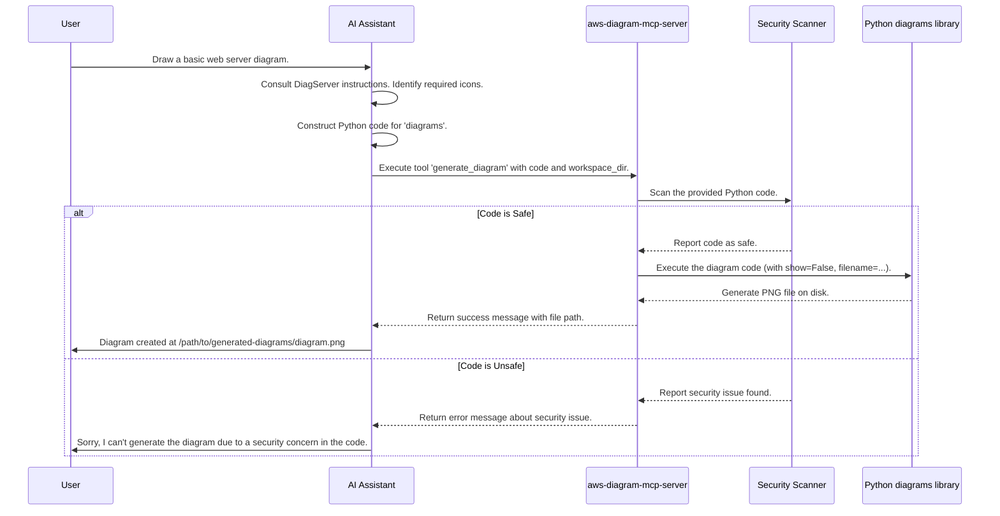

# Chapter 5: Diagram Generation

In [Chapter 4: Cost Analysis Workflow](04_cost_analysis_workflow.md), we saw how the AI assistant follows a strict procedure using multiple tools to get reliable cost estimates. Now, let's explore another cool capability: automatically creating architecture diagrams!

## What's the Big Idea?

Imagine you're designing a new system on AWS. You need a clear picture, an architecture diagram, to show how different parts connect. Drawing these by hand can be time-consuming and tedious, especially if things change.

What if you could just *describe* the architecture in simple code and have a diagram generated automatically? That's exactly what the **Diagram Generation** capability offers!

Think of it like an automated drafting service. You provide instructions in a specific language (Python code using the `diagrams` package), and the `aws-diagram-mcp-server` (our "Diagram Department") creates a visual blueprint (a PNG image file) for you.

**Use Case:** You ask the AI assistant, "Can you draw me a diagram showing a basic web server setup with a load balancer, EC2 instance, and a database?"

## The Diagram Department: `aws-diagram-mcp-server`

This capability is provided by a dedicated [MCP Server (FastMCP)](01_mcp_server__fastmcp_.md) called `aws-diagram-mcp-server`. Its main job is to take Python code written for the popular `diagrams` library and turn it into an image file.

This server offers several helpful [MCP Tool (@mcp.tool)](02_mcp_tool___mcp_tool_.md)s:

1.  **`list_icons`**: Before you draw, you need to know what building blocks (icons for AWS services, generic components, etc.) are available. This tool gives you a complete list, organized by provider (like AWS, Kubernetes, etc.) and service category (like compute, database, network).
2.  **`get_diagram_examples`**: Learning a new way to write code can be tricky. This tool provides ready-to-run example code snippets for different types of diagrams (AWS architectures, flow charts, Kubernetes, etc.). You can use these as starting points.
3.  **`generate_diagram`**: This is the core tool. You provide the Python code describing your diagram, and this tool executes the code to generate the actual PNG image file.

## Safety First: Security Scanning

Wait, the server runs Python code provided by the AI? Isn't that risky?

Yes, running arbitrary code can be dangerous. That's why the `aws-diagram-mcp-server` has a built-in security check. Before executing any diagram code, it uses a tool (internally called `scan_python_code`) to look for potentially harmful commands (like trying to access files it shouldn't, or running system commands).

If the scan finds anything suspicious, the server will refuse to generate the diagram and report the issue. This ensures that only safe diagram code is executed.

## How It Works: From Request to Diagram

Let's revisit our use case: "Draw me a basic web server setup." Here's how the AI assistant, guided by the `aws-diagram-mcp-server`'s instructions, might handle this:

1.  **Understand Request:** The AI understands you want an AWS diagram with specific components.
2.  **(Optional) Check Icons:** The AI might call `list_icons` to confirm the exact names for the Load Balancer (e.g., `ELB`), EC2 instance (`EC2`), and database (`RDS`) icons within the `aws` provider section.
3.  **(Optional) Get Example:** If unsure about the syntax, the AI might call `get_diagram_examples` (requesting `aws` type) to see how to structure the code.
4.  **Write Code:** The AI constructs the Python code using the `diagrams` syntax. It might look something like this (simplified):

    ```python
    # This code describes the diagram structure
    from diagrams import Diagram
    from diagrams.aws.network import ELB
    from diagrams.aws.compute import EC2
    from diagrams.aws.database import RDS

    # The 'with Diagram(...)' block defines the diagram
    # 'show=False' prevents it from popping up a window on the server
    with Diagram("Basic Web Service", show=False):
        # Define the components and their connections (>>)
        ELB("lb") >> EC2("web_server") >> RDS("user_database")
    ```
    *(Note: The actual code sent to the tool might omit the `import` statements as the server pre-imports common things.)*

5.  **Generate Diagram:** The AI calls the `generate_diagram` tool, passing the Python code string. It also *must* provide the `workspace_dir` parameter, telling the server where *your* working directory is, so the generated diagram is saved where you can easily find it (usually in a `generated-diagrams` subfolder).

    ```python
    # Conceptual call from AI to the tool
    tool_call(
        tool_name='generate_diagram',
        parameters={
            "code": 'with Diagram("Basic Web Service", show=False):\n ELB("lb") >> EC2("web_server") >> RDS("user_database")',
            "filename": "web_service_diagram", # Optional: Suggest a name
            "workspace_dir": "/path/to/user/current/folder" # CRITICAL: User's working directory
        }
    )
    ```

6.  **Server Processing:**
    *   The `aws-diagram-mcp-server` receives the request.
    *   It **scans** the Python code for security issues.
    *   If the code is safe, it **executes** the Python code. The `diagrams` library generates the `web_service_diagram.png` file within the specified `workspace_dir` (inside `generated-diagrams`).
    *   The server sends back a confirmation message to the AI, including the path to the generated file (e.g., `/path/to/user/current/folder/generated-diagrams/web_service_diagram.png`).
7.  **Result:** The AI tells you the diagram has been created and provides the path to the PNG file.

## Under the Hood

How does the server manage these tools and the generation process?



1.  The AI Assistant interacts with the `aws-diagram-mcp-server`.
2.  The server uses its registered [MCP Tool (@mcp.tool)](02_mcp_tool___mcp_tool_.md)s. These tools are Python functions decorated with `@mcp.tool`.
3.  Inside the `aws-diagram-mcp-server/server.py` file, you'll find the tool definitions:

    ```python
    # --- File: src/aws-diagram-mcp-server/awslabs/aws_diagram_mcp_server/server.py ---
    # (Simplified view)

    # Import the actual logic functions
    from awslabs.aws_diagram_mcp_server.diagrams_tools import (
        generate_diagram,
        get_diagram_examples,
        list_diagram_icons,
    )
    # Import the server framework
    from mcp.server.fastmcp import FastMCP
    # Assume 'mcp' is our FastMCP instance

    @mcp.tool(name='generate_diagram')
    async def mcp_generate_diagram(code: str, ..., workspace_dir: Optional[str]):
        """Generate a diagram from Python code... (Description for AI)"""
        # This function calls the actual implementation logic
        result = await generate_diagram(code, ..., workspace_dir=workspace_dir)
        return result.model_dump() # Return results as a dictionary

    @mcp.tool(name='get_diagram_examples')
    async def mcp_get_diagram_examples(...):
        """Get example code for different types of diagrams..."""
        result = get_diagram_examples(...)
        return result.model_dump()

    @mcp.tool(name='list_icons')
    async def mcp_list_diagram_icons():
        """List all available icons from the diagrams package..."""
        result = list_diagram_icons()
        return result.model_dump()

    # ... rest of the server setup ...
    ```
    *   The `@mcp.tool` decorator registers each `async def mcp_...` function as a tool the AI can call.
    *   These functions mostly wrap the actual implementation logic found in `aws-diagram-mcp-server/diagrams_tools.py`.

4.  The `generate_diagram` function within `diagrams_tools.py` performs the key steps:
    *   It calls `scan_python_code` from `aws-diagram-mcp-server/scanner.py` to check the input code.
    *   If safe, it prepares the environment and uses Python's `exec` function (carefully) to run the diagram code.
    *   It ensures the diagram is saved to the correct path based on the `workspace_dir`.
    *   It handles timeouts and errors.

## Conclusion

The Diagram Generation capability, powered by the `aws-diagram-mcp-server`, provides an automated way to create architecture diagrams from Python code. It offers tools to discover available icons (`list_icons`), learn the syntax (`get_diagram_examples`), and generate the final image (`generate_diagram`). Crucially, it includes security scanning to ensure only safe code is executed. This turns diagramming from a manual chore into a simple, code-driven task integrated with your AI assistant.

Now that we've seen how to visualize architectures, let's look at how `gx-aws-mcp` can help manage the infrastructure itself using another popular tool.

Next up: [Chapter 6: Terraform Tooling](06_terraform_tooling.md)!

---

Generated by [AI Codebase Knowledge Builder](https://github.com/The-Pocket/Tutorial-Codebase-Knowledge)