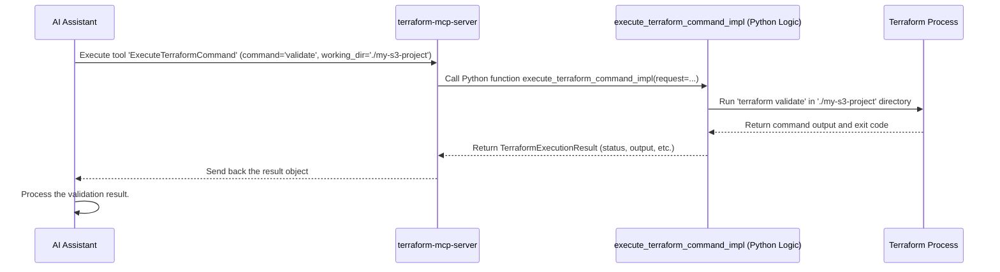

# Chapter 6: Terraform Tooling

Welcome to the final chapter of our `gx-aws-mcp` tutorial! In [Chapter 5: Diagram Generation](05_diagram_generation.md), we saw how to automatically create architecture diagrams from code. Now, let's look at how `gx-aws-mcp` helps you actually build and manage the infrastructure described in your code using Terraform.

## What's the Big Idea?

Terraform is a popular tool for defining and managing your cloud infrastructure (like servers, databases, and networks) using code. But working with Terraform involves several steps: writing the code, looking up documentation, checking for errors, ensuring security, and finally, running the commands to create or change your infrastructure on AWS.

Wouldn't it be great if your AI assistant could help with all these Terraform tasks directly? That's what **Terraform Tooling** provides!

Think of it as a dedicated **"Terraform Command Center"** or "Terraform Department" within `gx-aws-mcp`. This department, implemented as an [MCP Server (FastMCP)](01_mcp_server__fastmcp_.md) called `terraform-mcp-server`, offers a suite of tools specifically designed to help you work with Terraform for AWS.

**Use Case:** Imagine you want to create a simple storage bucket (an S3 bucket) on AWS using Terraform. You'd typically need to:
1.  Find the documentation for the `aws_s3_bucket` resource in Terraform.
2.  Write the Terraform code file (e.g., `main.tf`).
3.  Check if your code syntax is correct (`terraform validate`).
4.  Scan your code for potential security mistakes.
5.  Run the command to create the bucket on AWS (`terraform apply`).

The Terraform Tooling server provides tools to help the AI assistant guide you through (or even perform) each of these steps.

## What Can the Terraform Command Center Do?

The `terraform-mcp-server` offers several helpful services, implemented as [MCP Tool (@mcp.tool)](02_mcp_tool___mcp_tool_.md)s:

1.  **Search Documentation (`SearchAwsProviderDocs`, `SearchAwsccProviderDocs`):** Need to know how to configure an S3 bucket or a Lambda function in Terraform? These tools let the AI search the official documentation for both the standard AWS provider and the newer AWS Cloud Control (AWSCC) provider. It can find descriptions, examples, required settings (arguments), and available outputs (attributes).
2.  **Find Reusable Code Blocks (`SearchSpecificAwsIaModules`):** Instead of writing everything from scratch, you often use pre-built Terraform "modules." This tool helps the AI find specific, high-quality modules maintained by AWS Intelligent Automation (AWS-IA) for common tasks like setting up AI services (Bedrock, SageMaker).
3.  **Run Terraform Commands (`ExecuteTerraformCommand`):** This is the core tool for interacting with your Terraform project. The AI can use it to run standard Terraform commands like `init` (initialize), `validate` (check syntax), `plan` (see changes), `apply` (make changes), and `destroy` (remove infrastructure).
4.  **Check for Security Issues (`RunCheckovScan`):** Writing secure infrastructure code is vital. This tool lets the AI run Checkov, a popular security scanner, directly on your Terraform code to find common misconfigurations or potential vulnerabilities *before* you deploy anything.

## Exploring the Tools with Examples

Let's see how the AI assistant might use these tools.

### 1. Finding Documentation

You ask: "How do I define an S3 bucket in Terraform?"

The AI assistant can use the `SearchAwsProviderDocs` tool:

```python
# Conceptual call from AI to the tool
tool_call(
    tool_name='SearchAwsProviderDocs',
    parameters={
        "asset_name": "aws_s3_bucket",  # What we're looking for
        "asset_type": "resource"        # We want a resource, not a data source
    }
)
```

**Explanation:**
*   `tool_name`: Specifies the documentation search tool for the standard AWS provider.
*   `asset_name`: The name of the Terraform resource (like `aws_s3_bucket`). The tool is smart enough to handle names with or without the `aws_` prefix.
*   `asset_type`: Tells the tool if you're looking for a 'resource' (something Terraform creates) or a 'data_source' (something Terraform reads information about). You can also search for 'both'.

**Result:** The tool returns detailed information found in the documentation, including:
*   A description of the `aws_s3_bucket` resource.
*   Example code snippets showing how to use it.
*   A list of configuration arguments (like `bucket`, `acl`, `tags`).
*   A list of attributes you can reference (like `id`, `arn`).

*(Note: There's also `SearchAwsccProviderDocs` for the newer AWSCC provider, which works similarly.)*

### 2. Running Terraform Commands

You've written your `main.tf` file for the S3 bucket and saved it in a folder, say `./my-s3-project`. You want to check if the code is valid.

The AI assistant uses the `ExecuteTerraformCommand` tool:

```python
# Conceptual call from AI to the tool
tool_call(
    tool_name='ExecuteTerraformCommand',
    parameters={
        "command": "validate",                # The terraform command to run
        "working_directory": "./my-s3-project" # CRITICAL: Where your .tf files are!
    }
)
```

**Explanation:**
*   `command`: Specifies which Terraform command to run (`init`, `plan`, `validate`, `apply`, `destroy`).
*   `working_directory`: This is **very important**. It tells the tool *where* your Terraform code files are located. The command will be run inside this folder.

**Result:** The tool runs `terraform validate` in the specified directory. It returns:
*   The status (`success` or `error`).
*   The output text from the command (e.g., "Success! The configuration is valid.").
*   Any error messages if validation failed.

*(Security Note: Running `apply` or `destroy` makes real changes to your AWS account! The `ExecuteTerraformCommand` tool includes safety checks, and for `apply`/`destroy`, it automatically adds the `-auto-approve` flag, meaning it won't stop and ask for confirmation.)*

### 3. Checking for Security Issues

Before creating the S3 bucket, you want to make sure your code follows security best practices.

The AI assistant uses the `RunCheckovScan` tool:

```python
# Conceptual call from AI to the tool
tool_call(
    tool_name='RunCheckovScan',
    parameters={
        "working_directory": "./my-s3-project", # Directory with the code to scan
        "output_format": "json"                 # Get results in a structured format
    }
)
```

**Explanation:**
*   `working_directory`: Again, tells the tool where your Terraform code is.
*   `output_format`: Specifies how the results should be returned (e.g., `json` for easy processing, or `cli` for text).

**Result:** The tool runs Checkov on the code in the directory. It returns:
*   A status (`success` or `error`).
*   A list of any vulnerabilities found, including the check ID, file path, line number, description, and severity.
*   A summary of how many checks passed, failed, or were skipped.

## Putting It Together: The S3 Bucket Use Case

So, how would the AI assistant use these tools together to help you create that S3 bucket?

1.  **Find Docs:** You ask how to create an S3 bucket. The AI uses `SearchAwsProviderDocs(asset_name='aws_s3_bucket')` to get the details.
2.  **Write Code:** Guided by the documentation, you (or the AI) write the `main.tf` file in `./my-s3-project`.
3.  **Validate:** The AI uses `ExecuteTerraformCommand(command='validate', working_directory='./my-s3-project')`. If it fails, the AI helps you fix the errors based on the output.
4.  **Scan:** The AI uses `RunCheckovScan(working_directory='./my-s3-project')`. If issues are found, the AI explains them and suggests fixes.
5.  **Initialize:** (Often needed before plan/apply) The AI uses `ExecuteTerraformCommand(command='init', working_directory='./my-s3-project')`.
6.  **Plan:** (Optional but recommended) The AI uses `ExecuteTerraformCommand(command='plan', working_directory='./my-s3-project')` to show you what changes will be made.
7.  **Apply:** Once you're ready, the AI uses `ExecuteTerraformCommand(command='apply', working_directory='./my-s3-project')` to create the actual S3 bucket in your AWS account.
8.  **Confirmation:** The tool returns the output from Terraform, confirming the bucket was created.

## Under the Hood

How does the `terraform-mcp-server` make these tools available?

As we learned in [Chapter 2: MCP Tool (@mcp.tool)](02_mcp_tool___mcp_tool_.md), each tool is essentially a Python function within the server code, marked with the `@mcp.tool` decorator. This decorator registers the function with the server, making it callable by the AI assistant.

Here's a simplified sequence diagram showing the AI asking to validate Terraform code:



Inside the `terraform-mcp-server` code (`src/terraform-mcp-server/awslabs/terraform_mcp_server/server.py`), you'd find definitions like these (highly simplified):

```python
# --- File: src/terraform-mcp-server/awslabs/terraform_mcp_server/server.py ---
# (Simplified view)

# Assume 'mcp' is our FastMCP instance
# Import the actual implementation functions
from awslabs.terraform_mcp_server.impl.tools import (
    execute_terraform_command_impl,
    search_aws_provider_docs_impl,
    run_checkov_scan_impl,
    # ... other imports
)
from awslabs.terraform_mcp_server.models import (
    TerraformExecutionRequest, TerraformExecutionResult, # Input/Output models
    # ... other models
)

@mcp.tool(name='ExecuteTerraformCommand')
async def execute_terraform_command(
    command: str, # Simplified args for example
    working_directory: str,
    # ... other params like variables, aws_region
) -> TerraformExecutionResult:
    """Execute Terraform workflow commands... (Description for AI)"""
    # 1. Create a request object from parameters
    request = TerraformExecutionRequest(command=command, working_directory=working_directory, ...)
    # 2. Call the real logic function from the 'impl' folder
    result = await execute_terraform_command_impl(request)
    # 3. Return the result
    return result

@mcp.tool(name='SearchAwsProviderDocs')
async def search_aws_provider_docs(
    asset_name: str, asset_type: str = 'resource'
) -> List[TerraformAWSProviderDocsResult]:
    """Search AWS provider documentation... (Description for AI)"""
    # Call the real logic function
    result = await search_aws_provider_docs_impl(asset_name, asset_type)
    return result

@mcp.tool(name='RunCheckovScan')
async def run_checkov_scan(
    working_directory: str, # Simplified args
    output_format: str = 'json',
    # ... other params like check_ids
) -> CheckovScanResult:
    """Run Checkov security scan... (Description for AI)"""
    # Create request and call implementation
    request = CheckovScanRequest(working_directory=working_directory, output_format=output_format, ...)
    result = await run_checkov_scan_impl(request)
    return result

# ... other tools and resources ...
```

**Explanation:**
*   Each tool the AI can call (`ExecuteTerraformCommand`, `SearchAwsProviderDocs`, `RunCheckovScan`) has a corresponding `async def` function decorated with `@mcp.tool`.
*   The decorator provides the `name` the AI uses and the `description` explaining what the tool does.
*   These wrapper functions typically take the parameters provided by the AI, bundle them into a request object (like `TerraformExecutionRequest`), and then call the *actual* implementation logic function (like `execute_terraform_command_impl`).
*   The real work (running subprocesses, parsing output, fetching docs) happens inside functions located in the `src/terraform-mcp-server/awslabs/terraform_mcp_server/impl/tools/` directory.

## Resources Too!

Besides the action-oriented tools, the `terraform-mcp-server` also provides helpful information as [MCP Resource (@mcp.resource)](03_mcp_resource___mcp_resource_.md)s. These are like documents the AI can request directly using a URI. Examples include:

*   `terraform://development_workflow`: A guide on the recommended steps for developing Terraform code.
*   `terraform://aws_best_practices`: Best practice guidelines for using Terraform with AWS.
*   `terraform://aws_provider_resources_listing`: A categorized list of all available resources in the AWS provider.

The AI can fetch these resources to provide context or guidance. For example, here's how the development workflow guide might be defined:

```python
# --- File: src/terraform-mcp-server/awslabs/terraform_mcp_server/server.py ---
# (Simplified view)
from awslabs.terraform_mcp_server.static import TERRAFORM_WORKFLOW_GUIDE

@mcp.resource(
    name='terraform_development_workflow',
    uri='terraform://development_workflow', # The unique address
    description='Terraform Development Workflow Guide...',
    mime_type='text/markdown', # It's Markdown text
)
async def terraform_development_workflow() -> str:
    """Provides guidance for developing Terraform code."""
    # Simply returns the text content stored elsewhere
    return f'{TERRAFORM_WORKFLOW_GUIDE}'
```

## Conclusion

The Terraform Tooling capability, powered by the `terraform-mcp-server`, acts as a comprehensive command center for managing AWS infrastructure with Terraform. It equips the AI assistant with tools to search documentation (`SearchAwsProviderDocs`, `SearchAwsccProviderDocs`), find modules (`SearchSpecificAwsIaModules`), execute core commands like `init`, `validate`, `plan`, and `apply` (`ExecuteTerraformCommand`), and perform security checks (`RunCheckovScan`). It also provides static knowledge through resources like best practice guides. This integration makes working with Terraform smoother, safer, and more efficient.

This concludes our tutorial on the core concepts of the `gx-aws-mcp` project! We've journeyed from understanding the basic [MCP Server (FastMCP)](01_mcp_server__fastmcp_.md) structure, defining actions with [MCP Tool (@mcp.tool)](02_mcp_tool___mcp_tool_.md), providing data with [MCP Resource (@mcp.resource)](03_mcp_resource___mcp_resource_.md), to seeing how these combine in workflows like [Cost Analysis](04_cost_analysis_workflow.md), [Diagram Generation](05_diagram_generation.md), and now, [Terraform Tooling](06_terraform_tooling.md). We hope this gives you a solid foundation for understanding and potentially extending the capabilities of this powerful AI-driven AWS management framework. Happy building!

---

Generated by [AI Codebase Knowledge Builder](https://github.com/The-Pocket/Tutorial-Codebase-Knowledge)