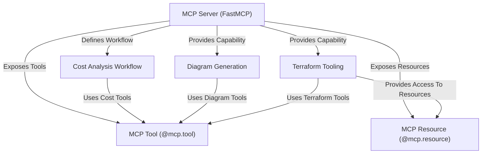

# Tutorial: gx-aws-mcp

This project, **gx-aws-mcp**, uses the *Model Context Protocol (MCP)* to create specialized AI agents called **MCP Servers**.
Each server acts like a focused expert (e.g., for Cost Analysis, Diagram Generation, Terraform).
Servers expose specific actions called **MCP Tools** (`@mcp.tool`) and provide access to specific data via **MCP Resources** (`@mcp.resource`).
This allows an AI assistant to leverage these servers to perform complex AWS-related tasks like *estimating costs*, *generating architecture diagrams*, or *interacting with Terraform configurations*.

**Source Repository:** [None](None)

## Chapters

1. [MCP Server (FastMCP)](01_mcp_server__fastmcp_.md)
2. [MCP Tool (@mcp.tool)](02_mcp_tool___mcp_tool_.md)
3. [MCP Resource (@mcp.resource)](03_mcp_resource___mcp_resource_.md)
4. [Cost Analysis Workflow](04_cost_analysis_workflow.md)
5. [Diagram Generation](05_diagram_generation.md)
6. [Terraform Tooling](06_terraform_tooling.md)

---

Generated by [AI Codebase Knowledge Builder](https://github.com/The-Pocket/Tutorial-Codebase-Knowledge)