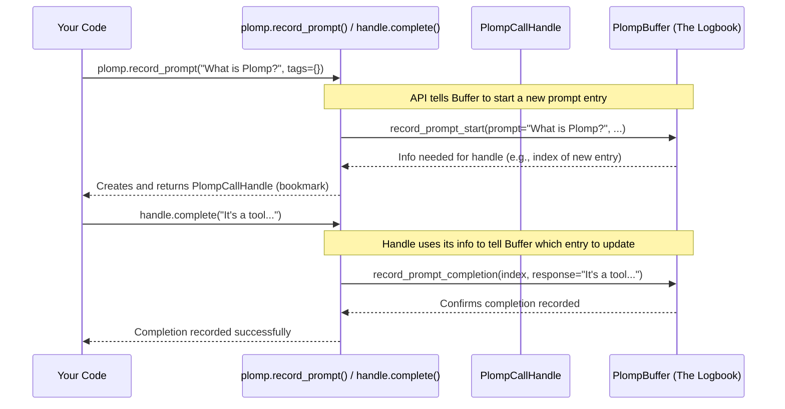

# Chapter 1: Data Recording API

Welcome to Plomp! Imagine you're working with AI, perhaps building a chatbot or using a language model to generate text. It quickly becomes important to keep track of what you asked the AI (the "prompt") and what it answered (the "completion"). Without a good record, it's hard to debug problems, see how well the AI is doing, or even remember what worked best!

Plomp acts like a detailed logbook for these interactions. But how do you actually *write* information into this logbook? That's where the **Data Recording API** comes in. It's the set of tools Plomp gives you to add entries to your log.

In this chapter, we'll learn the basic ways to record information using Plomp. Our main goal will be to understand how to log a simple conversation: asking an AI a question and recording its answer.

## Recording a Prompt and its Completion (The Manual Way)

Let's start with the most common task: recording a prompt you send to an AI and the completion (response) you get back.

Imagine you want to ask an AI, "What is the capital of France?". Plomp provides a function called `record_prompt` to note down that you're *about* to ask this question.

```python
import plomp

# Tell Plomp we are starting a new prompt/completion cycle
prompt_text = "What is the capital of France?"
prompt_handle = plomp.record_prompt(prompt=prompt_text)

print("Recorded the prompt, got a handle:", prompt_handle)
# Example Output: Recorded the prompt, got a handle: <plomp._buffer_items.PlompCallHandle object at ...>
```

Think of `plomp.record_prompt()` like telling your logbook, "Okay, I'm starting a new entry here for a question I'm asking." You give it the `prompt` text.

What does it give back? It returns something called a `PlompCallHandle`. This `handle` is like a unique bookmark or ticket for *this specific prompt entry* in your logbook. We need it to add the AI's answer later.

Now, let's say you send the prompt to your AI, and it replies, "The capital of France is Paris." To add this answer to the correct entry in our Plomp logbook, we use the `complete()` method on the `handle` we received earlier.

```python
# Assume 'prompt_handle' is the handle we got from plomp.record_prompt() above
ai_response = "The capital of France is Paris."

# Use the handle to add the completion to the log entry
prompt_handle.complete(response=ai_response)

print("Added the completion using the handle.")
# Example Output: Added the completion using the handle.
```

By calling `prompt_handle.complete()`, you're essentially telling Plomp, "Remember that prompt I bookmarked earlier? Here's the answer that goes with it."

And that's the basic manual process!
1.  Call `plomp.record_prompt()` when you're about to send a prompt. Get the `handle`.
2.  Get the response from your AI.
3.  Call `handle.complete()` with the response to finish the log entry.

*(We briefly saw `tags` mentioned in the code snippets. Tags are like labels you can attach to your log entries, and we'll explore them fully in the [Tagging System](03_tagging_system.md) chapter.)*

## Recording Other Information: Events

Sometimes, you want to log things that aren't strictly a prompt/completion pair. Maybe you want to record:
*   When a specific error occurred.
*   Which model settings were used for a particular task.
*   User feedback on an AI response.

For this, Plomp provides `record_event()`. It lets you log any structured information you want, as long as you can represent it as a Python dictionary.

```python
import plomp

# Let's record some settings we used
settings = {
    "model_name": "super-ai-1000",
    "temperature": 0.7,
    "max_tokens": 50
}

plomp.record_event(payload=settings)

print("Recorded an event.")
# Example Output: Recorded an event.
```

Here, `payload` is just a standard Python dictionary containing whatever information you find useful to log at that point in your program. `record_event` simply adds this dictionary (along with a timestamp and any optional tags) as a separate entry in the logbook.

## Making Recording Easier: The `wrap_prompt_fn` Decorator

Manually calling `record_prompt` before your AI call and `handle.complete` afterwards works, but it can become repetitive if you have a specific Python function that always handles your AI interactions.

Plomp offers a shortcut: the `@plomp.wrap_prompt_fn()` decorator. A decorator in Python is like a wrapper you can put around a function to add extra behavior automatically.

Let's say you have a function that takes a prompt string and returns the AI's response:

```python
# Imagine this function actually calls an AI
def get_ai_completion(prompt_text: str) -> str:
    print(f" Pretending to send '{prompt_text}' to AI...")
    # Simulate getting a response
    if "France" in prompt_text:
        return "The capital of France is Paris."
    else:
        return "I'm not sure about that."

# Let's call it normally first
response = get_ai_completion("Capital of France?")
print(f"Got response: {response}")
# Example Output:
#  Pretending to send 'Capital of France?' to AI...
# Got response: The capital of France is Paris.
```

This function works, but it doesn't log anything with Plomp yet. Now, let's add the Plomp decorator:

```python
import plomp

# Add the Plomp decorator!
@plomp.wrap_prompt_fn()
def get_ai_completion_logged(prompt_text: str) -> str:
    print(f" Pretending to send '{prompt_text}' to AI...")
    # Simulate getting a response
    if "France" in prompt_text:
        return "The capital of France is Paris."
    else:
        return "I'm not sure about that."

# Now, calling this function automatically logs the prompt and completion!
response = get_ai_completion_logged("Capital of Spain?")
print(f"Got response: {response}")
# Example Output:
#  Pretending to send 'Capital of Spain?' to AI...
# Got response: I'm not sure about that.
# (Behind the scenes, Plomp recorded the prompt and completion!)
```

By simply adding `@plomp.wrap_prompt_fn()` above our function definition, we told Plomp: "Whenever this function is called, automatically do the `record_prompt` and `handle.complete` steps for me."

By default, `wrap_prompt_fn` assumes the *first* argument of the function (`prompt_text` in our case) is the prompt. It then takes whatever the function returns, converts it to a string, and uses that as the completion. You can customize this behavior (e.g., specify a different argument for the prompt using `prompt_arg` or `prompt_kwarg`), but the default often works well.

This decorator is a convenient way to integrate Plomp logging into your existing code with minimal changes.

## How Does It Work Under the Hood?

You might be wondering, where does all this recorded information actually *go*? All the functions we discussed (`record_prompt`, `record_event`, and the `wrap_prompt_fn` decorator) interact with a central object called a [PlompBuffer](04_plompbuffer.md).

Think of the [PlompBuffer](04_plompbuffer.md) as the main logbook file folder. The Data Recording API functions are like a helpful secretary who knows how to create new entries or update existing ones in that folder.

Here’s a simplified step-by-step for the manual `record_prompt` and `complete` flow:



1.  **`plomp.record_prompt(prompt=...)`**: Your code calls this function (the "secretary").
2.  **Inside `record_prompt`**: It talks to the main [PlompBuffer](04_plompbuffer.md) (the "logbook") and asks it to create a *new*, incomplete prompt entry using its internal `record_prompt_start` method.
3.  **`PlompBuffer`**: Creates the entry, notes its location (like an index number).
4.  **Return `PlompCallHandle`**: `record_prompt` creates a `PlompCallHandle` object (the "bookmark"), storing the location info from the buffer, and gives it back to your code.
5.  **`handle.complete(response=...)`**: Your code calls `complete` on the handle.
6.  **Inside `complete`**: The handle uses its stored location info to tell the [PlompBuffer](04_plompbuffer.md) exactly *which* entry to update, providing the response text via the buffer's internal `record_prompt_completion` method.
7.  **`PlompBuffer`**: Finds the entry using the location info and adds the completion details.

Similarly, `plomp.record_event()` directly asks the [PlompBuffer](04_plompbuffer.md) to add a new event entry using its `record_event` method. The `@plomp.wrap_prompt_fn()` decorator essentially inserts the calls to `record_prompt` and `handle.complete` around the execution of your original function.

The actual implementation details live in `plomp/__init__.py` (which defines `record_prompt`, `record_event`, `wrap_prompt_fn`) and `plomp/_core.py` (which defines the `PlompBuffer` class and its methods like `record_prompt_start`). You don't usually need to interact with `_core.py` directly, but knowing it's there helps understand the structure.

```python
# Simplified view from plomp/__init__.py
def record_prompt(prompt: str, ...) -> PlompCallHandle:
    buffer = _get_the_main_logbook() # Gets the PlompBuffer
    return buffer.record_prompt_start(prompt=prompt, ...) # Asks buffer to add

def record_event(payload: dict, ...):
    buffer = _get_the_main_logbook() # Gets the PlompBuffer
    buffer.record_event(payload=payload, ...) # Asks buffer to add

# Simplified view from plomp/_core.py
class PlompBuffer:
    def record_prompt_start(self, prompt: str, ...) -> PlompCallHandle:
        # ... logic to add a new PlompBufferItem to internal list ...
        new_entry_index = len(self._buffer_items) - 1
        return PlompCallHandle(self, new_entry_index) # Return handle

    def record_prompt_completion(self, call_index: int, response: str):
        # ... logic to find item at call_index and add completion ...

    def record_event(self, payload: dict, ...):
        # ... logic to add a new PlompBufferItem to internal list ...
```

## Conclusion

In this chapter, we learned about the Plomp **Data Recording API** – the tools for writing information into your Plomp logbook ([PlompBuffer](04_plompbuffer.md)). We saw how to:

*   Manually record a prompt using `plomp.record_prompt()` and its completion using the returned `PlompCallHandle`'s `.complete()` method.
*   Record arbitrary dictionary data using `plomp.record_event()`.
*   Automatically log prompt/completion cycles for a function using the `@plomp.wrap_prompt_fn()` decorator.

Now that we know *how* to put data *into* the logbook, you might be wondering: what does an entry in the logbook actually look like? What information does it store? In the next chapter, we'll dive into the structure of individual log entries.

Next Up: [Chapter 2: PlompBufferItem](02_plompbufferitem.md)

---

Generated by [AI Codebase Knowledge Builder](https://github.com/The-Pocket/Tutorial-Codebase-Knowledge)