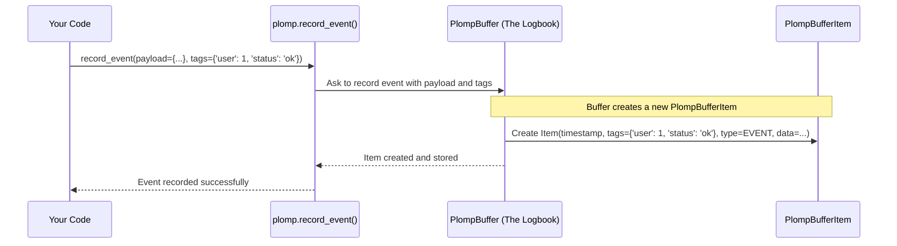

# Chapter 3: Tagging System

In the [previous chapter](02_plompbufferitem.md), we learned that every entry in our Plomp logbook is a [PlompBufferItem](02_plompbufferitem.md), a standardized container holding information like timestamps and the specific data (prompt, event, etc.). But as your logbook grows, how do you find the specific entries you care about? Imagine trying to find all the notes about a specific user or a particular experiment in a giant notebook filled with hundreds of pages! It would be very difficult.

This is where Plomp's **Tagging System** comes to the rescue. It's like giving each page (each `PlompBufferItem`) a set of sticky notes or labels. These labels help you organize your entries and make it incredibly easy to find them later.

## What are Tags? Sticky Notes for Your Log Entries

Think about organizing physical documents. You might use different colored sticky notes or write keywords on tabs. "Urgent," "User 123," "Experiment A," "Needs Review." These labels help you quickly grab the right documents.

In Plomp, **tags** work exactly like this. For every [PlompBufferItem](02_plompbufferitem.md) you create, you can attach a collection of these labels. Specifically, tags are stored as a Python dictionary of **key-value pairs**.

For example, you might tag an entry like this:

```python
# Example tags for a log entry
tags = {
    'user_id': 123,
    'status': 'success',
    'experiment_name': 'color_test_v1',
    'is_test_data': True
}
```

Here:
*   `'user_id'` is a **key** (like the *type* of label), and `123` is its **value**.
*   `'status'` is a key, and `'success'` is its value.
*   And so on...

This set of tags gives the log entry context: it belongs to user 123, the operation was successful, it was part of 'color_test_v1', and it used test data.

## Adding Tags When Recording Data

Plomp makes it easy to add these tags right when you're recording information using the [Data Recording API](01_data_recording_api.md) functions we learned about in Chapter 1.

### Tagging with `record_prompt` and `record_event`

Both `record_prompt` and `record_event` accept an optional `tags` argument. You just pass your dictionary of tags here.

```python
import plomp

# Define some tags
prompt_tags = {'user_id': 456, 'session': 'abc'}

# Record a prompt with tags
prompt_handle = plomp.record_prompt(
    prompt="Generate a short story about a robot.",
    tags=prompt_tags
)
# ... (later complete the prompt)
# prompt_handle.complete("Once upon a time...")

# Define tags for an event
event_tags = {'system_event': True, 'severity': 'info'}
event_payload = {'message': 'User logged out', 'user_id': 456}

# Record an event with tags
plomp.record_event(payload=event_payload, tags=event_tags)

print("Recorded a prompt and an event, both with tags.")
# Output: Recorded a prompt and an event, both with tags.
```

In this example, the prompt entry will be logged with `{'user_id': 456, 'session': 'abc'}`, and the event entry will have `{'system_event': True, 'severity': 'info'}`. If you don't provide the `tags` argument, the entry will simply have an empty dictionary `{}` as its tags.

### Tagging with the `@wrap_prompt_fn` Decorator

The `@plomp.wrap_prompt_fn()` decorator also provides powerful ways to add tags automatically.

**1. Capturing Function Arguments as Tags:**

You can tell the decorator to automatically grab certain arguments passed to your wrapped function and use them as tags.

```python
import plomp

# Tell the decorator to capture 'user_id' and 'model' arguments as tags
@plomp.wrap_prompt_fn(
    capture_tag_kwargs={'user_id', 'model'} # Capture keyword args
)
def ask_ai(prompt_text: str, user_id: int, model: str) -> str:
    print(f" Asking AI (User: {user_id}, Model: {model}): {prompt_text}")
    # ... (pretend to call AI) ...
    return f"AI response for user {user_id}"

# Call the function
response = ask_ai("What's the weather?", user_id=789, model="weather-bot-v2")
print(f"Got response: {response}")

# Output:
#  Asking AI (User: 789, Model: weather-bot-v2): What's the weather?
# Got response: AI response for user 789
# (Behind the scenes, Plomp logged this with tags: {'user_id': 789, 'model': 'weather-bot-v2'})
```

Here, `capture_tag_kwargs={'user_id', 'model'}` tells Plomp: "When `ask_ai` is called, look for keyword arguments named 'user_id' and 'model'. If they exist, add them to the tags dictionary for the log entry." You can also capture positional arguments using `capture_tag_args`.

**2. Adding Extra Fixed or Dynamic Tags:**

Sometimes, you want to add tags that aren't direct arguments of the function. You can pass an `plomp_extra_tags` dictionary when *calling* the decorated function.

```python
import plomp

@plomp.wrap_prompt_fn() # Simple wrapper, no automatic tag capture here
def simple_ask_ai(prompt: str) -> str:
    print(f" Simple ask: {prompt}")
    return "Simple AI reply."

# Add extra tags when calling the function
extra_info = {'environment': 'production', 'critical': False}
response = simple_ask_ai(
    "Ping",
    plomp_extra_tags=extra_info # Special argument for the wrapper
)
print(f"Got response: {response}")

# Output:
#  Simple ask: Ping
# Got response: Simple AI reply.
# (Behind the scenes, Plomp logged this with tags: {'environment': 'production', 'critical': False})
```

The `plomp_extra_tags` argument is special; it's intercepted by the decorator and added to the tags for that specific call, without being passed to the original `simple_ask_ai` function itself.

## Why Use Tags? Finding Your Entries Later

Okay, we've added tags. What's the point? The *main* reason for using tags is to **filter and query** your logbook later.

Imagine you've logged hundreds of prompts and events, each tagged with information like `user_id`, `status`, `experiment_name`, etc. Now, you want to find:
*   All entries for `user_id` 123.
*   All entries where `status` was `'error'`.
*   All entries from `experiment_name` 'color_test_v1' that also had `status` 'success'.

Tags make these kinds of searches incredibly efficient. Plomp provides query capabilities, most notably the `filter` method on a [PlompBuffer](04_plompbuffer.md) or [PlompBufferQuery](05_plompbufferquery.md) object, which heavily relies on these tags.

```python
# --- Preview of querying (details in Chapter 5) ---
# Assume 'my_buffer' is our PlompBuffer logbook

# Find all items tagged with user_id: 123
user_123_items = my_buffer.filter(tags_filter={'user_id': 123})

# Find all items tagged with status: 'error'
error_items = my_buffer.filter(tags_filter={'status': 'error'})

# Find items tagged with BOTH user_id: 456 AND system_event: True
# ('how="all"' means all conditions must match)
specific_items = my_buffer.filter(
    how='all',
    tags_filter={'user_id': 456, 'system_event': True}
)

# Now you can iterate through 'user_123_items', 'error_items', etc.
# to examine the specific log entries that matched.
```

We'll dive deep into querying in [Chapter 5: PlompBufferQuery](05_plompbufferquery.md), but hopefully, you can already see how useful tags are for retrieving exactly the information you need.

## What Can Be a Tag Value?

The keys in your tags dictionary must always be strings (like `'user_id'`, `'status'`). The values can be simple data types:
*   Strings (`'success'`, `'test_run_alpha'`)
*   Integers (`123`, `0`, `-10`)
*   Floating-point numbers (`0.95`, `3.14`)
*   Booleans (`True`, `False`)
*   Dictionaries (Yes, you can have nested dictionaries as tag values! e.g., `{'settings': {'temp': 0.7, 'model': 'gpt-4'}}`)

This flexibility allows you to store rich, structured information in your tags. Plomp defines these allowed types internally as `TagType` in `plomp/_types.py`.

```python
# From plomp/_types.py
TagType = str | dict | bool | int | float # Allowed types for tag values
TagsType = dict[str, TagType] # Type alias for the whole tags dictionary
```

## Under the Hood: Tags in PlompBufferItem

How does Plomp store these tags? It's actually quite simple! As we saw in [Chapter 2](02_plompbufferitem.md), every [PlompBufferItem](02_plompbufferitem.md) has a few standard fields. One of those fields is `tags`.

```python
# Simplified from plomp/_buffer_items.py
from dataclasses import dataclass
import datetime as dt
# ... other imports

@dataclass
class PlompBufferItem:
    timestamp: dt.datetime
    tags: dict # <<< Here it is! The tags dictionary.
    type_: PlompBufferItemType # PROMPT, EVENT, etc.
    _data: ... # The specific data (PlompCallTrace, PlompEvent, etc.)

    # ... other methods and properties ...
```

When you call `plomp.record_prompt(..., tags=my_tags)` or `plomp.record_event(..., tags=my_tags)`, Plomp simply takes the `my_tags` dictionary you provided and stores it directly in the `tags` field of the new `PlompBufferItem` it creates. If you don't provide tags, it just stores an empty dictionary `{}`.

Here's a simplified view of what happens when you record an event with tags:



The tags are just carried along and stored as part of the log entry itself. Later, when you use methods like `filter`, Plomp iterates through the items in the [PlompBuffer](04_plompbuffer.md) and checks the `tags` dictionary of each item against your filter criteria.

## Conclusion

In this chapter, we explored Plomp's **Tagging System**. We learned that:
*   Tags are **key-value pairs** (like sticky notes) attached to each [PlompBufferItem](02_plompbufferitem.md).
*   They are stored as a Python **dictionary**.
*   We can add tags easily when calling `record_prompt`, `record_event`, or using the `@wrap_prompt_fn` decorator.
*   The primary purpose of tags is to **organize and filter** log entries, making it easy to find specific information later using query methods like `filter`.

Tags are fundamental to keeping your Plomp logs manageable and useful. By tagging your entries thoughtfully, you make future analysis and debugging much simpler.

Now that we understand individual log entries ([PlompBufferItem](02_plompbufferitem.md)) and how to label them (Tags), where do all these entries live? They are stored together in the main logbook object. Let's explore that next.

Next Up: [Chapter 4: PlompBuffer](04_plompbuffer.md)

---

Generated by [AI Codebase Knowledge Builder](https://github.com/The-Pocket/Tutorial-Codebase-Knowledge)