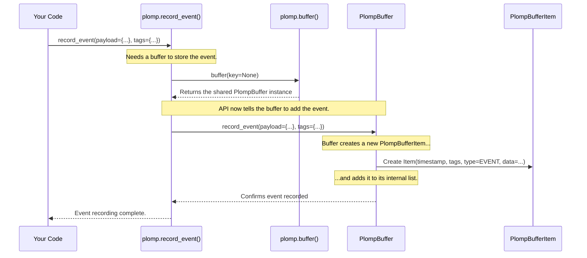

# Chapter 4: PlompBuffer

In the [previous chapter](03_tagging_system.md), we learned how to use the [Tagging System](03_tagging_system.md) to add helpful labels (tags) to our log entries ([PlompBufferItem](02_plompbufferitem.md)s). This helps organize our data. But where do all these labeled entries actually live? We need a central place to store them all together.

Imagine you have a stack of notes (your `PlompBufferItem`s), each with sticky note tags. You wouldn't just leave them scattered on your desk, right? You'd put them in a designated folder or a filing cabinet to keep them organized and safe. In Plomp, that central storage container is called the **`PlompBuffer`**.

## What is a PlompBuffer? Your Digital Logbook

The `PlompBuffer` is the heart of Plomp's storage system. Think of it as:
*   A **specialized logbook**: Where every interaction or event is written down in order.
*   A **digital filing cabinet**: Where each recorded item ([PlompBufferItem](02_plompbufferitem.md)) is filed chronologically.

Essentially, a `PlompBuffer` holds a list of all the [PlompBufferItem](02_plompbufferitem.md)s you've recorded using functions like `record_prompt` and `record_event`. It keeps everything together in one place.

## The Default Buffer vs. Named Buffers

Plomp offers flexibility in how you organize your logs.

*   **The Default Shared Buffer:** By default, if you just start recording events using `plomp.record_prompt()` or `plomp.record_event()` without any extra configuration, Plomp uses a *single, shared* `PlompBuffer` behind the scenes. This is like having one main filing cabinet in an office that everyone uses. It's simple and often sufficient for smaller projects or initial explorations.

*   **Multiple Named Buffers:** Sometimes, you might want to keep different kinds of logs separate. For example, you might want one logbook for user interactions and another for internal system errors. Plomp allows you to create multiple, independent `PlompBuffer` instances, each identified by a unique **key** (which is just a string name you choose). This is like having separate filing cabinets for different projects or departments.

## Getting a Handle on Your Buffer

To work directly with a buffer (either the default one or a named one), you use the `plomp.buffer()` function.

**1. Getting the Default Buffer:**

If you just want the main, shared buffer, call `plomp.buffer()` without any arguments.

```python
import plomp

# Get the default, shared PlompBuffer
default_buffer = plomp.buffer()

print(f"Got the default buffer: {default_buffer}")
# Example Output: Got the default buffer: <plomp._core.PlompBuffer object at ...>
```
This gives you the central logbook object that Plomp uses by default.

**2. Getting a Named Buffer:**

If you want a separate, named buffer (or want to create one if it doesn't exist yet), provide a `key` argument to `plomp.buffer()`.

```python
import plomp

# Get (or create) a buffer specifically for 'project_alpha' logs
project_alpha_buffer = plomp.buffer(key='project_alpha')

# Get (or create) a different buffer for system events
system_event_buffer = plomp.buffer(key='system_events')

print(f"Project Alpha Buffer: {project_alpha_buffer}")
print(f"System Event Buffer: {system_event_buffer}")
# Example Output:
# Project Alpha Buffer: <plomp._core.PlompBuffer object at ...>
# System Event Buffer: <plomp._core.PlompBuffer object at ...>
```
Plomp keeps track of these named buffers. Calling `plomp.buffer(key='project_alpha')` multiple times will always give you back the *same* buffer object associated with that key. This lets different parts of your code access the same named logbook easily.

## How Buffers Store Items

When you use the [Data Recording API](01_data_recording_api.md) functions:

*   `plomp.record_prompt(...)`
*   `plomp.record_event(...)`
*   `@plomp.wrap_prompt_fn(...)`

These functions, by default, add the new [PlompBufferItem](02_plompbufferitem.md) to the **default shared buffer**.

You can also tell these functions to use a *specific* buffer by passing the buffer object using the `buffer=` argument:

```python
import plomp

# Get our named buffer
project_alpha_buffer = plomp.buffer(key='project_alpha')

# Record an event specifically into the 'project_alpha' buffer
project_alpha_buffer.record_event(
    payload={'status': 'initialized'},
    tags={'module': 'main'}
)
# OR, using the top-level function with the buffer argument:
plomp.record_event(
    payload={'status': 'running'},
    tags={'module': 'worker'},
    buffer=project_alpha_buffer # Tell it which buffer to use
)

print(f"Items in project_alpha buffer: {len(project_alpha_buffer)}")
# Example Output: Items in project_alpha buffer: 2
```
Here, we added two event items *only* to the `project_alpha_buffer`. The default buffer remains empty in this specific example.

The `PlompBuffer` essentially keeps an internal list of all the [PlompBufferItem](02_plompbufferitem.md)s added to it. You can easily check how many items are in a buffer using Python's built-in `len()` function.

## Starting Point for Queries

Okay, we have all our log entries nicely stored in a `PlompBuffer`. How do we get them *out*? How do we search for specific items using the tags we learned about?

The `PlompBuffer` object is your starting point for **querying** your logs. It provides methods like `filter()` and `where()` that allow you to specify criteria (like tags or timestamps) to find the entries you need.

```python
import plomp

# Assume default_buffer has some items recorded in it...
default_buffer = plomp.buffer()
# Add some dummy data for the example
plomp.record_event(payload={'value': 1}, tags={'type': 'A'})
plomp.record_event(payload={'value': 2}, tags={'type': 'B'})
plomp.record_event(payload={'value': 3}, tags={'type': 'A'})


# Use the filter method on the buffer to start a query
# Find all items tagged with type: 'A'
query_for_type_A = default_buffer.filter(tags_filter={'type': 'A'})

print(f"Query object created: {query_for_type_A}")
# Example Output: Query object created: <plomp._query.PlompBufferQuery object at ...>

# The query object itself can be iterated over to get matching items
print(f"Found {len(query_for_type_A)} items matching type 'A'")
# Example Output: Found 2 items matching type 'A'
```

Calling methods like `filter()` on a `PlompBuffer` doesn't immediately give you the items. Instead, it returns a `PlompBufferQuery` object. This query object represents your search request and knows how to fetch the matching items from the original buffer. We'll explore exactly how to build and use these queries in the next chapter.

## Under the Hood: A List of Items

What's inside a `PlompBuffer` object? It's actually quite simple conceptually. The core component is a standard Python list that holds all the [PlompBufferItem](02_plompbufferitem.md) objects added to it.

Let's trace what happens when you call `plomp.record_event()`:



1.  Your code calls `plomp.record_event()`.
2.  The `record_event` function needs to know *which* buffer to use. Since none was specified, it asks `plomp.buffer()` for the default buffer (using `key=None`).
3.  `plomp.buffer()` returns the shared `PlompBuffer` instance.
4.  `record_event` then calls the `record_event` method *on the `PlompBuffer` object itself*.
5.  The `PlompBuffer`'s `record_event` method creates a new [PlompBufferItem](02_plompbufferitem.md) with the provided payload and tags, assigns a timestamp, sets the type to `EVENT`, and appends this new item to its internal list (`_buffer_items`).
6.  Confirmation is sent back.

The internal structure is defined in the `plomp/_core.py` file. Here's a simplified view of the `PlompBuffer` class:

```python
# Simplified from plomp/_core.py
import datetime as dt
from typing import Callable, Iterator, List # Added List for clarity
from plomp._buffer_items import PlompBufferItem # Represents a single entry
from plomp._query import PlompBufferQuery # Represents a search query

class PlompBuffer:
    def __init__(self, key: str | None = None, ...):
        self.key = key # The name of the buffer, if any
        # The core storage: a list of log entries!
        self._buffer_items: List[PlompBufferItem] = []
        self.timestamp_fn: Callable[[], dt.datetime] = dt.datetime.now
        # ... other initialization ...

    def record_prompt_start(self, *, prompt: str, tags: dict) -> PlompCallHandle:
        # ... creates a PlompBufferItem of type PROMPT ...
        new_item = PlompBufferItem(...)
        self._buffer_items.append(new_item) # Adds the item to the list
        # ... returns a handle ...

    def record_event(self, *, payload: dict, tags: dict):
        event_time = self.timestamp_fn()
        # Creates a PlompBufferItem of type EVENT
        new_item = PlompBufferItem(
            timestamp=event_time,
            tags=tags,
            type_=PlompBufferItemType.EVENT,
            _data=PlompEvent(payload=payload)
        )
        self._buffer_items.append(new_item) # Adds the item to the list

    def filter(self, *, tags_filter: dict) -> PlompBufferQuery:
        # Creates a Query object, telling it to use this buffer
        return PlompBufferQuery(self).filter(tags_filter=tags_filter)

    def __len__(self) -> int:
        # Returns the number of items in the internal list
        return len(self._buffer_items)

    def __getitem__(self, index: int) -> PlompBufferItem:
        # Allows accessing items by index (like my_buffer[0])
        return self._buffer_items[index]

    def __iter__(self) -> Iterator[PlompBufferItem]:
        # Allows looping through the items (like 'for item in my_buffer:')
        yield from self._buffer_items

    # ... other methods like record_prompt_completion, where, etc. ...
```

This shows the key parts:
*   `_buffer_items`: The list where all recorded `PlompBufferItem`s are stored.
*   Methods like `record_event`: These add new items to the `_buffer_items` list.
*   Methods like `filter`: These create `PlompBufferQuery` objects that know how to search within *this buffer's* `_buffer_items` list.
*   Standard Python methods like `__len__`, `__getitem__`, `__iter__`: These make the buffer behave like a standard Python list or sequence in many ways.

## Conclusion

In this chapter, we explored the **`PlompBuffer`**, the central storage container in Plomp. We learned:
*   It acts like a **logbook or filing cabinet**, holding a chronological list of all recorded [PlompBufferItem](02_plompbufferitem.md)s.
*   Plomp uses a **default shared buffer** if you don't specify one.
*   You can create and access **multiple, independent buffers** using unique `key`s with `plomp.buffer(key=...)`.
*   Recording functions like `record_event` implicitly use the default buffer or can be directed to a specific buffer.
*   The `PlompBuffer` is the **starting point for querying** your logs using methods like `filter()`.

Now that we have our data stored in a `PlompBuffer`, the next logical step is to learn how to effectively search and retrieve specific information from it. That's where querying comes in!

Next Up: [Chapter 5: PlompBufferQuery](05_plompbufferquery.md)

---

Generated by [AI Codebase Knowledge Builder](https://github.com/The-Pocket/Tutorial-Codebase-Knowledge)