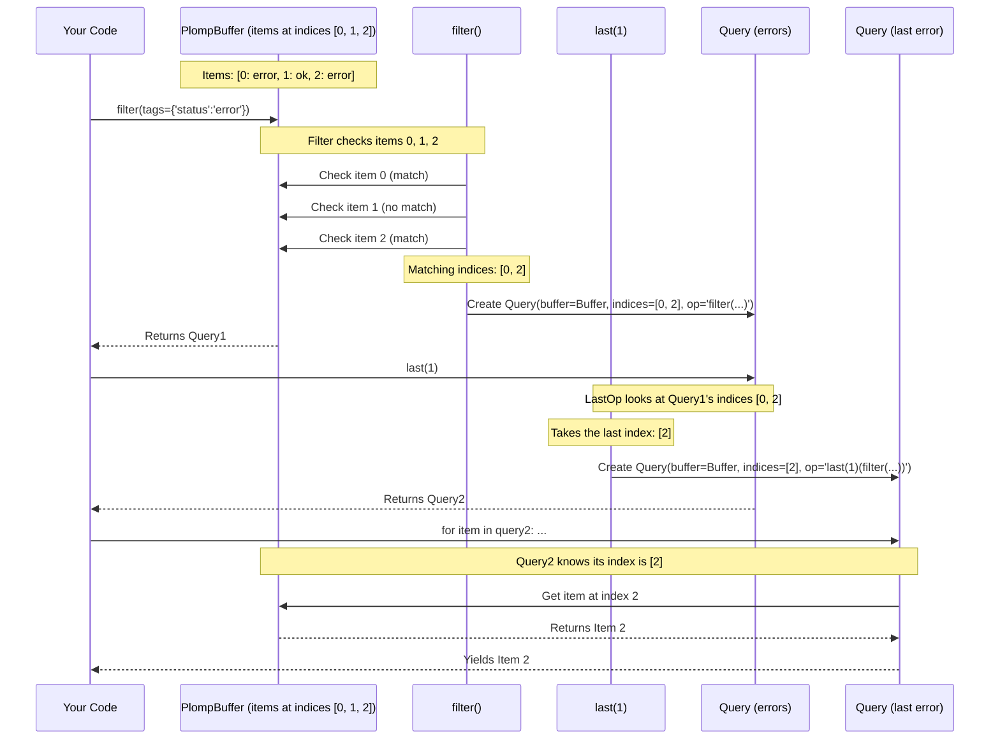

# Chapter 5: PlompBufferQuery - Searching Your Logbook

In the [previous chapter](04_plompbuffer.md), we learned about the [PlompBuffer](04_plompbuffer.md) – the digital filing cabinet where Plomp stores all your recorded log entries ([PlompBufferItem](02_plompbufferitem.md)s). Having all entries in one place is great, but how do you find specific ones? What if you only want to see errors? Or only entries related to a particular user? You need a way to search!

This is where **`PlompBufferQuery`** comes in. Think of it as the search engine for your Plomp logbook. It lets you define criteria (like "find all entries tagged 'error'") and retrieve only the items that match, without changing the original logbook itself.

## The Need for Searching: Finding Needles in a Haystack

Imagine your application has been running for a while, and your [PlompBuffer](04_plompbuffer.md) contains thousands of entries: prompts, completions, events. Now, you need to investigate a bug reported by User 123. You'd want to see all log entries specifically tagged with `{'user_id': 123}`. Scrolling through thousands of entries manually is impossible!

`PlompBufferQuery` provides the tools to precisely ask your logbook questions like:
*   "Show me all entries tagged with `user_id: 123`."
*   "Find the *last 5* entries that were tagged as `status: 'error'`."
*   "Get the *first* prompt recorded after a specific timestamp."

## What is a PlompBufferQuery?

A `PlompBufferQuery` is an object that represents a *search operation* on a [PlompBuffer](04_plompbuffer.md). Key things to remember:

1.  **It's a Search, Not an Edit:** Running a query doesn't change or delete anything in the original [PlompBuffer](04_plompbuffer.md). It just finds the items that match your criteria.
2.  **It Creates a View:** The result of a query is like a temporary, filtered view of your buffer, showing only the selected items.
3.  **It Uses Criteria:** You specify *what* you're looking for using things like tags (from the [Tagging System](03_tagging_system.md)) or the position of items (like the first or last ones).
4.  **It's Chainable:** You can build complex searches by applying multiple query operations one after another. Like filtering first, then taking the last few results.

## Starting a Query: Filtering the Buffer

Queries usually start by calling a method on your [PlompBuffer](04_plompbuffer.md) object. The most common starting point is the `.filter()` method, which lets you search based on tags.

Let's say we have our default buffer and want to find all items tagged with `'status': 'error'`.

```python
import plomp

# Get the default buffer (assume it has items)
my_buffer = plomp.buffer()

# --- Add some example data for demonstration ---
plomp.record_event(payload={'code': 500}, tags={'status': 'error', 'source': 'api'})
plomp.record_event(payload={'user': 1}, tags={'status': 'ok', 'source': 'login'})
plomp.record_event(payload={'code': 404}, tags={'status': 'error', 'source': 'web'})
# --- End of example data ---

# Start a query: Filter for items where the tag 'status' is 'error'
error_query = my_buffer.filter(tags_filter={'status': 'error'})

print(f"Created a query object: {error_query}")
# Example Output: Created a query object: <plomp._query.PlompBufferQuery object at ...>
```
Calling `my_buffer.filter(...)` doesn't immediately give us the log items. Instead, it returns a `PlompBufferQuery` object. This object now *represents* the search "find items tagged with `status: 'error'` within `my_buffer`".

## Refining Your Search: Chaining Operations

The cool thing about `PlompBufferQuery` objects is that they also have methods like `filter()`, `first()`, `last()`, etc. When you call one of these methods on a query object, it doesn't search the *entire* buffer again. Instead, it refines the *results of the previous step* and returns a *new* `PlompBufferQuery` object representing the refined search.

Let's continue our example. We have `error_query` which found all error items. Now, maybe we only want the *most recent* error. We can use the `.last()` method on our existing query:

```python
# Assume 'error_query' is the query object from the previous step

# Refine the query: From the error items, get the last one
latest_error_query = error_query.last(size=1)

print(f"Refined query for the last error: {latest_error_query}")
# Example Output: Refined query for the last error: <plomp._query.PlompBufferQuery object at ...>
```
Now, `latest_error_query` represents the search: "find items tagged with `status: 'error'` within `my_buffer`, *and then* take the last 1 item from that result."

You can chain multiple operations together:

```python
# Find items tagged 'source':'api', then filter those for 'status':'error',
# and finally take the first one.
specific_item_query = my_buffer.filter(
    tags_filter={'source': 'api'}
).filter(
    tags_filter={'status': 'error'}
).first(size=1)

print(f"Chain query: {specific_item_query}")
# Example Output: Chain query: <plomp._query.PlompBufferQuery object at ...>
```
This makes building complex searches feel like assembling building blocks.

## Common Query Operations

Here are some of the most useful methods available on both `PlompBuffer` and `PlompBufferQuery` objects:

*   **`filter(tags_filter={...}, how='any'|'all'|'none')`**:
    *   Finds items based on tags. `tags_filter` is a dictionary where keys are tag names and values are the tag values (or a list of values) to match.
    *   `how='any'` (default): Matches if *at least one* tag in `tags_filter` matches the item's tags.
    *   `how='all'`: Matches only if *all* tags in `tags_filter` match the item's tags.
    *   `how='none'`: Matches if *none* of the tags in `tags_filter` match the item's tags.

    ```python
    # Find items tagged with EITHER status:'error' OR source:'web'
    query_any = my_buffer.filter(
        how='any',
        tags_filter={'status': 'error', 'source': 'web'}
    )

    # Find items tagged with BOTH status:'error' AND source:'web'
    query_all = my_buffer.filter(
        how='all',
        tags_filter={'status': 'error', 'source': 'web'}
    )
    ```

*   **`first(size=1)`**:
    *   Takes the first `size` items from the current results.

    ```python
    # Get the first 2 items in the entire buffer
    first_two_query = my_buffer.first(size=2)

    # Get the first error item found by error_query
    first_error_query = error_query.first(size=1)
    ```

*   **`last(size=1)`**:
    *   Takes the last `size` items from the current results.

    ```python
    # Get the very last item added to the buffer
    last_item_query = my_buffer.last(size=1)

    # Get the last 2 error items found by error_query
    last_two_errors_query = error_query.last(size=2)
    ```

*   **`union(other_query)`**:
    *   Combines the results of the current query with another query (`other_query`). It returns items present in *either* query result.

    ```python
    errors = my_buffer.filter(tags_filter={'status': 'error'})
    logins = my_buffer.filter(tags_filter={'source': 'login'})

    # Get items that are either errors OR logins
    combined_query = errors.union(logins)
    ```

*   **`intersection(other_query)`**:
    *   Finds items that are present in *both* the current query and `other_query`.

    ```python
    api_items = my_buffer.filter(tags_filter={'source': 'api'})
    error_items = my_buffer.filter(tags_filter={'status': 'error'})

    # Get items that are BOTH from the 'api' AND have 'status':'error'
    # (Alternative to using filter with how='all')
    api_errors_query = api_items.intersection(error_items)
    ```
*   **`where(truth_fn=...)`**:
    *   A more advanced filter that uses a custom function (`truth_fn`). The function receives a [PlompBufferItem](02_plompbufferitem.md) and should return `True` if the item should be included, `False` otherwise.

    ```python
    # Find events where the payload dictionary contains a 'code' key >= 500
    severe_error_query = my_buffer.where(
        truth_fn=lambda item: (
            item.type_ == plomp.PlompBufferItemType.EVENT and
            'code' in item.event.payload and
            item.event.payload['code'] >= 500
        )
    )
    ```

## Getting the Actual Log Items

So far, we've only created `PlompBufferQuery` objects that *represent* our search. How do we get the actual [PlompBufferItem](02_plompbufferitem.md)s that matched?

It's simple! The `PlompBufferQuery` object itself is **iterable**. You can use it directly in a `for` loop:

```python
# Recall error_query finds items with status: 'error'
error_query = my_buffer.filter(tags_filter={'status': 'error'})

print(f"Found {len(error_query)} error items.") # Yes, len() works!

# Loop through the results
for item in error_query:
    print(f" - Timestamp: {item.timestamp}, Tags: {item.tags}")
    # You can inspect item.type_, item.call_trace, item.event etc. here
    if item.type_ == plomp.PlompBufferItemType.EVENT:
        print(f"   Payload: {item.event.payload}")

# Example Output:
# Found 2 error items.
#  - Timestamp: 2023-10-27..., Tags: {'status': 'error', 'source': 'api'}
#    Payload: {'code': 500}
#  - Timestamp: 2023-10-27..., Tags: {'status': 'error', 'source': 'web'}
#    Payload: {'code': 404}
```
You can also get a specific item by index from the query results:

```python
# Get the first item matched by error_query
first_match = error_query[0]
print(f"First error item's tags: {first_match.tags}")

# Get the second item matched by error_query
second_match = error_query[1]
print(f"Second error item's tags: {second_match.tags}")

# Example Output:
# First error item's tags: {'status': 'error', 'source': 'api'}
# Second error item's tags: {'status': 'error', 'source': 'web'}
```

## Recording Your Queries (Meta-Logging!)

Sometimes, it's useful to log the fact that you performed a search. Maybe you want to track which searches are common or audit how data is being accessed. Plomp allows you to record a `PlompBufferQuery` itself as a new entry in the buffer!

You do this using the `.record()` method on the query object:

```python
# Assume error_query is our query for errors
error_query = my_buffer.filter(tags_filter={'status': 'error'})

# Record this query operation back into the buffer
error_query.record(tags={'query_user': 'admin', 'reason': 'debugging'})

print("Recorded the query operation itself into the buffer.")

# Now, if you look at the last item in the buffer, it will be of type QUERY
last_item = my_buffer.last(1)[0] # Get the last item
print(f"Last item type: {last_item.type_}")
print(f"Last item tags: {last_item.tags}")
print(f"Recorded query details: {last_item.query.op_name}")

# Example Output:
# Recorded the query operation itself into the buffer.
# Last item type: PlompBufferItemType.QUERY
# Last item tags: {'query_user': 'admin', 'reason': 'debugging'}
# Recorded query details: filter[how='any', tags={'status': ['error']}]('<buffer>')
```
This adds a new [PlompBufferItem](02_plompbufferitem.md) with `type_ = PlompBufferItemType.QUERY`. The `_data` for this item holds information about the query that was run (`op_name`) and the indices it matched (`matched_indices`), along with the tags you provided to the `.record()` call.

## Under the Hood: Indices and Chaining

How does `PlompBufferQuery` work internally without copying all the data around? It's quite clever!

A `PlompBufferQuery` object primarily stores three things:
1.  **`buffer`**: A reference back to the original [PlompBuffer](04_plompbuffer.md) it's searching within.
2.  **`matched_indices`**: A sorted list of *index numbers*. These indices tell the query which positions in the original buffer's internal list of items currently match the query criteria.
3.  **`op_name`**: A string describing the sequence of operations that led to this query state (useful for debugging and recording queries).

Let's trace `my_buffer.filter(tags_filter={'status': 'error'}).last(1)`:



1.  **`my_buffer.filter(...)`**:
    *   This method (defined in `PlompBuffer`) creates an initial `PlompBufferQuery` object (let's call it `query1`).
    *   Inside `filter`, it iterates through *all* indices of `my_buffer` (0, 1, 2).
    *   It checks the tags of the item at each index against `{'status': 'error'}`.
    *   It finds matches at index 0 and index 2.
    *   It creates `query1` storing a reference to `my_buffer`, the list `matched_indices=[0, 2]`, and an `op_name` like `"filter[...]"`.
2.  **`.last(1)`** (called on `query1`):
    *   This method (defined in `PlompBufferQuery`) takes the `matched_indices` from `query1` (which is `[0, 2]`).
    *   It applies the "last 1" logic to this list, resulting in `[2]`.
    *   It creates a *new* `PlompBufferQuery` object (`query2`) storing the reference to `my_buffer`, the new list `matched_indices=[2]`, and an updated `op_name` like `"last[1](filter[...])"`.
3.  **`for item in query2:`**:
    *   The loop asks `query2` for its items.
    *   `query2` looks at its `matched_indices` (`[2]`).
    *   For each index in its list (just `2`), it asks the original `my_buffer` for the item at that index (`my_buffer[2]`).
    *   It yields the item it receives from the buffer.

This way, only the small list of index numbers is passed along and modified during chaining, not the potentially large log entries themselves. The actual items are only retrieved from the buffer when you iterate over the final query result.

Here's a peek at the simplified internal structure from `plomp/_query.py`:

```python
# Simplified from plomp/_query.py
from typing import Callable, Iterable, TYPE_CHECKING

if TYPE_CHECKING:
    from plomp._core import PlompBuffer # Reference to the buffer
    from plomp._buffer_items import PlompBufferItem # The item type

@dataclass(slots=True, kw_only=True)
class PlompBufferQuery:
    buffer: "PlompBuffer"
    matched_indices: list[int] # The important list of indices!
    op_name: str # Tracks the operations

    def __init__(
        self,
        buffer: "PlompBuffer",
        *,
        matched_indices: Iterable[int] | None = None,
        op_name: str | None = None,
    ):
        self.buffer = buffer
        # If no indices given, start with ALL indices from the buffer
        self.matched_indices = sorted(
            list(range(len(buffer))) if matched_indices is None else matched_indices
        )
        self.op_name = op_name or "<buffer>" # Default name

    # Helper method used by filter, where, etc.
    def _where(
        self, *, truth_fn: Callable[["PlompBufferItem"], bool], condition_op_name: str
    ) -> "PlompBufferQuery":
        new_matched_indices = []
        # Iterate through CURRENTLY matched indices
        for i in self.matched_indices:
            # Get the item from the buffer and check the condition
            if truth_fn(self.buffer[i]):
                new_matched_indices.append(i) # Keep index if condition met

        # Return a NEW query object with the refined indices
        return PlompBufferQuery(
            buffer=self.buffer,
            matched_indices=new_matched_indices,
            op_name=f"{condition_op_name}({self.op_name})", # Update op_name
        )

    def filter(self, *, tags_filter: dict, how: str = "any") -> "PlompBufferQuery":
        # ... (complex logic to build the right truth_fn based on tags_filter and how)
        truth_fn = lambda item: _check_tags(item.tags, tags_filter, how)
        condition_op_name = f"filter[how={how}, tags={tags_filter}]"
        return self._where(truth_fn=truth_fn, condition_op_name=condition_op_name)

    def last(self, size: int = 1) -> "PlompBufferQuery":
        # Apply slicing to the CURRENT matched_indices
        new_matched_indices = self.matched_indices[-size:]
        # Return a NEW query object
        return PlompBufferQuery(
            buffer=self.buffer,
            matched_indices=new_matched_indices,
            op_name=f"last[size={size}]({self.op_name})", # Update op_name
        )

    def __iter__(self):
        # When iterating, get items from buffer using stored indices
        for matched_index in self.matched_indices:
            yield self.buffer[matched_index]

    def __len__(self):
        # Length is just the number of matched indices
        return len(self.matched_indices)

    def __getitem__(self, i: int) -> "PlompBufferItem":
         # Get item by index within the matched results
         actual_buffer_index = self.matched_indices[i]
         return self.buffer[actual_buffer_index]

    # ... other methods like first, union, intersection, where, record ...
```
This simplified code highlights how each operation (`filter`, `last`) takes the current `matched_indices`, calculates a new list based on its logic, and then creates and returns a *new* `PlompBufferQuery` instance with this updated list and operation name.

## Conclusion

In this chapter, we dove into **`PlompBufferQuery`**, Plomp's powerful mechanism for searching and selecting data from your [PlompBuffer](04_plompbuffer.md) logbook. We learned that:

*   Queries act like a search engine, creating filtered views without modifying the original buffer.
*   Queries typically start from a `PlompBuffer` (e.g., `buffer.filter(...)`).
*   Query operations (`filter`, `first`, `last`, `union`, etc.) can be **chained** together to build complex searches step-by-step.
*   Each operation returns a *new* query object, efficiently managing results using a list of `matched_indices`.
*   You retrieve the actual [PlompBufferItem](02_plompbufferitem.md)s by iterating over the final query object (e.g., using a `for` loop or `len()`).
*   Queries themselves can optionally be recorded back into the buffer for auditing purposes.

`PlompBufferQuery` gives you the flexibility to slice, dice, and retrieve exactly the log information you need, which is essential for debugging, analysis, and understanding your AI application's behavior.

Now that we know how to record data, structure it, tag it, store it, and query it, how do we save our logbook for later use, load it back, or present the data in a human-readable format? That's what we'll explore next.

Next Up: [Chapter 6: Persistence and Rendering](06_persistence_and_rendering.md)

---

Generated by [AI Codebase Knowledge Builder](https://github.com/The-Pocket/Tutorial-Codebase-Knowledge)