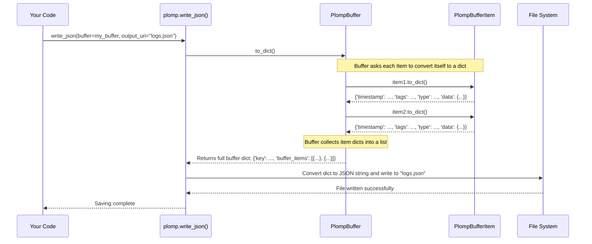
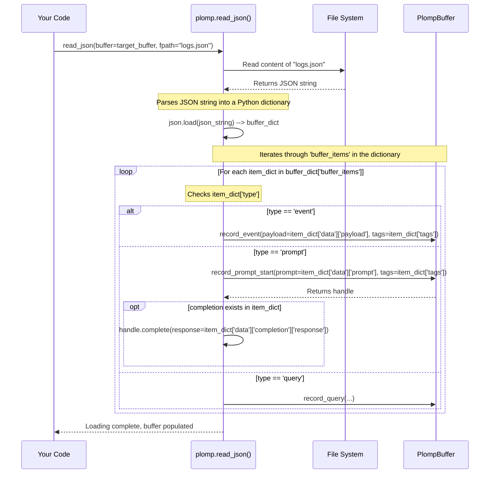
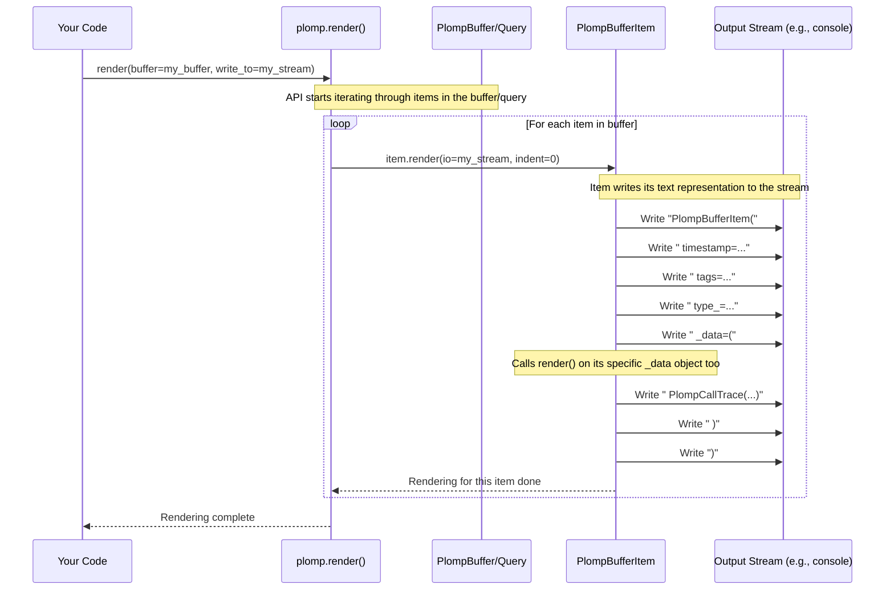

# Chapter 6: Persistence and Rendering

In the [previous chapter](05_plompbufferquery.md), we learned how to use [PlompBufferQuery](05_plompbufferquery.md) to search and filter our log entries stored in a [PlompBuffer](04_plompbuffer.md). We can find exactly the information we need! But what happens when our program finishes running? All the logs stored in the `PlompBuffer` (which usually lives just in the computer's memory) will disappear.

Imagine writing detailed notes in a physical logbook all day, only to have it vanish overnight! That wouldn't be very useful. We need ways to:
1.  **Save** our logbook (`PlompBuffer`) to a file so we can keep it permanently.
2.  **Load** a saved logbook back into Plomp later.
3.  **View** the contents of our logbook in a convenient format, either as a detailed report or a quick summary.

This is where Plomp's **Persistence and Rendering** features come in. They provide the tools to save your logs, load them back, and display them.

## Why Save and View Your Logs?

Think about why you keep logs in the first place:
*   **Debugging:** When something goes wrong, you need to look back at the logs to see what happened.
*   **Analysis:** You might want to analyze patterns in AI interactions over time.
*   **Sharing:** You might need to share logs with colleagues or attach them to bug reports.
*   **Archiving:** Keep records for compliance or long-term tracking.

To do any of these things, you need to be able to get your logs *out* of the running program and into a more permanent or viewable format.

## Saving Your Logbook: Persistence

Plomp offers two main ways to save the entire contents of a [PlompBuffer](04_plompbuffer.md) to a file.

**1. Saving as Raw Data: `write_json()`**

Sometimes, you just want the raw data. You might want to load it back into Plomp later, process it with another program, or store it efficiently. The `plomp.write_json()` function saves your buffer's content in **JSON** format. JSON (JavaScript Object Notation) is a standard text format that's easy for computers to read and write.

```python
import plomp

# Get the buffer (assume it has some log entries)
my_buffer = plomp.buffer()
# Example: Add an item so the buffer isn't empty
plomp.record_event(payload={'status': 'ready'}, tags={'app': 'main'})

# Specify the filename where you want to save the data
output_filename = "my_logs.json"

# Save the buffer to the JSON file
plomp.write_json(buffer=my_buffer, output_uri=output_filename)

print(f"Buffer saved to {output_filename}")
# Output: Buffer saved to my_logs.json
```
This creates a file named `my_logs.json` containing all the information from `my_buffer` (timestamps, tags, prompts, events, etc.) structured as JSON. It's like exporting your logbook's raw text into a file.

**2. Saving as an Interactive Report: `write_html()`**

Raw JSON is great for computers, but not very friendly for humans to read directly. If you want to easily browse, search, and visualize your logs, `plomp.write_html()` is the perfect tool. It takes your buffer's data and embeds it within a self-contained **HTML** file. This HTML file includes an interactive viewer right in your web browser!

```python
import plomp

# Get the buffer (assume it has some log entries)
my_buffer = plomp.buffer()
# Example: Add some items
plomp.record_prompt(prompt="What is Plomp?", tags={'topic': 'meta'})
plomp.record_event(payload={'error': 'connection failed'}, tags={'severity': 'high'})

# Specify the HTML filename
output_filename = "my_logs_report.html"

# Save the buffer to the interactive HTML file
plomp.write_html(buffer=my_buffer, output_uri=output_filename)

print(f"Interactive report saved to {output_filename}")
# Output: Interactive report saved to my_logs_report.html
```
Now, you can open `my_logs_report.html` in any web browser. You'll see a nicely formatted view of your logs, often with features to filter, search, and inspect individual entries. It's like generating a dynamic, clickable report from your logbook.

## Loading Your Logbook: Repopulating a Buffer

Okay, you saved your logs using `write_json()`. How do you get them back into a Plomp buffer later, maybe in a different program run or on a different computer? You use `plomp.read_json()`.

This function reads a JSON file (that was previously created by `write_json`) and adds its contents into an *existing* [PlompBuffer](04_plompbuffer.md) object.

```python
import plomp
import os # Needed for checking if file exists

json_filename = "my_logs.json" # The file saved earlier

# First, make sure the file exists
if not os.path.exists(json_filename):
    print(f"Error: File '{json_filename}' not found. Please run the saving example first.")
else:
    # Create a new, empty buffer (or get an existing one)
    # The loaded data will be ADDED to this buffer.
    target_buffer = plomp.buffer(key='loaded_logs')
    print(f"Buffer before loading: {len(target_buffer)} items")

    # Load the data from the JSON file into the buffer
    plomp.read_json(buffer=target_buffer, fpath=json_filename)

    print(f"Buffer after loading: {len(target_buffer)} items")
    # Example Output (if my_logs.json had 1 item):
    # Buffer before loading: 0 items
    # Buffer after loading: 1 items
```
Important: `read_json` *adds* the items from the file to the buffer you provide. If the buffer already had items, the new items from the file will be appended to the end.

## Viewing Your Logs Directly: Rendering

Sometimes you don't need a fancy HTML report or a raw JSON file. You just want a quick text summary of your logs printed to the screen (or maybe saved to a simple text file). For this, Plomp provides the `plomp.render()` function.

It takes a [PlompBuffer](04_plompbuffer.md) (or even a [PlompBufferQuery](05_plompbufferquery.md) result!) and writes a simple, human-readable text representation of each item to a specified output stream (like your console).

```python
import plomp
import io # Needed to render to a string buffer

# Get the buffer (assume it has items)
my_buffer = plomp.buffer()
# Example: Add items if buffer is empty from previous examples
if not my_buffer:
    plomp.record_prompt("Test prompt", tags={'run': 1}).complete("Test response")
    plomp.record_event({'value': 10}, tags={'run': 1})

# To print directly to the console (standard output):
# import sys
# print("--- Rendering to Console ---")
# plomp.render(my_buffer, write_to=sys.stdout)

# To render to a string variable:
string_io = io.StringIO() # Create an in-memory text stream
plomp.render(my_buffer, write_to=string_io)

# Get the rendered text from the stream
rendered_text = string_io.getvalue()
print("--- Rendered Text ---")
print(rendered_text)

# Example Output (structure depends on items, will be detailed text):
# --- Rendered Text ---
# PlompBufferItem(
#  timestamp=datetime.datetime(...),
#  tags={'run': 1},
#  type_=<PlompBufferItemType.PROMPT: 'prompt'>,
#  _data=(
#   PlompCallTrace(
#    prompt='Test prompt',
#    completion=PlompCallCompletion(completion_timestamp=datetime.datetime(...), response='Test response')
#   )
#  )
# )
#
# PlompBufferItem(
#  timestamp=datetime.datetime(...),
#  tags={'run': 1},
#  type_=<PlompBufferItemType.EVENT: 'event'>,
#  _data=(
#   PlompEvent(
#    payload={'value': 10}
#   )
#  )
# )
#
```
The `render()` function gives you a detailed, Python-like representation of each [PlompBufferItem](02_plompbufferitem.md) in the buffer or query result. It's useful for quick inspection during development.

## Under the Hood: How Saving, Loading, and Rendering Work

Let's peek behind the curtain to see how Plomp handles these operations.

**`write_json()` and `write_html()`**

Both saving functions rely on converting the [PlompBuffer](04_plompbuffer.md) and its items into a standard dictionary format first.



1.  You call `plomp.write_json(buffer, output_uri)`.
2.  The function calls the `buffer.to_dict()` method.
3.  The `PlompBuffer`'s `to_dict()` method iterates through its internal list of [PlompBufferItem](02_plompbufferitem.md)s.
4.  For each `PlompBufferItem`, it calls *that item's* `to_dict()` method.
5.  Each item converts its data (timestamp, tags, type, specific data like prompt/payload) into a dictionary. Timestamps are typically converted to standard ISO format strings.
6.  The buffer collects these item dictionaries into a list under the key `"buffer_items"`.
7.  The final buffer dictionary is returned to `write_json()`.
8.  `write_json()` uses Python's standard `json.dump()` to convert this dictionary into a JSON string and write it to the specified file.

`write_html()` works similarly: it calls `buffer.to_dict()` to get the data as a dictionary, converts it to JSON, but then it loads an HTML template file and injects the JSON data into a specific place within that template before writing the final HTML content to the output file.

Let's look at the simplified code involved from `plomp/_core.py`, `plomp/_buffer_items.py`, and `plomp/_progress.py`:

```python
# Simplified from plomp/_buffer_items.py
# (Showing to_dict on PlompBufferItem)
class PlompBufferItem:
    # ... (timestamp, tags, type_, _data fields) ...
    def to_dict(self) -> dict:
        return {
            "timestamp": self.timestamp.isoformat(), # Convert timestamp to string
            "tags": self.tags,
            "type": self.type_.value, # Use enum value (e.g., "prompt")
            # Call to_dict on the specific data object (PlompCallTrace, PlompEvent, etc.)
            "data": self._data.to_dict(),
        }
    # ... (other methods) ...

# Simplified from plomp/_core.py
# (Showing to_dict on PlompBuffer)
class PlompBuffer:
    # ... (key, _buffer_items list) ...
    def to_dict(self) -> dict:
        return {
            "key": self.key,
            # Create a list by calling to_dict() on each item in the buffer
            "buffer_items": [
                buffer_item.to_dict() for buffer_item in self._buffer_items
            ],
        }
    # ... (other methods) ...

# Simplified from plomp/_progress.py
# (Showing write_json)
import json

def write_json(buffer: PlompBuffer, output_uri: str):
    # 1. Get the dictionary representation from the buffer
    json_contents = buffer.to_dict()

    # 2. Open the file and write the dictionary as JSON
    with open(output_uri, "w", encoding="utf-8") as f:
        json.dump(json_contents, f) # Python's standard JSON writing

# Simplified from plomp/_progress.py
# (Showing write_html)
def write_html(buffer: PlompBuffer, output_uri: str):
    # 1. Get the dictionary representation
    json_contents = buffer.to_dict()
    # 2. Convert dictionary to a JSON string
    json_str = json.dumps(json_contents)
    # 3. Load an HTML template (simplified)
    template = "<html><body><script>/* data goes here */</script></body></html>"
    # 4. Inject the JSON data into the template
    html = template.replace(
        "/* data goes here */",
        f"window.__PLOMP_BUFFER_JSON__ = {json_str};"
    )
    # 5. Write the final HTML to the file
    with open(output_uri, "w", encoding="utf-8") as f:
        f.write(html)
```

**`read_json()`**

Loading data involves reading the JSON file, parsing it back into a Python dictionary, and then iterating through the items, using the buffer's regular recording methods (`record_event`, `record_prompt_start`, `complete`) to add them back.



The `read_json` function essentially simulates the original recording process based on the data read from the file.

```python
# Simplified from plomp/_progress.py
import json
import os

def read_json(buffer: PlompBuffer, fpath: str) -> None:
    if not os.path.exists(fpath):
        raise ValueError(f"File {fpath} does not exist")

    # 1. Open and read the JSON file into a dictionary
    with open(fpath) as f:
        input_json = json.load(f)

    # Basic validation omitted for brevity...

    # 2. Iterate through the items described in the dictionary
    for item_dict in input_json.get("buffer_items", []):
        item_type = item_dict.get("type")
        item_data = item_dict.get("data", {})
        item_tags = item_dict.get("tags", {})

        # 3. Use buffer's methods to re-create each item
        if item_type == "event":
            buffer.record_event(
                payload=item_data.get("payload", {}),
                tags=item_tags,
            )
        elif item_type == "prompt":
            handle = buffer.record_prompt_start(
                prompt=item_data.get("prompt", ""),
                tags=item_tags,
            )
            completion_data = item_data.get("completion")
            if completion_data and "response" in completion_data:
                handle.complete(completion_data["response"])
        elif item_type == "query":
            # Simplified - needs PlompBufferQuery reconstruction
             pass # buffer.record_query(...)
        else:
            print(f"Warning: Unknown item type '{item_type}' found in file.")

```

**`render()`**

Rendering is straightforward: the main `plomp.render` function iterates through the items provided (either directly from a buffer or from a query result) and calls the `render()` method on each individual item.


Each `PlompBufferItem` knows how to represent itself as text, including calling the `render` method of its specific data payload (`PlompCallTrace`, `PlompEvent`, etc.).

```python
# Simplified from plomp/__init__.py
import io

def render(buffer: PlompBuffer | PlompBufferQuery, write_to: io.IOBase):
    # 1. Iterate through the items in the buffer or query result
    for item in buffer:
        # 2. Call the render method on each item, passing the output stream
        item.render(write_to, indent=0)
        write_to.write("\n") # Add a newline between items

# Simplified from plomp/_buffer_items.py
# (Showing render on PlompBufferItem)
class PlompBufferItem:
    # ... (timestamp, tags, type_, _data) ...

    def render(self, io: io.IOBase, *, indent: int = 0):
        prefix = indent * " "
        io.write(prefix + self.__class__.__name__ + "(\n")
        io.write((indent + 1) * " " + f"timestamp={repr(self.timestamp)},\n")
        io.write((indent + 1) * " " + f"tags={repr(self.tags)},\n")
        io.write((indent + 1) * " " + f"type_={repr(self.type_)},\n")
        io.write((indent + 1) * " " + "_data=(\n")
        # 3. Delegate rendering of the specific data to the _data object itself
        self._data.render(io, indent=indent + 2)
        io.write("\n")
        io.write((indent + 1) * " " + ")\n")
        io.write(prefix + ")")

# (Similar render methods exist on PlompCallTrace, PlompEvent, PlompBufferQuery)
```

## Conclusion

In this chapter, we learned how to manage our Plomp logs beyond the lifetime of our running program using **Persistence and Rendering**.

*   We can **save** the complete state of a [PlompBuffer](04_plompbuffer.md) using:
    *   `plomp.write_json()`: For raw, machine-readable JSON data.
    *   `plomp.write_html()`: For an interactive, human-friendly HTML report.
*   We can **load** previously saved logs from a JSON file back into a buffer using `plomp.read_json()`.
*   We can get a quick, detailed **text view** of a buffer or query result using `plomp.render()`, which is useful for printing to the console or a simple text file.

These tools are essential for making your Plomp logs truly useful for debugging, analysis, sharing, and long-term storage.

---

This concludes the Plomp tutorial series! We've journeyed from the basics of recording prompts and events ([Data Recording API](01_data_recording_api.md)), understanding the structure of individual log entries ([PlompBufferItem](02_plompbufferitem.md)) and how to label them ([Tagging System](03_tagging_system.md)), to managing the logbook itself ([PlompBuffer](04_plompbuffer.md)) and searching within it ([PlompBufferQuery](05_plompbufferquery.md)). Finally, we saw how to save, load, and view our logs ([Persistence and Rendering](06_persistence_and_rendering.md)).

Hopefully, you now have a solid understanding of how Plomp can help you keep track of your AI interactions. Happy logging!

---

Generated by [AI Codebase Knowledge Builder](https://github.com/The-Pocket/Tutorial-Codebase-Knowledge)