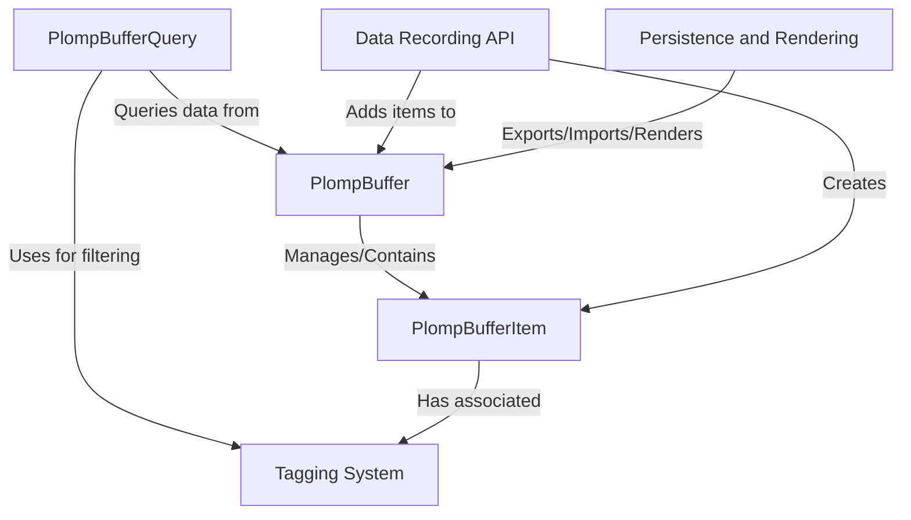

# Tutorial: Plomp

Plomp acts like a specialized *logbook* for your applications, particularly those using **Large Language Models (LLMs)**.
It lets you **record** various events, including the *prompts* sent to LLMs and their *responses*, along with custom data and **tags**.
You can then **query** this recorded information using filters (like tags) to find specific entries, and finally **save** or visualize the logbook.

**Source Repository:** [None](None)

## Chapters

1. [Data Recording API](01_data_recording_api.md)
2. [PlompBufferItem](02_plompbufferitem.md)
3. [Tagging System](03_tagging_system.md)
4. [PlompBuffer](04_plompbuffer.md)
5. [PlompBufferQuery](05_plompbufferquery.md)
6. [Persistence and Rendering](06_persistence_and_rendering.md)

---

Generated by [AI Codebase Knowledge Builder](https://github.com/The-Pocket/Tutorial-Codebase-Knowledge)