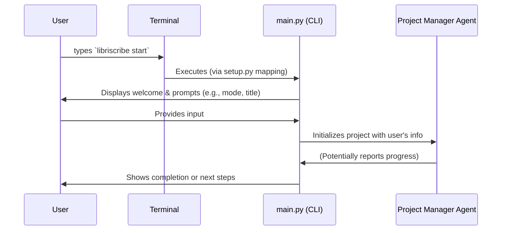

# Chapter 1: Command-Line Interface (CLI) & Workflow

Welcome to Libriscribe! This is the first chapter in our journey to understand how Libriscribe helps you create books with the power of AI. We'll start with the very first thing you'll interact with: the Command-Line Interface, or CLI.

## What's a CLI and Why Do We Need One?

Imagine you have a powerful robot that can help you write a book. How do you tell it what to do? You could have a complicated dashboard with lots of buttons and screens, or you could talk to it. A Command-Line Interface is like talking to the robot, but using text commands.

**Use Case: Starting Your Book Project**

Let's say you have a brilliant idea for a new fantasy novel. You want to use Libriscribe to help you outline it, develop characters, and even write some chapters. How do you kick things off? This is where the CLI comes in. You'll type a command, Libriscribe will ask you some questions, and then it will start working its magic.

The CLI in Libriscribe, mainly managed by the `src/libriscribe/main.py` file, is your main control panel. It's how you:
1.  Tell Libriscribe what you want to do (e.g., "start a new book," "write chapter 3").
2.  Provide initial information about your book (like the title, genre, etc.).
3.  Guide the overall book-writing process.

Think of it as the friendly receptionist and project coordinator for your AI writing assistant. It takes your requests and makes sure the right AI agents get to work.

## Talking to Libriscribe: Commands and Prompts

Interacting with Libriscribe through the CLI involves two main things:

1.  **Commands:** These are specific instructions you give to Libriscribe. For example, to start a new book project, you'll use the `libriscribe start` command.
2.  **Prompts:** After you give a command, Libriscribe might need more information. It will ask you questions, and these are called prompts. For instance, it might ask, "What is the title of your book?".

Let's see this in action!

**Starting a New Book Project**

To begin your book writing journey with Libriscribe, you'll open your computer's terminal (also known as a command prompt or shell) and type:

```bash
libriscribe start
```

After you press Enter, Libriscribe will wake up and greet you!

**What Happens Next? The Initial Interaction**

The `libriscribe start` command kicks off an interactive session. Here's a glimpse of what you might see (the exact messages might vary slightly):

```
Welcome to Libriscribe! ✨
... (welcome message) ...

✨ Choose your creation mode:
1. Simple (guided process)
2. Advanced (more options)
Enter your choice:
```

Libriscribe is now prompting you to choose a mode. Let's say you type `1` for "Simple". It will then ask for more details:

```
📁 Enter a project name (this will be the directory name): MyFantasyNovel
📕 What is the title of your book?: The Dragon's Amulet
... (and so on, asking about genre, length, etc.) ...
```

You provide answers to these prompts. This information is crucial for Libriscribe to understand what kind of book you want to create. The CLI is orchestrating this initial information-gathering phase. Once it has enough details, it will pass this information to the [Project Manager Agent](03_project_manager_agent_.md), which then takes over the more complex tasks of book creation.

## Under the Hood: How Does `libriscribe start` Work?

When you type `libriscribe start` and hit Enter, a few things happen behind the scenes.

**1. Finding `libriscribe` (The Magic of `setup.py`)**

First, your computer needs to know what `libriscribe` means. When you installed Libriscribe, a file named `setup.py` configured this. It told your system that `libriscribe` is a command linked to our Python code.

Here's the relevant part from `setup.py`:

```python
# setup.py
# ... other setup configurations ...
setup(
    # ...
    entry_points={
        "console_scripts": [
            "libriscribe=libriscribe.main:app", # This line is key!
        ],
    },
)
```
This `entry_points` section tells your system: "When someone types `libriscribe` in the terminal, run the `app` object found in the `libriscribe.main` Python module."

**2. `main.py` Takes Control**

So, the `libriscribe` command executes `src/libriscribe/main.py`. This file uses a library called `Typer` to easily create command-line applications.

Inside `src/libriscribe/main.py`:

```python
# src/libriscribe/main.py
import typer # The library for creating CLIs
# ... other imports ...

app = typer.Typer() # Creates a new Typer application

@app.command() # This decorator tells Typer that 'start' is a command
def start():
    """Starts the interactive book creation process."""
    introduction() # Shows the welcome message
    
    mode_options = ["Simple (guided process)", "Advanced (more options)"]
    mode = select_from_list("✨ Choose your creation mode:", mode_options) # Asks you to choose a mode
    
    if "Simple" in mode:
        simple_mode() # Calls another function for the simple workflow
    elif "Advanced" in mode:
        advanced_mode() # Calls another function for the advanced workflow
```
- `app = typer.Typer()`: Initializes the Typer application. Think of `app` as the main switchboard.
- `@app.command()`: This is a Python decorator. It "decorates" the `start()` function, turning it into a command that `Typer` recognizes. So, `libriscribe start` runs this `start()` function.
- Inside `start()`, other functions like `introduction()` and `select_from_list()` are called to display messages and get your input.
- Depending on your choice, it then calls either `simple_mode()` or `advanced_mode()`.

**3. Gathering Information (Example: `simple_mode`)**

Let's peek into what `simple_mode()` might do:

```python
# src/libriscribe/main.py

# ... (ProjectManagerAgent and ProjectKnowledgeBase would be imported and initialized)
# from libriscribe.agents.project_manager import ProjectManagerAgent
# from libriscribe.knowledge_base import ProjectKnowledgeBase
# project_manager = ProjectManagerAgent(llm_client=None)


def get_project_name_and_title():
    # This function uses typer.prompt to ask questions
    project_name = typer.prompt("📁 Enter a project name")
    title = typer.prompt("📕 What is the title of your book?")
    return project_name, title

def simple_mode():
    console.print("\n[cyan]✨ Starting Simple Mode...[/cyan]\n")

    project_name, title = get_project_name_and_title()
    # Information gathered here will be stored, often in a ProjectKnowledgeBase object
    # (More on this in the next chapter!)
    # project_knowledge_base = ProjectKnowledgeBase(project_name=project_name, title=title)
    
    # ... more functions like get_category_and_genre(), get_book_length() are called ...

    # Finally, hand off to the Project Manager Agent
    # project_manager.initialize_project_with_data(project_knowledge_base)
    console.print("\n[green]🎉 Book creation process initiated![/green]")
```
- Functions like `get_project_name_and_title()` use `typer.prompt()` to ask you questions.
- The answers are collected.
- Eventually, all this gathered information is used to initialize and instruct the [Project Manager Agent](03_project_manager_agent_.md), which handles the core logic of creating your book.

**High-Level Workflow Diagram**

Here's a simplified view of what happens when you run `libriscribe start`:



This diagram shows that the CLI (`main.py`) acts as an intermediary between you (the User) and the powerful [Project Manager Agent](03_project_manager_agent_.md).

**Other Commands**

Besides `start`, Libriscribe offers other commands that you can use once a project is underway:
- `libriscribe outline`: To generate a book outline.
- `libriscribe characters`: To create character profiles.
- `libriscribe worldbuilding`: To develop world details.
- `libriscribe write --chapter-number 1`: To write a specific chapter.
- `libriscribe format`: To compile your book into a final document.
- `libriscribe resume`: To continue working on an existing project.

Each of these commands is also defined in `src/libriscribe/main.py` using the `@app.command()` decorator, similar to the `start` command. They provide focused ways to interact with different parts of the book creation process, always orchestrated by the CLI which then delegates tasks to the [Project Manager Agent](03_project_manager_agent_.md).

## Conclusion

The Command-Line Interface (CLI) is your gateway to Libriscribe. It's how you issue commands, provide initial details, and guide the AI-assisted book writing workflow. The `src/libriscribe/main.py` file, with the help of `Typer`, defines these commands and manages the user interaction, acting as the "control panel" for the entire system. It collects your requirements and then hands them over to specialized agents, like the [Project Manager Agent](03_project_manager_agent_.md), to do the actual work.

Now that you understand how you "talk" to Libriscribe, you might be wondering: where does all the information about your book (title, genre, plot ideas, generated content) get stored and organized? That's where the [Project Knowledge Base](02_project_knowledge_base_.md) comes in, and we'll explore it in the next chapter!

---

Generated by [AI Codebase Knowledge Builder](https://github.com/The-Pocket/Tutorial-Codebase-Knowledge)