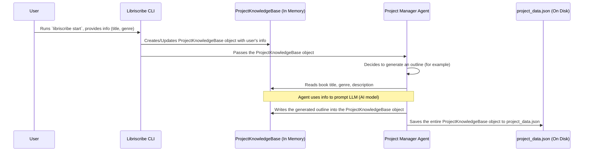

# Chapter 2: Project Knowledge Base

Welcome to the second chapter of our Libriscribe tutorial! In [Chapter 1: Command-Line Interface (CLI) & Workflow](01_command_line_interface__cli____workflow_.md), we learned how to talk to Libriscribe using commands like `libriscribe start` and provide initial information about our book. But where does all that precious information go? How does Libriscribe remember your book's title, its genre, or the brilliant character ideas you have?

That's where the **Project Knowledge Base** comes in!

## What is the Project Knowledge Base?

Imagine you're starting a big research project for school. You'd probably have a binder, right? This binder would have different sections: one for your main ideas, one for your research notes, another for your outline, and perhaps sections for important people or concepts. You'd keep everything organized in this binder so you can easily find what you need.

The `ProjectKnowledgeBase` in Libriscribe is exactly like that master project binder, but for your book. It's the central, digital place where Libriscribe stores **all** the essential information about your book project. This includes:

*   Your book's **title** and **genre**.
*   A **description** or summary of your book.
*   Details about your **characters**.
*   Information about the **world** your story takes place in (worldbuilding).
*   Summaries of each **chapter**.
*   The AI-generated **outline** for your book.

Essentially, it's the master digital manuscript where every piece of information is meticulously organized. All other parts of the Libriscribe system, like the AI agents that help write and outline, can read from this knowledge base to understand your project and write new information back into it (like a newly generated chapter).

**Use Case: Remembering Your Book's Details**

Let's go back to our example from Chapter 1. You ran `libriscribe start` and told Libriscribe:

*   Project Name: `MyFantasyNovel`
*   Book Title: `The Dragon's Amulet`
*   Genre: `Fantasy`

This information doesn't just disappear! Libriscribe needs to store it so that when it's time to, say, generate an outline, it knows it's working on a fantasy book called "The Dragon's Amulet." The `ProjectKnowledgeBase` is where this information is carefully stored.

## Looking Inside: The Structure of the Knowledge Base

The `ProjectKnowledgeBase` is defined in the file `src/libriscribe/knowledge_base.py`. It's built using Python and a helpful library called `Pydantic`. Pydantic helps us define what kind of information should be stored and makes sure it's in the correct format. Think of Pydantic as the rules for how to organize your binder.

Let's peek at a very simplified version of how `ProjectKnowledgeBase` might look in the code:

```python
# src/libriscribe/knowledge_base.py (Simplified Excerpt)
from pydantic import BaseModel # Pydantic helps define data structures
from typing import Dict, List, Optional # For type hints

class Character(BaseModel): # A simple structure for a character
    name: str
    description: str = ""
    role: str = ""

class ChapterSummary(BaseModel): # A simple structure for a chapter summary
    chapter_number: int
    title: str = ""
    summary: str = ""

class ProjectKnowledgeBase(BaseModel):
    project_name: str
    title: str = "Untitled Book"
    genre: str = "Unknown"
    description: str = "No description yet."
    
    # It can also hold more complex info, like a list of characters
    characters: Dict[str, Character] = {} # A dictionary to store characters by name
    
    # And chapter summaries
    chapter_summaries: Dict[int, ChapterSummary] = {} # Store chapter summaries by number
    
    outline: str = "" # The book's outline, perhaps as text
    
    # ... and many other details!
```

Let's break this down:

*   `class ProjectKnowledgeBase(BaseModel):`: This line declares our main "binder." `BaseModel` comes from Pydantic and gives us helpful features.
*   `project_name: str`, `title: str`, `genre: str`, `description: str`: These are like labels on the front of our binder or main tabs. They store simple text information. `str` just means "string," which is programming-speak for text.
*   `characters: Dict[str, Character] = {}`: This is more advanced. It means the `ProjectKnowledgeBase` can hold a collection of `Character` objects. `Dict` stands for "dictionary," which is like a list where each item has a unique name (the character's name, in this case). We define `Character` separately (as shown above the `ProjectKnowledgeBase`) to specify what information each character entry should have (like `name`, `description`, `role`).
*   `chapter_summaries: Dict[int, ChapterSummary] = {}`: Similar to characters, this stores a collection of `ChapterSummary` objects, organized by chapter number.
*   `outline: str = ""`: This field will hold the complete outline of your book, likely generated by an AI agent.

The actual `ProjectKnowledgeBase` in `src/libriscribe/knowledge_base.py` is more detailed, with many more fields to capture all aspects of your book, including worldbuilding elements, full chapter structures, and settings. But the core idea is the same: it's a well-defined container for your project's data.

## How Does Information Get Into the Knowledge Base?

Remember the `libriscribe start` command from [Chapter 1: Command-Line Interface (CLI) & Workflow](01_command_line_interface__cli____workflow_.md)? When you answered the prompts, that information was gathered to create and fill up a `ProjectKnowledgeBase` object.

Here's a simplified snippet from `src/libriscribe/main.py` (which handles the CLI) showing how this happens:

```python
# src/libriscribe/main.py (Simplified Excerpt from simple_mode)

from libriscribe.knowledge_base import ProjectKnowledgeBase # Import our "binder"

def get_project_name_and_title():
    project_name = typer.prompt("📁 Enter a project name")
    title = typer.prompt("📕 What is the title of your book?")
    return project_name, title

def simple_mode():
    # ... (other code) ...
    project_name, title = get_project_name_and_title() # Get info from user

    # Create an instance of our ProjectKnowledgeBase!
    project_knowledge_base = ProjectKnowledgeBase(project_name=project_name, title=title)

    # Get more info (e.g., genre) and add it to the knowledge base
    # category_and_genre = get_category_and_genre(project_knowledge_base) 
    # project_knowledge_base.set("genre", genre_from_user) # Example of setting genre

    # ... (gather more details like description, etc.) ...

    # This knowledge_base object, now full of your info,
    # is then passed to other parts of Libriscribe, like the Project Manager Agent.
    # project_manager.initialize_project_with_data(project_knowledge_base)
    # ...
```

In this code:
1.  We `import ProjectKnowledgeBase`.
2.  After getting the `project_name` and `title` from you, we create a `ProjectKnowledgeBase` object: `project_knowledge_base = ProjectKnowledgeBase(project_name=project_name, title=title)`.
3.  As more information is collected (like genre, description), it's added to this `project_knowledge_base` object.
4.  Finally, this populated `project_knowledge_base` object is handed over to the [Project Manager Agent](03_project_manager_agent_.md), which you'll learn about in the next chapter. This agent then uses the information to manage the book creation process.

## How is Information Used and Updated?

Once the `ProjectKnowledgeBase` is filled with initial details, other AI agents in Libriscribe use it.

For example, an `OutlinerAgent` (responsible for creating your book's outline) would:
1.  **Read** information from the `ProjectKnowledgeBase`, like the `title`, `genre`, and `description` you provided.
2.  Use this information to ask the AI (the Large Language Model) to generate an outline.
3.  **Write** the newly generated `outline` back into the `ProjectKnowledgeBase.outline` field.

Here's a very simplified, hypothetical example of how an agent might interact with the `ProjectKnowledgeBase`:

```python
# Hypothetical Agent (very simplified)
# from libriscribe.knowledge_base import ProjectKnowledgeBase

class OutlineAgent:
    def generate_outline(self, kb: ProjectKnowledgeBase): # 'kb' is our knowledge base
        print(f"Reading from Knowledge Base: Title is '{kb.title}', Genre is '{kb.genre}'.")
        
        # Agent uses kb.description, kb.genre etc. to generate an outline
        # (Simplified - actual generation involves an LLM)
        newly_generated_outline = f"Chapter 1: Introduction to {kb.title}\nChapter 2: ..."
        
        # Agent writes the new outline back into the knowledge base
        kb.outline = newly_generated_outline
        print(f"Outline generated and saved to Knowledge Base.")
```
This way, the `ProjectKnowledgeBase` is always kept up-to-date. If a character's description is updated, that change is saved in the `ProjectKnowledgeBase` for all other agents to see.

## Keeping Your Data Safe: Saving and Loading

What happens when you close Libriscribe? Does all your hard work and AI-generated content vanish? Of course not!

The `ProjectKnowledgeBase` can be saved to a file and loaded back later. This is how you can pause your work on a book and resume it anytime. Typically, this information is saved in a file named `project_data.json` inside your project's directory (e.g., `MyFantasyNovel/project_data.json`). JSON is a common text-based format for storing data.

The `ProjectKnowledgeBase` class in `src/libriscribe/knowledge_base.py` has built-in methods for this:

```python
# src/libriscribe/knowledge_base.py (Simplified Excerpt)
# class ProjectKnowledgeBase(BaseModel):
    # ... (fields like title, genre, etc.) ...

    def save_to_file(self, file_path: str):
        """Saves the knowledge base to a JSON file."""
        # 'self.model_dump_json()' is a Pydantic helper to convert the data to JSON
        json_data = self.model_dump_json(indent=4) # indent=4 makes it readable
        with open(file_path, "w", encoding="utf-8") as f:
            f.write(json_data)
        print(f"Project data saved to {file_path}")

    @classmethod
    def load_from_file(cls, file_path: str) -> Optional["ProjectKnowledgeBase"]:
        """Loads the knowledge base from a JSON file."""
        try:
            with open(file_path, "r", encoding="utf-8") as f:
                json_data = f.read()
                # 'cls.model_validate_json()' is a Pydantic helper to load data from JSON
                return cls.model_validate_json(json_data)
        except FileNotFoundError:
            print(f"Oops! Project file not found at {file_path}")
            return None
        # ... (other error handling for invalid JSON, etc.) ...
```
*   `save_to_file`: Takes all the data in the `ProjectKnowledgeBase` object and writes it into a JSON file. The `model_dump_json()` part is a handy Pydantic function.
*   `load_from_file`: Reads a JSON file and rebuilds the `ProjectKnowledgeBase` object in memory with all your project's data. The `model_validate_json()` is another Pydantic helper.

This saving and loading mechanism is crucial for commands like `libriscribe resume`, which allows you to pick up where you left off.

## The Big Picture: How it Fits Together

Let's visualize the flow of information involving the `ProjectKnowledgeBase`:



This diagram shows:
1.  You provide information through the CLI.
2.  The CLI creates a `ProjectKnowledgeBase` object in the computer's memory and fills it.
3.  This object is passed to the [Project Manager Agent](03_project_manager_agent_.md).
4.  The [Project Manager Agent](03_project_manager_agent_.md) (or other specialized agents it calls) reads from this object to get context and writes new information (like a generated outline or chapter) back into it.
5.  Periodically, or when tasks are done, the [Project Manager Agent](03_project_manager_agent_.md) tells the `ProjectKnowledgeBase` object to save itself to a file (`project_data.json`) on your computer's disk.

## Conclusion

The `ProjectKnowledgeBase` is the heart of your book project within Libriscribe. It acts as a central, organized repository for all details, from your initial ideas to the AI-generated content. Think of it as the single source of truth for your book. It ensures that every part of Libriscribe has access to consistent and up-to-date information.

We've seen how it's structured, how it gets populated with data you provide via the CLI, how other agents read from and write to it, and how it's saved to persist your work.

Now that we understand where all the project data lives, let's move on to learn about the chief conductor of the book creation orchestra: the [Project Manager Agent](03_project_manager_agent_.md). This agent uses the `ProjectKnowledgeBase` to coordinate all the different AI assistants to bring your book to life!

---

Generated by [AI Codebase Knowledge Builder](https://github.com/The-Pocket/Tutorial-Codebase-Knowledge)