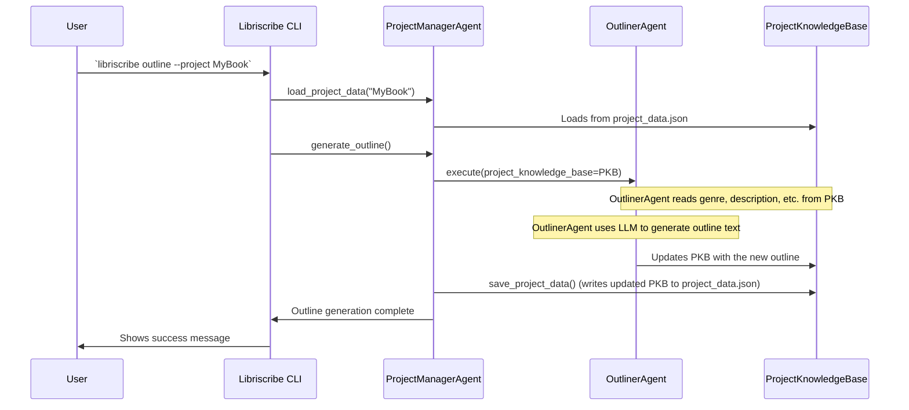

# Chapter 3: Project Manager Agent

Welcome to Chapter 3! In [Chapter 2: Project Knowledge Base](02_project_knowledge_base_.md), we learned how Libriscribe stores all the important information about your book in a digital "binder" called the `ProjectKnowledgeBase`. We saw how this "binder" gets filled with details like your book's title, genre, and your initial ideas.

But once all that information is gathered, who actually takes charge of the book-writing process? Who tells the AI what to do, in what order, and makes sure everything runs smoothly?

That's the job of the **Project Manager Agent**!

## The Conductor of Your Book Creation Orchestra

Imagine you're directing a movie. You have actors, camera crew, scriptwriters, and sound engineers. You, as the director, don't operate the camera or write every line yourself. Instead, you coordinate everyone, tell them what needs to be done, and make sure the whole movie comes together.

The `ProjectManagerAgent` in Libriscribe is like that movie director or an orchestra conductor. It's the main coordinator for the entire book creation process. It doesn't write the chapters or design the characters itself. Instead, it:

1.  **Initializes the Project:** Takes the information you provided (now stored in the [Project Knowledge Base](02_project_knowledge_base_.md)) and officially starts the project, setting up necessary files and folders.
2.  **Orchestrates Specialized Agents:** It delegates tasks to other, more specialized AI agents. For example, it tells an "Outliner Agent" to create an outline, a "Character Agent" to develop characters, and a "Chapter Writer Agent" to write the actual chapters. (We'll learn more about these specialized agents in the [Agent System](04_agent_system_.md) chapter).
3.  **Manages the Project Lifecycle:** It handles the overall flow, from starting a new book to saving your progress and allowing you to resume work later.
4.  **Saves Your Work:** It makes sure that all the generated content and project details are regularly saved, so you don't lose anything.

**Use Case: From Idea to Outline**

Let's say you've used the `libriscribe start` command (from [Chapter 1: Command-Line Interface (CLI) & Workflow](01_command_line_interface__cli____workflow_.md)) and provided all the initial details for your new fantasy novel, "The Dragon's Amulet." This information is now in the `ProjectKnowledgeBase`.

You then decide you want Libriscribe to generate an outline. You might use a command like `libriscribe outline`.

What happens next?
1.  The CLI tells the `ProjectManagerAgent` that an outline needs to be generated.
2.  The `ProjectManagerAgent` looks at your `ProjectKnowledgeBase` to understand the book's genre, description, etc.
3.  It then "hires" a specialist, the `OutlinerAgent`, and gives it the task: "Create an outline for this fantasy novel, 'The Dragon's Amulet', based on these details."
4.  The `OutlinerAgent` does its work (using AI).
5.  The `ProjectManagerAgent` takes the finished outline from the `OutlinerAgent` and makes sure it's saved back into your `ProjectKnowledgeBase` and to a file.

Without the `ProjectManagerAgent`, it would be like having a bunch of talented specialists ready to work, but no one to tell them what to do or how their work fits together.

## Key Responsibilities of the Project Manager Agent

Let's break down the main jobs of the `ProjectManagerAgent`.

### 1. Initializing Your Project

When you start a new book with `libriscribe start`, after you've answered all the questions, the CLI hands over the collected information (as a `ProjectKnowledgeBase` object) to the `ProjectManagerAgent`.

Here's a simplified look at how `main.py` (our CLI) might tell the `ProjectManagerAgent` to get started:

```python
# src/libriscribe/main.py (Simplified from simple_mode)

# project_knowledge_base is already filled with user's input
# (e.g., project_name, title, genre)

# project_manager is an instance of ProjectManagerAgent
project_manager.initialize_project_with_data(project_knowledge_base)

console.print("\n[green]🎉 Book creation process initiated![/green]")
```
-   `project_manager.initialize_project_with_data(project_knowledge_base)`: This line is crucial. It tells the `ProjectManagerAgent` to take the `project_knowledge_base` (our "binder" full of info) and formally set up the project.

Inside the `ProjectManagerAgent`, the `initialize_project_with_data` method (found in `src/libriscribe/agents/project_manager.py`) does a few things:
*   It figures out where your project should be saved on your computer (e.g., `libriscribe_projects/MyFantasyNovel/`).
*   It creates this folder if it doesn't exist.
*   It stores the `project_knowledge_base` object so it can refer to it later.
*   It calls `save_project_data()` to make an initial save of your project's details (usually in a file named `project_data.json` inside your project folder).

```python
# src/libriscribe/agents/project_manager.py (Simplified Excerpt)

class ProjectManagerAgent:
    # ... (other parts of the class) ...

    def initialize_project_with_data(self, project_data: ProjectKnowledgeBase):
        """Initializes a project using the ProjectKnowledgeBase object."""
        # Figure out the project directory path based on settings and project_data.project_name
        self.project_dir = Path(self.settings.projects_dir) / project_data.project_name
        self.project_dir.mkdir(parents=True, exist_ok=True) # Create the folder

        self.project_knowledge_base = project_data # Keep a copy of the project data
        
        # Make sure the ProjectKnowledgeBase knows its directory too
        self.project_knowledge_base.project_dir = self.project_dir
            
        self.save_project_data() # Save the initial state
        self.logger.info(f"🚀 Initialized project: {project_data.project_name}")
        console.print(f"✨ Project [green]'{project_data.project_name}'[/green] initialized successfully!")
```
This setup ensures your project has a dedicated home and its initial state is safely stored.

### 2. Orchestrating Other Agents

The `ProjectManagerAgent` itself doesn't generate outlines, characters, or chapters. It delegates these tasks to specialized "worker" agents. It keeps a list of these agents and knows which one to call for which task.

For example, when you want an outline, the `ProjectManagerAgent` has a method like `generate_outline()`:

```python
# src/libriscribe/agents/project_manager.py (Simplified Excerpt)

class ProjectManagerAgent:
    def __init__(self, llm_client: LLMClient = None):
        # ...
        self.llm_client: Optional[LLMClient] = llm_client
        self.agents = {} # This will be filled with specialist agents
        # ...
        # When the LLM client is initialized, it populates self.agents:
        # self.agents = {
        #     "outliner": OutlinerAgent(self.llm_client),
        #     "character_generator": CharacterGeneratorAgent(self.llm_client),
        #     # ... and other agents
        # }

    def run_agent(self, agent_name: str, *args, **kwargs):
        """Runs a specific agent, passing project_data."""
        if agent_name not in self.agents:
            # ... (error handling) ...
            return
        agent = self.agents[agent_name]
        if self.project_knowledge_base:
            # Call the 'execute' method of the specialist agent
            agent.execute(project_knowledge_base=self.project_knowledge_base, *args, **kwargs)
        # ... (error handling) ...

    def generate_outline(self):
        """Generates a book outline."""
        if self.project_knowledge_base is None:
            # ... (error handling) ...
            return
        
        console.print("\n[cyan]📝 Generating outline...[/cyan]")
        # Call the 'outliner' specialist agent
        self.run_agent("outliner") 
        
        self.save_project_data() # Save the project data (which now includes the outline)
        console.print("\n[green]✅ Outline generated and saved![/green]")
```
-   The `ProjectManagerAgent` first initializes its team of specialist agents (like `OutlinerAgent`, `CharacterGeneratorAgent`, etc.) when the [LLM Client](05_llm_client_.md) is set up. Each specialist agent gets a reference to the [LLM Client](05_llm_client_.md) so it can talk to the AI.
-   The `run_agent("outliner")` call tells the `ProjectManagerAgent` to find its "outliner" specialist and ask it to do its job.
-   The specialist agent (e.g., `OutlinerAgent`) will then use the information in `self.project_knowledge_base` (like title, genre, description) to prompt the AI and generate the outline.
-   The `OutlinerAgent` updates the `self.project_knowledge_base` with the newly generated outline.
-   Finally, `self.save_project_data()` ensures this updated `ProjectKnowledgeBase` is saved to your `project_data.json` file.

This delegation is key to keeping the code organized. The `ProjectManagerAgent` focuses on *what* needs to be done and *when*, while the specialist agents focus on *how* to do specific tasks.

### 3. Managing Project Lifecycle (Saving and Loading)

You'll want to stop working on your book and come back to it later. The `ProjectManagerAgent` handles this through saving and loading.

**Saving:**
We've already seen `save_project_data()`. It's called after important steps (like generating an outline or writing a chapter) to ensure your progress is stored. It essentially tells the `ProjectKnowledgeBase` object: "Hey, write all your current information into the `project_data.json` file."

```python
# src/libriscribe/agents/project_manager.py (Simplified Excerpt)

class ProjectManagerAgent:
    # ...
    def save_project_data(self):
        """Saves project data using the ProjectKnowledgeBase object."""
        if self.project_knowledge_base and self.project_dir:
            try:
                file_path = str(self.project_dir / "project_data.json")
                # The ProjectKnowledgeBase object itself knows how to save
                self.project_knowledge_base.save_to_file(file_path)
                # logger.info(f"Project data saved to {file_path}") # Usually, this logs silently
            except Exception as e:
                # ... (error handling) ...
                pass # In a real app, log this error
        # ...
```

**Loading:**
When you want to resume working on a project (e.g., using the `libriscribe resume MyFantasyNovel` command), the `ProjectManagerAgent` uses its `load_project_data()` method.

```python
# src/libriscribe/agents/project_manager.py (Simplified Excerpt)

class ProjectManagerAgent:
    # ...
    def load_project_data(self, project_name: str):
        """Loads project data."""
        self.project_dir = Path(self.settings.projects_dir) / project_name
        project_data_path = self.project_dir / "project_data.json"

        if project_data_path.exists():
            # Ask ProjectKnowledgeBase class to load data from the file
            loaded_kb = ProjectKnowledgeBase.load_from_file(str(project_data_path)) 
            if loaded_kb:
                self.project_knowledge_base = loaded_kb
                self.project_knowledge_base.project_dir = self.project_dir # Important!
                
                # After loading, re-initialize the LLM client and agents
                # if an LLM provider was saved in the project data
                llm_provider = self.project_knowledge_base.get("llm_provider")
                if llm_provider:
                    self.initialize_llm_client(llm_provider)
                else:
                    # Handle case where no LLM provider is set (e.g., prompt user)
                    console.print("[yellow]No LLM provider found in project. You may need to select one.[/yellow]")

                console.print(f"Project '{project_name}' loaded successfully.")
            else:
                raise ValueError("Failed to load or validate project data.")
        else:
            raise FileNotFoundError(f"Project data not found for project: {project_name}")
```
This method reads the `project_data.json` file from your project's folder and rebuilds the `ProjectKnowledgeBase` object in memory. It also re-initializes the [LLM Client](05_llm_client_.md) and all the specialist agents, so Libriscribe is ready to pick up where you left off.

The `ProjectManagerAgent` also has a `checkpoint()` method, which is just a quieter way to call `save_project_data()`. It's used internally to save progress frequently during long operations without bothering you with messages every time.

## Under the Hood: How the Project Manager Coordinates

Let's visualize the flow when you ask Libriscribe to generate an outline for an existing project:



This diagram shows:
1.  You tell the CLI you want an outline.
2.  The CLI tells the `ProjectManagerAgent` (PMA) to load your project.
3.  The PMA loads the data into the `ProjectKnowledgeBase` (PKB).
4.  The CLI then asks the PMA to generate the outline.
5.  The PMA delegates this to the `OutlinerAgent`.
6.  The `OutlinerAgent` reads from the PKB for context, uses the AI to create the outline, and writes the new outline back into the PKB.
7.  The PMA then tells the PKB to save itself to the `project_data.json` file.

The `ProjectManagerAgent` (located in `src/libriscribe/agents/project_manager.py`) is the central hub ensuring all these steps happen correctly and in the right order.

## Conclusion

The `ProjectManagerAgent` is the indispensable conductor of your AI book-writing orchestra. It doesn't write the music (the content) itself, but it ensures all the musicians (the specialized agents) play their parts correctly, manages the overall performance (the project lifecycle), and keeps a master score (the [Project Knowledge Base](02_project_knowledge_base_.md)) updated and saved.

It initializes your project, delegates tasks like outlining, character generation, and chapter writing to specialist agents, and handles saving and loading your precious work. Without it, Libriscribe would be a collection of tools without a coordinator.

Now that we understand how the `ProjectManagerAgent` delegates tasks, you're probably curious about those "specialist agents" it commands. What are they, and how do they work? We'll dive into that in our next chapter: [Agent System](04_agent_system_.md)!

---

Generated by [AI Codebase Knowledge Builder](https://github.com/The-Pocket/Tutorial-Codebase-Knowledge)