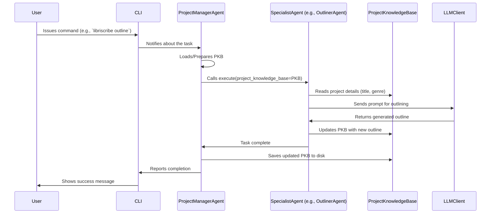

# Chapter 4: Agent System

Welcome to Chapter 4! In [Chapter 3: Project Manager Agent](03_project_manager_agent_.md), we met the `ProjectManagerAgent`, the brilliant conductor of our book-writing orchestra. We learned that it coordinates the entire process, but it doesn't do all the specialized work itself. So, who does it delegate these tasks to?

That's where Libriscribe's **Agent System** comes into play.

## What is an Agent System? The Publishing House Analogy

Imagine a real-world publishing house. There isn't just one person doing everything. Instead, there's a team of experts:
*   An **Outliner** who drafts the book's structure.
*   A **Character Developer** who fleshes out the characters.
*   A **Writer** who pens the chapters.
*   An **Editor** who refines the manuscript.

Each person is a specialist, focusing on their area of expertise. They all work together, managed by a project manager, to produce the final book.

Libriscribe's Agent System works just like this! It's a team of specialized AI "workers," called **agents**. Each agent is designed to perform a specific task in the book creation pipeline. The [Project Manager Agent](03_project_manager_agent_.md) acts like the head of the publishing house, delegating tasks to these specialist agents.

**Use Case: Building Your Book, Piece by Piece**

Let's say you've started your project, "The Dragon's Amulet." The [Project Manager Agent](03_project_manager_agent_.md) needs to:
1.  Generate an outline.
2.  Create some characters.
3.  Write the first chapter.
4.  Edit that chapter.

Instead of trying to do all this complex work itself, the [Project Manager Agent](03_project_manager_agent_.md) will call upon its team:
*   "Hey `OutlinerAgent`, can you create an outline for this fantasy novel?"
*   "Thanks! Now, `CharacterGeneratorAgent`, please develop three main characters based on this outline and the book's description."
*   "Great characters! `ChapterWriterAgent`, your turn. Write Chapter 1 using this outline and character profile."
*   "Chapter 1 looks good. `EditorAgent`, please review and refine this chapter."

This division of labor makes the whole process more organized, manageable, and allows each part of the AI to be highly specialized and effective.

## The Blueprint: The Base `Agent` Class

All these specialist agents, despite their different jobs, share some common characteristics. They are all "agents" that can be given a task to execute. In Libriscribe, this commonality is defined by a base `Agent` class. Think of it as a general job description for any "employee" in our AI publishing house.

This base `Agent` class is defined in `src/libriscribe/agents/agent_base.py`. Here's a simplified peek:

```python
# src/libriscribe/agents/agent_base.py (Simplified)
import logging
from typing import Any
from libriscribe.utils.llm_client import LLMClient # We'll learn about this in the next chapter!

class Agent:
    """Base class for all agents."""

    def __init__(self, name: str, llm_client: LLMClient):
        self.name = name  # Each agent has a name
        self.llm_client = llm_client # Each agent can use the LLM (AI brain)
        self.logger = logging.getLogger(self.name) # For logging messages

    def execute(self, *args, **kwargs) -> Any:
        """Executes the agent's main task. Must be implemented by subclasses."""
        raise NotImplementedError # This means specialist agents MUST define this
```

Let's break it down:
*   `class Agent:`: This defines the blueprint.
*   `__init__(self, name: str, llm_client: LLMClient)`: This is the constructor. When a new agent is "hired" (created), it's given a `name` (like "OutlinerAgent") and access to the `llm_client`. The `llm_client` is how agents talk to the powerful Large Language Model (the AI brain) – we'll cover this in detail in the [LLM Client](05_llm_client_.md) chapter.
*   `execute(self, *args, **kwargs) -> Any`: This is the most important part! It's like the "main job function" for every agent.
    *   `raise NotImplementedError`: This line means the base `Agent` class itself doesn't know *how* to do any specific task. It's up to each *specialist* agent (like the `OutlinerAgent`) to provide its own specific instructions for the `execute` method.

So, every specialist agent in Libriscribe will be built upon this `Agent` blueprint.

## Meet the Specialists: A Tour of the Team

Libriscribe comes with a team of specialized agents, each inheriting from the base `Agent` class and implementing its own `execute` method. Here are some of the key players:

*   **`OutlinerAgent`**: (from `src/libriscribe/agents/outliner.py`)
    *   **Job**: Drafts the book's outline, including chapter titles and summaries.
    *   **Input**: Reads the book's concept, genre, and description from the [Project Knowledge Base](02_project_knowledge_base_.md).
    *   **Output**: Writes the generated outline back into the [Project Knowledge Base](02_project_knowledge_base_.md).

*   **`CharacterGeneratorAgent`**: (from `src/libriscribe/agents/character_generator.py`)
    *   **Job**: Develops detailed character profiles, including their personalities, backstories, and roles.
    *   **Input**: Uses the book's description, genre, and any existing plot points from the [Project Knowledge Base](02_project_knowledge_base_.md).
    *   **Output**: Adds the new character profiles to the [Project Knowledge Base](02_project_knowledge_base_.md).

*   **`ChapterWriterAgent`**: (from `src/libriscribe/agents/chapter_writer.py`)
    *   **Job**: Writes the actual content for each chapter, scene by scene.
    *   **Input**: Uses the overall outline, character profiles, and specific scene details (from the [Project Knowledge Base](02_project_knowledge_base_.md)) for the chapter it's writing.
    *   **Output**: Saves the written chapter content as a file and updates the [Project Knowledge Base](02_project_knowledge_base_.md).

*   **`EditorAgent`**: (from `src/libriscribe/agents/editor.py`)
    *   **Job**: Refines and edits written chapters for clarity, consistency, style, and grammar.
    *   **Input**: Takes a written chapter's content and potentially review feedback.
    *   **Output**: Produces a revised version of the chapter.

*   **`WorldbuildingAgent`**: (from `src/libriscribe/agents/worldbuilding.py`)
    *   **Job**: Creates detailed descriptions of the story's world, including locations, cultures, rules, etc.
    *   **Input**: Uses the book's genre, description, and any user preferences from the [Project Knowledge Base](02_project_knowledge_base_.md).
    *   **Output**: Adds worldbuilding details to the [Project Knowledge Base](02_project_knowledge_base_.md).

*   **Other Specialists**: There are more, like the `ConceptGeneratorAgent` (helps brainstorm initial ideas), `ContentReviewerAgent` (provides feedback), and `FormattingAgent` (assembles the final book).

### Example: A Simplified `OutlinerAgent`

Let's see how a specialist agent, like the `OutlinerAgent`, might look. It inherits from `Agent` and provides its own `execute` method.

```python
# src/libriscribe/agents/outliner.py (Highly Simplified Example)
from libriscribe.agents.agent_base import Agent
from libriscribe.utils.llm_client import LLMClient
from libriscribe.knowledge_base import ProjectKnowledgeBase # To interact with project data
from rich.console import Console

console = Console()

class OutlinerAgent(Agent): # Inherits from the base Agent class
    def __init__(self, llm_client: LLMClient):
        super().__init__("OutlinerAgent", llm_client) # Calls the base class's __init__

    def execute(self, project_knowledge_base: ProjectKnowledgeBase, *args, **kwargs) -> None:
        """Generates a book outline."""
        console.print(f"📝 [cyan]{self.name} starting its work...[/cyan]")

        # 1. Get book details from the ProjectKnowledgeBase
        title = project_knowledge_base.title
        genre = project_knowledge_base.genre
        description = project_knowledge_base.description
        language = project_knowledge_base.language

        # 2. Create a prompt for the LLM (the AI brain)
        prompt = f"Generate a detailed chapter-by-chapter outline for a {genre} book titled '{title}'. Description: {description}. Language: {language}"
        # (The actual prompt in prompts_context.py is more complex)

        # 3. Use the llm_client to get the outline from the AI
        # We'll learn about llm_client in the next chapter!
        generated_outline_text = self.llm_client.generate_content(prompt, max_tokens=3000)

        # 4. Update the ProjectKnowledgeBase with the new outline
        project_knowledge_base.outline = generated_outline_text
        # (The real agent also parses this text into Chapter objects)

        console.print(f"[green]✅ Outline generated by {self.name}![/green]")
        # (The ProjectManagerAgent will then save the project_knowledge_base)
```
In this simplified example:
1.  `OutlinerAgent(Agent)`: It declares that `OutlinerAgent` is a type of `Agent`.
2.  `super().__init__(...)`: It makes sure to initialize the base `Agent` part (setting its name and `llm_client`).
3.  `execute(...)`: This is where the `OutlinerAgent` does its specific job.
    *   It receives the `project_knowledge_base` so it can read information about the book.
    *   It constructs a `prompt` (a set of instructions) for the AI.
    *   It uses `self.llm_client.generate_content(...)` to send the prompt to the AI and get the outline.
    *   It then updates the `project_knowledge_base` with the `generated_outline_text`.

Each specialist agent follows a similar pattern: get necessary info, prepare a task for the AI, use the `llm_client` to execute it, and then process/store the results, often in the [Project Knowledge Base](02_project_knowledge_base_.md).

## How They Work Together: The Manager and the Team

As we saw in [Chapter 3: Project Manager Agent](03_project_manager_agent_.md), the `ProjectManagerAgent` is responsible for orchestrating these specialist agents. When you ask Libriscribe to perform an action (like "generate an outline" or "write chapter 2"), the `ProjectManagerAgent` figures out which specialist agent is needed and calls its `execute` method.

### The Workflow

Here's a typical flow when the `ProjectManagerAgent` delegates a task:

1.  **User Request**: You issue a command via the CLI, e.g., `libriscribe outline`.
2.  **CLI to Project Manager**: The CLI informs the `ProjectManagerAgent` about your request.
3.  **Project Manager Decides**: The `ProjectManagerAgent` determines that the `OutlinerAgent` is needed. It ensures the `ProjectKnowledgeBase` is loaded with your project's current data.
4.  **Delegation**: The `ProjectManagerAgent` calls the `execute` method of the `OutlinerAgent`, passing it the `ProjectKnowledgeBase`.
5.  **Specialist Agent Works**:
    *   The `OutlinerAgent` reads necessary details (title, genre, etc.) from the `ProjectKnowledgeBase`.
    *   It prepares a specific prompt for the AI (using the [LLM Client](05_llm_client_.md)).
    *   It gets the generated outline from the AI.
    *   It updates the `ProjectKnowledgeBase` with this new outline.
6.  **Completion**: The `OutlinerAgent` finishes its `execute` method.
7.  **Project Manager Saves**: The `ProjectManagerAgent` then typically saves the updated `ProjectKnowledgeBase` to ensure your new outline isn't lost.

Let's visualize this with a simple diagram:



### Code Snippet: Project Manager Calling an Agent

In [Chapter 3: Project Manager Agent](03_project_manager_agent_.md), we saw that the `ProjectManagerAgent` has a way to manage and run its specialist agents. Here's a reminder of how it might call an agent (simplified from `src/libriscribe/agents/project_manager.py`):

```python
# src/libriscribe/agents/project_manager.py (Simplified Snippet)

class ProjectManagerAgent:
    def __init__(self, llm_client: LLMClient = None):
        # ...
        self.llm_client: Optional[LLMClient] = llm_client
        self.agents = {} # This will store instances of specialist agents
        self.project_knowledge_base: Optional[ProjectKnowledgeBase] = None
        # ...

    def _initialize_specialist_agents(self):
        """Creates instances of all specialist agents."""
        if self.llm_client:
            # Import and create each agent
            from libriscribe.agents.outliner import OutlinerAgent
            from libriscribe.agents.character_generator import CharacterGeneratorAgent
            # ... import other agents ...

            self.agents["outliner"] = OutlinerAgent(self.llm_client)
            self.agents["character_generator"] = CharacterGeneratorAgent(self.llm_client)
            # ... initialize other agents ...
        else:
            # Handle case where LLM client is not ready
            pass


    def run_agent(self, agent_name: str, *args, **kwargs):
        """Runs a specific agent, passing project_data."""
        if agent_name not in self.agents:
            # ... (error handling: agent not found) ...
            return None
        
        agent_to_run = self.agents[agent_name]
        
        if self.project_knowledge_base:
            # Call the 'execute' method of the chosen specialist agent
            return agent_to_run.execute(project_knowledge_base=self.project_knowledge_base, *args, **kwargs)
        else:
            # ... (error handling: project data not loaded) ...
            return None

    def generate_outline(self):
        """Generates a book outline using the OutlinerAgent."""
        if self.project_knowledge_base is None:
            # ... (error handling) ...
            return
        
        console.print("\n[cyan]📝 Requesting OutlinerAgent to generate outline...[/cyan]")
        self.run_agent("outliner") # Tell the "outliner" agent to do its job
        
        self.save_project_data() # Save the result
        console.print("\n[green]✅ Outline process complete and saved by Project Manager![/green]")

```
- `_initialize_specialist_agents()`: This method (called when the `ProjectManagerAgent` is fully set up) creates instances of all the specialist agents (like `OutlinerAgent`, `CharacterGeneratorAgent`) and stores them in the `self.agents` dictionary. Each specialist gets a reference to the `llm_client`.
- `run_agent(agent_name, ...)`: This is a general helper method to run any agent by its name. It looks up the agent in `self.agents` and calls its `execute` method, passing along the `project_knowledge_base`.
- `generate_outline()`: This specific method in the `ProjectManagerAgent` knows that outlining is the job of the "outliner" agent. So, it calls `self.run_agent("outliner")`.

This clearly shows the delegation: the `ProjectManagerAgent` doesn't write the outline; it asks the `OutlinerAgent` to do it.

## Why is This Agent System Useful?

*   **Specialization**: Each agent focuses on one thing and does it well. This leads to higher quality results for each step of the book creation.
*   **Organization**: The code is much easier to understand, manage, and extend. If you want to improve how characters are generated, you only need to look at the `CharacterGeneratorAgent`'s code.
*   **Modularity**: You can easily add new agents for new tasks (e.g., a `PlotTwistGeneratorAgent`!) without disturbing the existing system.
*   **Testability**: Each agent can be tested independently.

## Conclusion

The Agent System is the heart of Libriscribe's "workforce." It's a team of specialized AI agents, each an expert in a particular part of the book creation process, like outlining, character development, or chapter writing. They all follow a common `Agent` blueprint and are orchestrated by the [Project Manager Agent](03_project_manager_agent_.md). This system allows Libriscribe to tackle the complex task of book writing in a structured, modular, and effective way.

We've seen that these agents often need to communicate with a powerful AI model to generate content. How does that communication happen? That's where the [LLM Client](05_llm_client_.md) comes in, and we'll explore it in the next chapter!

---

Generated by [AI Codebase Knowledge Builder](https://github.com/The-Pocket/Tutorial-Codebase-Knowledge)