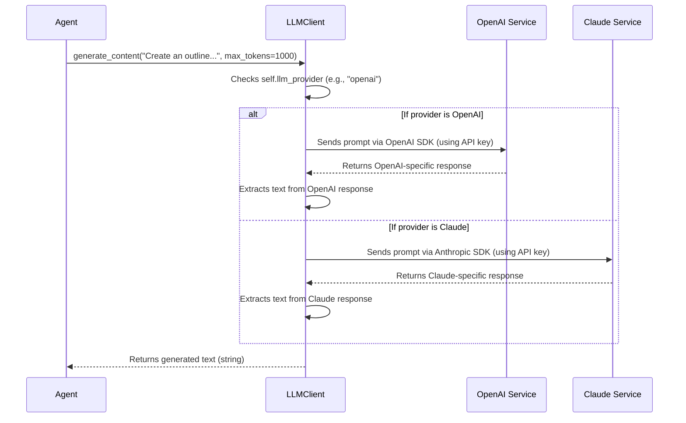

# Chapter 5: LLM Client

Welcome to Chapter 5! In [Chapter 4: Agent System](04_agent_system_.md), we met the team of specialist AI agents, like the `OutlinerAgent` and `ChapterWriterAgent`, who do the actual work of creating your book. We learned that these agents often need to "talk" to a powerful AI – a Large Language Model (LLM) – to generate ideas, text, and more.

But how do they talk to these AIs? What if Libriscribe wants to use OpenAI's GPT for one task, Anthropic's Claude for another, or even Google's Gemini? Do our agents need to learn the specific "language" (API) for each of these AI brains? That would be complicated!

This is where the **`LLMClient`** comes to the rescue.

## The Universal Remote for AI Brains

Imagine you have several different TVs at home – a Sony, an LG, and a Samsung. Each one has its own unique remote control with different buttons and layouts. It's a hassle to keep track of them all and remember how each one works. Wouldn't it be great to have a single, universal remote that works with all your TVs?

The `LLMClient` in Libriscribe is exactly like that universal remote, but for Large Language Models (LLMs). Different companies offer powerful LLMs:
*   OpenAI has models like GPT-4.
*   Anthropic offers Claude.
*   Google provides Gemini.

Each of these LLMs has its own way of being "talked to" – its own Application Programming Interface (API) and set of rules. The `LLMClient` acts as a unified, simple interface. It hides all the provider-specific details, allowing our agents to interact with different LLMs without needing to know the nitty-gritty of each one.

**Use Case: An Agent Needs AI-Generated Content**

Let's go back to our `OutlinerAgent` from [Chapter 4: Agent System](04_agent_system_.md). It needs to generate a book outline. To do this, it needs to ask an LLM.

Without an `LLMClient`, the `OutlinerAgent`'s code would need to look something like this (pseudo-code):

```
IF we want to use OpenAI:
  // ... code to talk to OpenAI ...
ELSE IF we want to use Claude:
  // ... different code to talk to Claude ...
ELSE IF we want to use Gemini:
  // ... yet another set of code for Gemini ...
```

This would make the `OutlinerAgent` (and every other agent) very complex!

With the `LLMClient`, the `OutlinerAgent` can simply say:
"Hey `LLMClient`, please generate content based on this prompt: 'Create an outline for a fantasy novel...'"

The `LLMClient` then takes care of figuring out *which* AI (OpenAI, Claude, etc.) is currently selected and how to talk to it.

## How Agents Use the `LLMClient`

Every agent in Libriscribe that needs to interact with an LLM is given an instance of the `LLMClient` when it's created. This happens in the base `Agent` class, as we saw a glimpse of in `src/libriscribe/agents/agent_base.py`:

```python
# src/libriscribe/agents/agent_base.py (Relevant part)
from libriscribe.utils.llm_client import LLMClient # Importing the LLMClient

class Agent:
    def __init__(self, name: str, llm_client: LLMClient):
        self.name = name
        self.llm_client = llm_client # Each agent gets an LLMClient
        # ... other initializations ...
```
This means every specialist agent (like `OutlinerAgent`, `CharacterGeneratorAgent`, etc.) has a `self.llm_client` attribute it can use.

Let's look at a simplified example of how our `OutlinerAgent` might use it:

```python
# Simplified OutlinerAgent using LLMClient
# from libriscribe.utils.llm_client import LLMClient
# from libriscribe.knowledge_base import ProjectKnowledgeBase

class OutlinerAgent: # (Simplified for this example)
    def __init__(self, llm_client: LLMClient):
        self.llm_client = llm_client
        self.name = "SimplifiedOutlinerAgent"

    def execute(self, project_knowledge_base: ProjectKnowledgeBase):
        # 1. Get book details from the ProjectKnowledgeBase
        title = project_knowledge_base.title
        genre = project_knowledge_base.genre
        
        # 2. Create a prompt (the message for the AI)
        prompt = f"Generate a chapter-by-chapter outline for a {genre} book titled '{title}'."
        
        # 3. Use the LLMClient to get the outline from the AI
        # The agent doesn't care which LLM (OpenAI, Claude, etc.) is used!
        generated_outline_text = self.llm_client.generate_content(
            prompt, 
            max_tokens=1500 # Ask for up to 1500 words/tokens
        )
        
        # 4. Update the ProjectKnowledgeBase with the new outline
        if generated_outline_text:
            project_knowledge_base.outline = generated_outline_text
            print(f"Outline generated by {self.name}!")
        else:
            print(f"Failed to generate outline by {self.name}.")

```
In this snippet:
1.  The `OutlinerAgent` has access to `self.llm_client`.
2.  It prepares a `prompt` (the instruction for the LLM).
3.  It calls `self.llm_client.generate_content(prompt, max_tokens=1500)`. This is the "universal remote" button press! The agent doesn't need to know if it's talking to OpenAI, Claude, or any other LLM. It just trusts the `LLMClient` to handle it.
4.  It receives the `generated_outline_text` (a string) from the `LLMClient`.

The beauty is its simplicity from the agent's perspective. If we later decide to switch from OpenAI to Claude, we don't need to change the `OutlinerAgent`'s code at all!

## Under the Hood: How Does the `LLMClient` Work?

So, how does this "universal remote" actually operate the different "TVs"? Let's peek inside `src/libriscribe/utils/llm_client.py`.

**1. Choosing the "TV Brand" (LLM Provider)**

When an `LLMClient` object is created, it needs to know which LLM provider (OpenAI, Claude, etc.) it should be using. This is usually determined by your [Configuration Settings](07_configuration_settings_.md).

```python
# src/libriscribe/utils/llm_client.py (Simplified __init__)

# ... imports like OpenAI, anthropic, genai, Settings ...

class LLMClient:
    def __init__(self, llm_provider: str): # e.g., "openai", "claude"
        self.settings = Settings() # Loads API keys from .env file
        self.llm_provider = llm_provider
        self.client = self._get_client() # Sets up the specific "TV remote"
        self.model = self._get_default_model() # Picks a default "channel" (model)
```
-   `llm_provider: str`: This tells the `LLMClient` which AI service to use (e.g., "openai", "claude", "google_ai_studio").
-   `self.settings = Settings()`: It loads settings, including necessary API keys for different providers, from your Libriscribe configuration (often an `.env` file). More on this in [Chapter 7: Configuration Settings](07_configuration_settings_.md).
-   `self.client = self._get_client()`: This is where it figures out which specific "remote control" (SDK or library) to use for the chosen provider.
-   `self.model = self._get_default_model()`: Each provider has different models (like different channels on a TV). This picks a sensible default.

**2. Setting Up the Specific "Remote" (`_get_client`)**

The `_get_client()` method is like a switchboard. Based on the `llm_provider` string, it initializes the correct client library.

```python
# src/libriscribe/utils/llm_client.py (Simplified _get_client)

# from openai import OpenAI
# import anthropic
# import google.generativeai as genai

class LLMClient:
    # ... ( __init__ from above) ...

    def _get_client(self):
        """Initializes the appropriate client based on the provider."""
        if self.llm_provider == "openai":
            if not self.settings.openai_api_key:
                raise ValueError("OpenAI API key is not set.")
            return OpenAI(api_key=self.settings.openai_api_key) # OpenAI's "remote"
        
        elif self.llm_provider == "claude":
            if not self.settings.claude_api_key:
                raise ValueError("Claude API key is not set.")
            return anthropic.Anthropic(api_key=self.settings.claude_api_key) # Claude's "remote"
        
        elif self.llm_provider == "google_ai_studio":
            # ... code to set up Google Gemini client ...
            return genai # Google's "remote" (module itself)
        
        # ... (elif for deepseek, mistral) ...
        else:
            raise ValueError(f"Unsupported LLM provider: {self.llm_provider}")
```
- If `llm_provider` is "openai", it creates an `OpenAI` client object using your OpenAI API key.
- If it's "claude", it creates an `anthropic.Anthropic` client object using your Claude API key.
- And so on for other supported providers. This `self.client` now holds the specific tool needed to talk to the chosen LLM.

**3. Pressing the "Play" Button (`generate_content`)**

This is the main method agents call. It takes the `prompt` and other parameters (like `max_tokens`) and then uses the `self.client` (which was set up in `_get_client`) to make the actual call to the LLM API.

```python
# src/libriscribe/utils/llm_client.py (Simplified generate_content)

class LLMClient:
    # ... ( __init__ and _get_client from above) ...

    def generate_content(self, prompt: str, max_tokens: int = 2000, temperature: float = 0.7, language: str = "English") -> str:
        try:
            if self.llm_provider == "openai":
                # Using OpenAI's specific way to make a call
                response = self.client.chat.completions.create(
                    model=self.model, # e.g., "gpt-4o-mini"
                    messages=[{"role": "user", "content": prompt}],
                    max_tokens=max_tokens,
                    temperature=temperature,
                )
                return response.choices[0].message.content.strip() # Get text

            elif self.llm_provider == "claude":
                # Using Claude's specific way to make a call
                response = self.client.messages.create(
                    model=self.model, # e.g., "claude-3-opus-20240229"
                    max_tokens=max_tokens,
                    messages=[{"role": "user", "content": prompt}]
                )
                return response.content[0].text.strip() # Get text
            
            # ... (elif for google_ai_studio, deepseek, mistral) ...
            
            else: # Should not happen if _get_client worked
                return "Error: Unknown provider."

        except Exception as e:
            # ... (error logging) ...
            return f"Error from {self.llm_provider}: {e}"
```
-   You can see the `if/elif` structure again. This time, it's routing the request to the correct API call for the chosen provider.
    -   For OpenAI, it uses `self.client.chat.completions.create(...)`.
    -   For Claude, it uses `self.client.messages.create(...)`.
-   Each block then extracts the text content from the provider's specific response format and returns it as a simple string. This ensures the agent always gets a consistent type of output.

**The Flow of Communication**

Here's a simplified diagram showing what happens when an agent asks the `LLMClient` for content:


This diagram illustrates how the `LLMClient` acts as an intermediary, translating the agent's simple request into the specific "language" needed by the chosen AI service.

**Other Helper Methods**
The `LLMClient` also has:
*   `_get_default_model()`: Chooses a default model name for the selected provider (e.g., "gpt-4o-mini" for OpenAI, "claude-3-opus-20240229" for Claude).
*   `set_model(model_name: str)`: Allows an agent (or the [Project Manager Agent](03_project_manager_agent_.md)) to explicitly choose a different model if needed, overriding the default.
*   `generate_content_with_json_repair()`: A more advanced version of `generate_content` that tries to fix common issues if the LLM is supposed to return structured data (like JSON) but makes a mistake. This makes Libriscribe more robust.

## Benefits of Using the `LLMClient`

This "universal remote" approach offers several advantages:

1.  **Flexibility**: Libriscribe can easily switch between different LLM providers or even use different providers for different tasks. If a new, better LLM comes out, Libriscribe can add support for it in the `LLMClient` without having to update all the individual agents.
2.  **Simplicity for Agents**: Agent developers don't need to learn the APIs of multiple LLM providers. They just use the simple `llm_client.generate_content()` method.
3.  **Centralized Logic**: All the code for interacting with specific LLM providers is in one place (`llm_client.py`). This makes it easier to update API calls, handle errors, or add new features related to LLM interaction.
4.  **Consistency**: Agents always get a consistent output (a text string) from the `LLMClient`, regardless of which underlying provider was used.

## Conclusion

The `LLMClient` is a crucial abstraction in Libriscribe. It acts as a universal translator or a universal remote control, allowing various specialized agents to "talk" to different Large Language Models (like OpenAI's GPT, Anthropic's Claude, or Google's Gemini) through a single, simple interface. It hides the complexities of each provider's specific API, making the agents' code cleaner and the entire system more flexible and maintainable.

Now that we understand *how* Libriscribe's agents can communicate with these powerful AI brains via the `LLMClient`, you might be wondering: *what* exactly do they say to the AI to get the desired results? Crafting the right messages, or "prompts," is an art and a science. In the next chapter, we'll explore how Libriscribe manages these important instructions in the [LLM Prompts Context](06_llm_prompts_context_.md).

---

Generated by [AI Codebase Knowledge Builder](https://github.com/The-Pocket/Tutorial-Codebase-Knowledge)