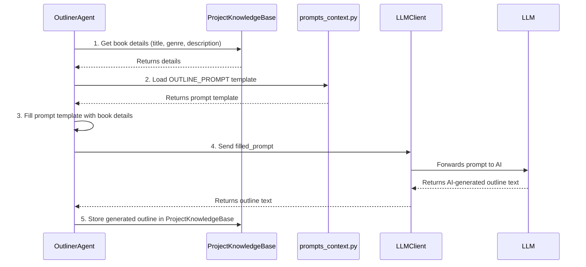

# Chapter 6: LLM Prompts Context

Welcome to Chapter 6! In [Chapter 5: LLM Client](05_llm_client_.md), we discovered how Libriscribe's agents, like the `OutlinerAgent` or `ChapterWriterAgent`, can talk to powerful AI brains (Large Language Models or LLMs) using the `LLMClient` as a universal remote. The `LLMClient` handles the "how" of sending a message to an LLM.

But *what* exactly do we say to the AI to get the specific results we want? If we just tell the AI "write a story," we might get something completely random. We need to give it clear, detailed instructions. This is where **LLM Prompts Context** comes in!

## What are LLM Prompts? The AI's Creative Brief

Imagine you're hiring a very talented artist to draw a picture for your book cover. You wouldn't just say, "Draw something." You'd give them a detailed **creative brief**:
*   "I want a picture for a fantasy novel titled 'The Dragon's Amulet'."
*   "The main character is a young hero with a magical sword."
*   "The mood should be adventurous and slightly mysterious."
*   "Please use a vibrant color palette."

These instructions guide the artist to create something that matches your vision.

**LLM Prompts** are exactly like these creative briefs, but for AI. They are carefully written text instructions that we send to the Large Language Model. These prompts tell the AI:
*   What kind of content to generate (e.g., a book outline, a character profile, a chapter narrative).
*   The desired style, tone, and format.
*   Specific details it should include (like your book's title, genre, or character names).

In Libriscribe, these important instructions are stored and managed in a module called `prompts_context.py` (found at `src/libriscribe/utils/prompts_context.py`).

**Use Case: Asking the AI to Write an Outline**

Let's say our `OutlinerAgent` needs to generate a book outline. It can't just send an empty message to the LLM. It needs to send a detailed prompt that might look something like this (in a simplified form):

"You are an expert book outliner. Please create a chapter-by-chapter outline for a **fantasy** novel titled '**The Dragon's Amulet**'. The book is about **a young hero who discovers a powerful amulet and must protect it from an evil sorcerer.** The outline should include a title and a brief summary for each chapter. Please list about 10 chapters."

This detailed instruction is an LLM prompt. The `prompts_context.py` module is where Libriscribe keeps these pre-written, carefully engineered prompts.

## Why Have a Special Place for Prompts (`prompts_context.py`)?

You might wonder, "Why not just type these instructions directly into the agent's code whenever we need them?" Storing prompts in a dedicated module like `prompts_context.py` offers several advantages:

1.  **Organization:** All the "creative briefs" for the AI are in one place. This makes them easy to find, review, and manage.
2.  **Consistency:** Different agents (or the same agent at different times) can use the exact same well-crafted prompt for a specific task, leading to more consistent AI outputs.
3.  **Reusability:** A good prompt for generating, say, character descriptions can be reused whenever character descriptions are needed.
4.  **Easy Updates & Improvements:** Crafting the perfect prompt (often called "prompt engineering") can take some trial and error. If we find a way to improve a prompt, we only need to change it in `prompts_context.py`, and all parts of Libriscribe that use it will benefit from the improvement.

Think of `prompts_context.py` as Libriscribe's library of master templates for talking to the AI.

## How Prompts Work: Templates and Placeholders

The prompts stored in `prompts_context.py` are often like templates with placeholders. These placeholders allow us to customize the prompt with specific details from your current book project.

Let's look at a simplified conceptual example of what a prompt for generating an outline might look like inside `prompts_context.py`:

```python
# src/libriscribe/utils/prompts_context.py (Simplified Example)

OUTLINE_PROMPT_TEMPLATE = """
Please generate a chapter-by-chapter outline for a {genre} book.
The title of the book is: {title}.
Here's a short description of the book: {description}.
The outline should have approximately {num_chapters} chapters.
For each chapter, provide a title and a 1-2 sentence summary.
"""

# ... other prompts for other tasks ...
```
In this `OUTLINE_PROMPT_TEMPLATE`:
*   `{genre}`, `{title}`, `{description}`, and `{num_chapters}` are **placeholders**.
*   When an agent, like the `OutlinerAgent`, wants to use this prompt, it will take this template and fill in these placeholders with actual information from your book (which it gets from the [Project Knowledge Base](02_project_knowledge_base_.md)).

For example, if your book is a "Fantasy" novel titled "The Lost Locket" with a description "A young girl finds a magical locket..." and you want 5 chapters, the filled-in prompt would become:

```
Please generate a chapter-by-chapter outline for a Fantasy book.
The title of the book is: The Lost Locket.
Here's a short description of the book: A young girl finds a magical locket....
The outline should have approximately 5 chapters.
For each chapter, provide a title and a 1-2 sentence summary.
```
This complete, filled-in prompt is then sent to the LLM via the [LLM Client](05_llm_client_.md).

### How Agents Use These Prompts

Here's a very simplified idea of how an agent (e.g., `OutlinerAgent`) might use a prompt from `prompts_context.py`:

```python
# Simplified Agent Code
# from libriscribe.knowledge_base import ProjectKnowledgeBase
# from libriscribe.utils.llm_client import LLMClient
from libriscribe.utils import prompts_context # Import the prompts module

class SimplifiedOutlinerAgent:
    def __init__(self, llm_client: LLMClient): # LLMClient from Chapter 5
        self.llm_client = llm_client

    def generate_outline_for_book(self, pk_base: ProjectKnowledgeBase): # PKB from Chapter 2
        # 1. Get book details from the Project Knowledge Base
        book_title = pk_base.title
        book_genre = pk_base.genre
        book_description = pk_base.description
        num_chapters_planned = pk_base.num_chapters # Assuming this exists

        # 2. Get the prompt template from prompts_context
        prompt_template = prompts_context.OUTLINE_PROMPT_TEMPLATE # Using our example above

        # 3. Fill in the placeholders (often using Python's .format() method or f-strings)
        filled_prompt = prompt_template.format(
            genre=book_genre,
            title=book_title,
            description=book_description,
            num_chapters=num_chapters_planned
        )

        # 4. Send the filled prompt to the LLM via the LLMClient
        generated_text = self.llm_client.generate_content(filled_prompt)

        # 5. The agent then processes 'generated_text' (e.g., saves it to PKB)
        pk_base.outline = generated_text
        print("Outline generated!")
```
In this example:
1.  The agent gets the necessary details (`book_title`, `book_genre`, etc.) from the `ProjectKnowledgeBase`.
2.  It imports the `prompts_context` module and accesses the `OUTLINE_PROMPT_TEMPLATE`.
3.  It uses the `.format()` method (Python's way of filling placeholders in a string) to create the `filled_prompt`.
4.  This `filled_prompt` is then passed to the `llm_client` to get the AI's response.

## A Peek Inside `src/libriscribe/utils/prompts_context.py`

The actual `prompts_context.py` file in Libriscribe contains many such prompt templates, one for each specific task the AI might perform. These are Python string variables, often multi-line strings, meticulously crafted for clarity and effectiveness.

For instance, you'll find prompts like:
*   `OUTLINE_PROMPT`: For generating the overall book outline.
*   `CHARACTER_PROMPT`: For creating detailed character profiles.
*   `WORLDBUILDING_PROMPT`: For developing aspects of the story's world.
*   `SCENE_PROMPT`: For writing individual scenes within a chapter.
*   `EDITOR_PROMPT`: For asking the AI to review and edit text.

Each of these prompts is designed to guide the AI to produce output in a specific structure and style. For example, the `CHARACTER_PROMPT` might instruct the AI to return character details in a JSON format, making it easier for Libriscribe to process the AI's output.

Some prompts can even be dynamic. For example, the `WORLDBUILDING_PROMPT` uses a helper function `get_worldbuilding_aspects(category)` from `prompts_context.py`. This function changes the list of worldbuilding questions based on whether your project is "fiction," "non-fiction," "business," etc., making the prompt even more tailored.

```python
# src/libriscribe/utils/prompts_context.py (Conceptual Snippet)

# ... other imports ...

def get_worldbuilding_aspects(category: str) -> str:
    """Dynamically returns worldbuilding aspects based on the project category."""
    # ... (logic to return different aspects for fiction, non-fiction, etc.) ...
    if category.lower() == "fiction":
        return "Geography: ...\nCulture: ...\nMagic System: ..."
    # ...
    return ""


WORLDBUILDING_PROMPT = """
Create detailed worldbuilding information for a {genre} book titled "{title}".
Category: {category}.
Language: {language}.
Book Description: {description}

Please detail the following aspects:
{worldbuilding_aspects}

Return the details in JSON format.
"""
```
Here, the `WORLDBUILDING_PROMPT` uses `{worldbuilding_aspects}` as a placeholder. An agent would first call `get_worldbuilding_aspects()` with the book's category, get the relevant list of aspects, and then insert that list into the main prompt template before sending it to the LLM.

## The Prompt in Action: Step-by-Step

Let's trace the journey of a prompt when an agent, say the `OutlinerAgent`, wants to generate an outline:



1.  **Get Data:** The `OutlinerAgent` fetches current book details (like title, genre, description) from the [Project Knowledge Base](02_project_knowledge_base_.md).
2.  **Load Template:** The agent imports `OUTLINE_PROMPT` (or a similar variable) from `prompts_context.py`.
3.  **Fill Template:** The agent combines the book details with the prompt template to create a specific, complete instruction for the LLM.
4.  **Send to LLM:** The agent uses the [LLM Client](05_llm_client_.md) to send this filled prompt to the chosen Large Language Model.
5.  **Process Output:** The LLM generates the outline based on the prompt, and the `LLMClient` returns this text to the agent. The agent then processes this text (e.g., saving it to the `ProjectKnowledgeBase`).

## The Art of "Prompt Engineering"

Creating prompts that consistently get the desired output from an LLM is a bit of an art and a science, often called **"prompt engineering."** It involves:
*   Being very clear and specific in your instructions.
*   Telling the AI what role to play (e.g., "You are an expert editor").
*   Providing examples of the desired output format.
*   Iterating and refining prompts based on the AI's responses.

The good news is that Libriscribe's `prompts_context.py` comes with many pre-engineered prompts designed to work well for common book-writing tasks. As a beginner, you don't have to worry too much about writing these prompts from scratch, but it's helpful to understand that they are the key to guiding the AI's creativity.

## Conclusion

The `prompts_context.py` module is Libriscribe's treasure chest of carefully crafted instructions – the **LLM Prompts**. These prompts act as detailed creative briefs or blueprints, guiding the Large Language Models to generate specific types of content like outlines, character profiles, or chapter narratives. By centralizing these prompts, Libriscribe ensures consistency, reusability, and makes it easier to refine how it communicates with its AI assistants. They are the crucial link that translates your project's needs into actionable tasks for the AI.

Now that we understand how Libriscribe talks to AI and what it tells it to do, you might be wondering how you can customize Libriscribe's behavior, such as specifying which AI provider to use or setting up your API keys. We'll cover that in our next and final chapter: [Chapter 7: Configuration Settings](07_configuration_settings_.md).

---

Generated by [AI Codebase Knowledge Builder](https://github.com/The-Pocket/Tutorial-Codebase-Knowledge)