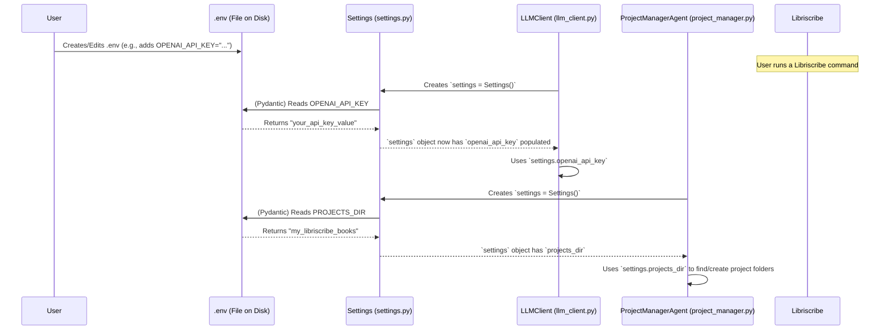

# Chapter 7: Configuration Settings

Welcome to the final chapter of our Libriscribe journey! In [Chapter 6: LLM Prompts Context](06_llm_prompts_context_.md), we learned how Libriscribe uses carefully crafted prompts to tell the AI exactly what to do. These prompts, along with the [LLM Client](05_llm_client_.md), enable communication with powerful AI models.

But how does Libriscribe know important details like your API key for OpenAI, or which AI provider you want to use by default? Or even where on your computer it should save your book projects? That's where **Configuration Settings** come in!

## What are Configuration Settings? The App's Preferences Panel

Imagine you're setting up a new app on your phone. You might go into a "Settings" or "Preferences" menu to:
*   Enter your login details for a service.
*   Choose your preferred language.
*   Decide where to save downloaded files.

Configuration Settings in Libriscribe work much like this. They are the application's way of remembering these crucial operational details. The main component responsible for this is the `Settings` class.

**Use Case: Using Your Own AI API Key**

Libriscribe needs to talk to AI services like OpenAI or Claude to help you write your book. These services usually require an "API key" – think of it as a secret password that proves you're allowed to use their service.

You wouldn't want to type your API key every time you run Libriscribe, nor would you want to write it directly into the main code (that's not secure!). Instead, Libriscribe needs a safe and consistent way to find and use your API key. This is a prime job for Configuration Settings.

## The Secret Keeper: The `.env` File

One common and secure way to store sensitive information like API keys is by using an **environment file**, typically named `.env`.

*   **What is it?** An `.env` file is a simple text file that you create in the main directory of your Libriscribe project (the same place where you installed Libriscribe). Inside this file, you list your settings as `KEY=VALUE` pairs.
*   **Why use it?**
    *   **Security:** It keeps your secret keys out of the main codebase. If you share your code, you don't accidentally share your secrets. The `.env` file is usually *not* shared.
    *   **Environment-Specific:** You can have different `.env` files for different environments (e.g., one for your computer, another for a server if Libriscribe were deployed there), without changing the code.
    *   **Easy to Manage:** It's a simple text file, easy to edit.

**Example: Creating Your `.env` File**

You'll need to create a file named `.env` (literally, just `.env`, starting with a dot and no other name before it) in the root folder of the Libriscribe project.

Inside your `.env` file, you might put lines like this:

```env
# .env file
OPENAI_API_KEY="your_openai_api_key_here"
CLAUDE_API_KEY="your_claude_api_key_here"
PROJECTS_DIR="my_libriscribe_books"
DEFAULT_LLM="openai"
```
*   Replace `"your_openai_api_key_here"` with your actual API key from OpenAI.
*   `PROJECTS_DIR` tells Libriscribe where to create the folders for your book projects. If you don't specify this, Libriscribe has a default location.
*   `DEFAULT_LLM` specifies which AI provider to use by default (e.g., "openai", "claude").

**Important:** If you're using a version control system like Git, make sure to add `.env` to your `.gitignore` file. This prevents your secret keys from being accidentally uploaded to a public repository!

## The `Settings` Class: Libriscribe's Preference Manager

Now that we have an `.env` file, how does Libriscribe read it? This is the job of the `Settings` class, defined in `src/libriscribe/settings.py`.

This class acts as a central hub for all configuration values. It uses a clever library called `Pydantic` (specifically `pydantic-settings`) to automatically read values from your `.env` file (and other environment variables) and make them available to the rest of the application.

Let's look at a simplified version of `src/libriscribe/settings.py`:

```python
# src/libriscribe/settings.py (Simplified)
from pydantic_settings import BaseSettings, SettingsConfigDict
from pathlib import Path

class Settings(BaseSettings):
    # Define the settings Libriscribe expects
    # Default values are provided if not found in .env
    openai_api_key: str = "" 
    google_ai_studio_api_key: str = ""
    claude_api_key: str = ""
    # ... other API keys ...
    
    projects_dir: str = str(Path(__file__).parent.parent.parent / "projects")
    default_llm: str = "openai"

    # This tells Pydantic where to look for the .env file
    model_config = SettingsConfigDict(env_file=".env", extra='ignore')
```
Let's break this down:
*   `class Settings(BaseSettings):`: Our `Settings` class inherits from `BaseSettings` provided by `pydantic-settings`. This gives it superpowers to load settings automatically.
*   `openai_api_key: str = ""`: This line defines a setting named `openai_api_key`. It expects a string (`str`). If it doesn't find `OPENAI_API_KEY` in your `.env` file, it will use the default value `""` (an empty string).
*   `projects_dir: str = ...`: This defines where projects are stored by default. `Path(__file__).parent.parent.parent / "projects"` cleverly creates a "projects" folder in the main directory of Libriscribe if you don't specify `PROJECTS_DIR` in your `.env`.
*   `model_config = SettingsConfigDict(env_file=".env", extra='ignore')`: This is crucial! It tells `Pydantic`:
    *   `env_file=".env"`: "Look for a file named `.env` in the current directory and load settings from there."
    *   `extra='ignore'`: "If there are other variables in the `.env` file that aren't defined in this `Settings` class, just ignore them."

When any part of Libriscribe needs a setting, it will create an instance of this `Settings` class. `Pydantic` automatically handles the loading from the `.env` file at that moment.

## How Other Parts of Libriscribe Use Settings

Different components of Libriscribe, like the [LLM Client](05_llm_client_.md) or the [Project Manager Agent](03_project_manager_agent_.md), need access to these settings. They do this by simply creating an instance of the `Settings` class.

**Example: `LLMClient` Accessing an API Key**

Remember our [LLM Client](05_llm_client_.md)? It needs API keys to talk to different AI providers. Here’s how it might get the OpenAI API key using the `Settings` class:

```python
# src/libriscribe/utils/llm_client.py (Simplified Snippet)
from libriscribe.settings import Settings # Import the Settings class
# ... other imports for OpenAI, Claude, etc. ...

class LLMClient:
    def __init__(self, llm_provider: str):
        self.settings = Settings() # 1. Create an instance of Settings
                                   # Pydantic loads from .env here!
        self.llm_provider = llm_provider
        self.client = self._get_client()
        # ...

    def _get_client(self):
        if self.llm_provider == "openai":
            # 2. Access the loaded setting
            if not self.settings.openai_api_key:
                raise ValueError("OpenAI API key is not set in .env file.")
            # Use the API key
            return OpenAI(api_key=self.settings.openai_api_key) 
        
        elif self.llm_provider == "claude":
            if not self.settings.claude_api_key:
                raise ValueError("Claude API key is not set in .env file.")
            return anthropic.Anthropic(api_key=self.settings.claude_api_key)
        # ... and so on for other providers
```
1.  `self.settings = Settings()`: When an `LLMClient` is created, it first creates its own `Settings` object. At this point, `Pydantic` automatically looks for your `.env` file and loads the values into `self.settings`.
2.  `self.settings.openai_api_key`: The `LLMClient` can then easily access the `openai_api_key` (or any other setting) as an attribute of the `self.settings` object.

The [Project Manager Agent](03_project_manager_agent_.md) similarly uses `settings.projects_dir` to know where to create and find your book project folders.

## Under the Hood: The Flow of Configuration

Let's visualize how these pieces fit together:



This diagram shows:
1.  You, the user, set up your `.env` file with your specific details.
2.  When Libriscribe runs, components like `LLMClient` or `ProjectManagerAgent` create an instance of the `Settings` class.
3.  The `Settings` class (thanks to `Pydantic`) automatically reads your `.env` file and loads the values.
4.  The components can then access these loaded settings as needed.

This system ensures that your sensitive and environment-specific configurations are kept separate from the core application code, but are easily accessible in a structured way.

## Conclusion

Configuration Settings, managed by the `Settings` class and loaded from your personal `.env` file, are like Libriscribe's preferences panel. They provide a secure and consistent way for different parts of the system to access essential operational parameters like API keys for AI services and the directory for storing your book projects. This allows Libriscribe to be flexible and configurable to your specific needs and environment without requiring code changes.

And with that, you've reached the end of our introductory tour through the core concepts of Libriscribe! We've journeyed from the [Command-Line Interface (CLI) & Workflow](01_command_line_interface__cli____workflow_.md) you use to interact with Libriscribe, explored how it stores data in the [Project Knowledge Base](02_project_knowledge_base_.md), met the chief coordinator in the [Project Manager Agent](03_project_manager_agent_.md), understood its team of specialist agents in the [Agent System](04_agent_system_.md), learned how it talks to AI brains via the [LLM Client](05_llm_client_.md) using carefully crafted [LLM Prompts Context](06_llm_prompts_context_.md), and finally, saw how it manages essential Configurations.

You now have a foundational understanding of how Libriscribe works under the hood. We hope this tour empowers you to explore the code further, contribute to the project, and, most importantly, use Libriscribe to bring your amazing book ideas to life! Happy writing!

---

Generated by [AI Codebase Knowledge Builder](https://github.com/The-Pocket/Tutorial-Codebase-Knowledge)