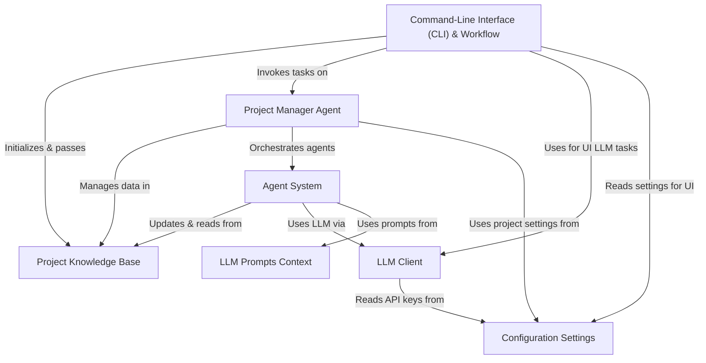

# Tutorial: libri

Libriscribe is an **AI-powered** application designed to assist users in *writing books*. It uses a **Command-Line Interface (CLI)** to guide the user through the creation process, from developing a *concept* and *outline* to writing *chapters*. The system employs specialized **AI agents** (the *Agent System*) that leverage **Large Language Models (LLMs)**, configured through specific **LLM Prompts**, to perform tasks like character generation and content writing. All project information is stored in a central **Project Knowledge Base**, and the overall workflow is managed by a **Project Manager Agent**. Operational parameters like API keys are handled by **Configuration Settings**.

**Source Repository:** [None](None)

## Chapters

1. [Command-Line Interface (CLI) & Workflow
](01_command_line_interface__cli____workflow_.md)
2. [Project Knowledge Base
](02_project_knowledge_base_.md)
3. [Project Manager Agent
](03_project_manager_agent_.md)
4. [Agent System
](04_agent_system_.md)
5. [LLM Client
](05_llm_client_.md)
6. [LLM Prompts Context
](06_llm_prompts_context_.md)
7. [Configuration Settings
](07_configuration_settings_.md)

---

Generated by [AI Codebase Knowledge Builder](https://github.com/The-Pocket/Tutorial-Codebase-Knowledge)